# Database Dependency Graph

This graph is generated from the grouped table YAML files under `schema/`.
Component paths plus direct FK and stock-seed dependencies are declared in
`schema/dependency.yml`.

- Every node is a table; column names are intentionally omitted in the
  flowcharts.
- Within a subgraph, every unlabeled solid arrow points from the child table
  to its FK parent table.
- Between subgraphs, one arrow points from the dependent component to the
  component it depends on. A solid arrow means at least one table FK creates
  the dependency; a dotted arrow is a stock-seed/application dependency only.
- `Core` combines startup configuration, UI access control, REST metadata,
  user management, RBAC, and consent. These tables and their stock seeds are
  not independently selectable by a deployable application.
- The ER diagrams remain split into smaller conceptual domains so their
  columns and relationship labels stay readable; their headings do not imply
  independently selectable schema modules.

## Core tables

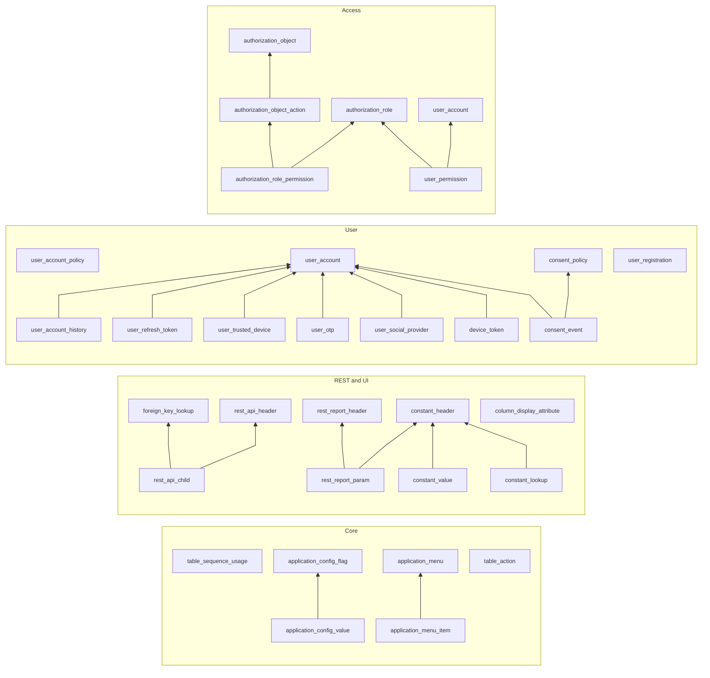
```mermaid
%%{init: {"flowchart": {"curve": "linear", "nodeSpacing": 24, "rankSpacing": 70, "diagramPadding": 12}, "themeVariables": {"fontSize": "12px"}}}%%
flowchart RL
    subgraph core["Core"]
        direction BT
        table_sequence_usage["table_sequence_usage"]
        table_action["table_action"]
        application_config_flag["application_config_flag"]
        application_config_value["application_config_value"]
        application_menu["application_menu"]
        application_menu_item["application_menu_item"]
    end
    application_config_value --> application_config_flag
    application_menu_item --> application_menu

    subgraph rest["REST and UI"]
        direction BT
        constant_header["constant_header"]
        constant_value["constant_value"]
        constant_lookup["constant_lookup"]
        foreign_key_lookup["foreign_key_lookup"]
        rest_api_header["rest_api_header"]
        rest_api_child["rest_api_child"]
        rest_report_header["rest_report_header"]
        rest_report_param["rest_report_param"]
        column_display_attribute["column_display_attribute"]
    end
    rest_api_child --> foreign_key_lookup
    rest_api_child --> rest_api_header
    rest_report_param --> rest_report_header
    rest_report_param --> constant_header
    constant_value --> constant_header
    constant_lookup --> constant_header

    subgraph user["User"]
        direction BT
        user_account_policy
        user_account
        user_account_history
        user_registration
        user_refresh_token
        user_trusted_device
        user_otp
        user_social_provider
        device_token
        consent_policy
        consent_event
    end

    user_account_history --> user_account
    user_refresh_token --> user_account
    user_trusted_device --> user_account
    user_otp --> user_account
    user_social_provider --> user_account
    device_token --> user_account
    consent_event --> consent_policy
    consent_event --> user_account

    subgraph access["Access"]
        direction BT
        authorization_object
        authorization_object_action
        authorization_role
        authorization_role_permission
        user_permission
        user_account2["user_account"]
    end

    authorization_object_action --> authorization_object
    authorization_role_permission --> authorization_role
    authorization_role_permission --> authorization_object_action
    user_permission --> user_account2
    user_permission --> authorization_role
```

## Dependent tables

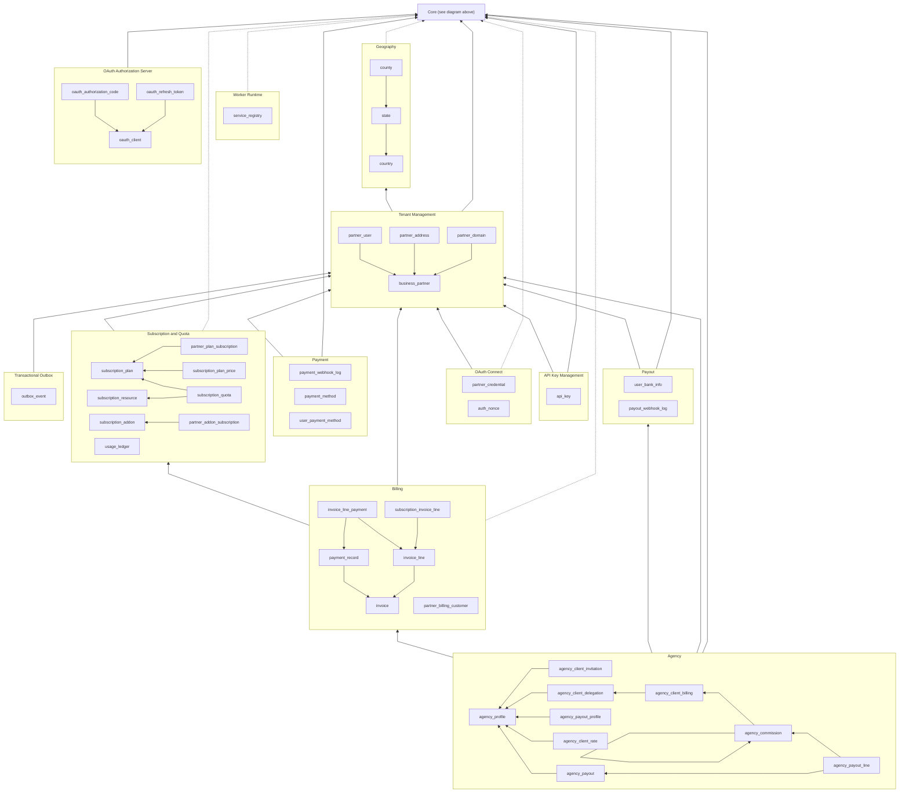
```mermaid
%%{init: {"flowchart": {"curve": "linear", "nodeSpacing": 24, "rankSpacing": 70, "diagramPadding": 12}, "themeVariables": {"fontSize": "12px"}}}%%
flowchart BT
    worker -.-> core
    geo -.-> core
    tenant_management --> core
    tenant_management --> geo
    oauth_server --> core
    api_key_management --> core
    api_key_management --> tenant_management
    oauth_connect -.-> core
    oauth_connect --> tenant_management
    subscription -.-> core
    subscription --> tenant_management
    payment --> core
    payment --> tenant_management
    payout --> core
    payout --> tenant_management
    outbox --> tenant_management
    billing -.-> core
    billing --> tenant_management
    billing --> subscription
    agency --> core
    agency --> tenant_management
    agency --> payout
    agency --> billing

    core["Core (see diagram above)"]

    subgraph worker["Worker Runtime"]
        direction TB
        service_registry["service_registry"]
    end

    subgraph geo["Geography"]
        direction TB
        country["country"]
        state["state"]
        county["county"]
    end

    state --> country
    county --> state

    subgraph tenant_management["Tenant Management"]
        direction TB
        business_partner["business_partner"]
        partner_user["partner_user"]
        partner_address["partner_address"]
        partner_domain["partner_domain"]
    end

    partner_user --> business_partner
    partner_address --> business_partner
    partner_domain --> business_partner

    subgraph oauth_server["OAuth Authorization Server"]
        direction TB
        oauth_client["oauth_client"]
        oauth_authorization_code["oauth_authorization_code"]
        oauth_refresh_token["oauth_refresh_token"]
    end

    oauth_authorization_code --> oauth_client
    oauth_refresh_token --> oauth_client

    subgraph api_key_management["API Key Management"]
        direction TB
        api_key["api_key"]
    end

    subgraph oauth_connect["OAuth Connect"]
        direction LR
        partner_credential["partner_credential"]
        auth_nonce["auth_nonce"]
    end

    subgraph subscription["Subscription and Quota"]
        direction RL
        subscription_plan["subscription_plan"]
        subscription_plan_price["subscription_plan_price"]
        subscription_resource["subscription_resource"]
        subscription_quota["subscription_quota"]
        subscription_addon["subscription_addon"]
        partner_plan_subscription["partner_plan_subscription"]
        partner_addon_subscription["partner_addon_subscription"]
        usage_ledger["usage_ledger"]
    end

    partner_plan_subscription --> subscription_plan
    subscription_plan_price --> subscription_plan
    subscription_quota --> subscription_plan
    subscription_quota --> subscription_resource
    partner_addon_subscription --> subscription_addon

    subgraph payment["Payment"]
        direction LR
        payment_webhook_log["payment_webhook_log"]
        payment_method["payment_method"]
        user_payment_method["user_payment_method"]
    end

    subgraph payout["Payout"]
        direction LR
        user_bank_info["user_bank_info"]
        payout_webhook_log["payout_webhook_log"]
    end

    subgraph outbox["Transactional Outbox"]
        direction TB
        outbox_event["outbox_event"]
    end

    subgraph billing["Billing"]
        direction TB
        invoice["invoice"]
        invoice_line["invoice_line"]
        partner_billing_customer["partner_billing_customer"]
        payment_record["payment_record"]
        invoice_line_payment["invoice_line_payment"]
        subscription_invoice_line["subscription_invoice_line"]
    end

    invoice_line --> invoice
    payment_record --> invoice
    invoice_line_payment --> payment_record
    invoice_line_payment --> invoice_line
    subscription_invoice_line --> invoice_line

    subgraph agency["Agency"]
        direction RL
        agency_profile["agency_profile"]
        agency_client_invitation["agency_client_invitation"]
        agency_client_delegation["agency_client_delegation"]
        agency_client_billing["agency_client_billing"]
        agency_payout_profile["agency_payout_profile"]
        agency_client_rate["agency_client_rate"]
        agency_commission["agency_commission"]
        agency_payout["agency_payout"]
        agency_payout_line["agency_payout_line"]
    end

    agency_client_invitation --> agency_profile
    agency_client_delegation --> agency_profile
    agency_client_billing --> agency_client_delegation
    agency_payout_profile --> agency_profile
    agency_client_rate --> agency_profile
    agency_commission --> agency_client_billing
    agency_commission --> agency_commission
    agency_payout --> agency_profile
    agency_payout_line --> agency_payout
    agency_payout_line --> agency_commission

```

## Conceptual ER diagrams

These smaller diagrams retain the previous conceptual domains for readability;
they do not define selectable schema components. Column names, key markers, and
relationship names come from the table YAML files. Every declared FK remains
drawn, with external parents repeated as minimal key-only stubs. The flowcharts
above show the actual merged component boundary and module dependencies.

### Core

#### Dictionary add-ons

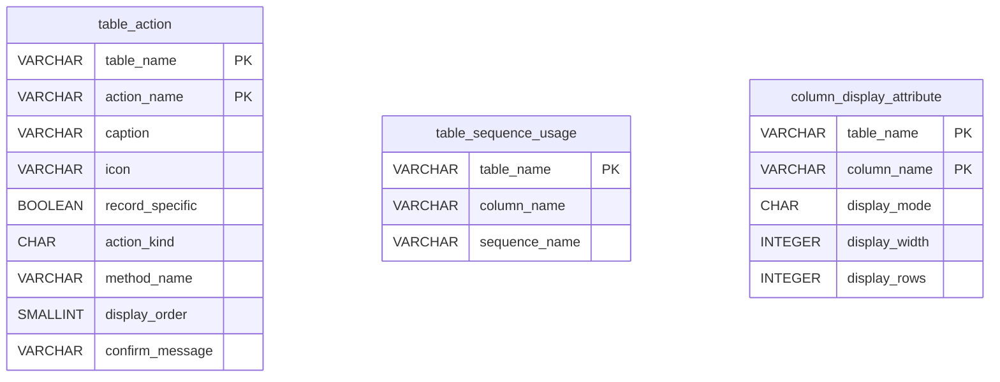
```mermaid
erDiagram
    table_action {
        VARCHAR table_name PK
        VARCHAR action_name PK
        VARCHAR caption
        VARCHAR icon
        BOOLEAN record_specific
        CHAR action_kind
        VARCHAR method_name
        SMALLINT display_order
        VARCHAR confirm_message
    }
    table_sequence_usage {
        VARCHAR table_name PK
        VARCHAR column_name
        VARCHAR sequence_name
    }
    column_display_attribute {
        VARCHAR table_name PK
        VARCHAR column_name PK
        CHAR display_mode
        INTEGER display_width
        INTEGER display_rows
    }
```

#### Application config and menu

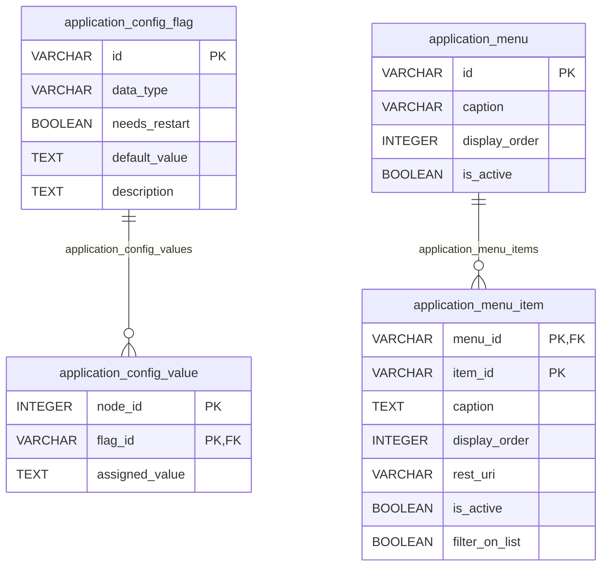
```mermaid
erDiagram
    application_config_flag ||--o{ application_config_value : "application_config_values"
    application_menu ||--o{ application_menu_item : "application_menu_items"

    application_config_flag {
        VARCHAR id PK
        VARCHAR data_type
        BOOLEAN needs_restart
        TEXT default_value
        TEXT description
    }
    application_config_value {
        INTEGER node_id PK
        VARCHAR flag_id PK,FK
        TEXT assigned_value
    }

    application_menu {
        VARCHAR id PK
        VARCHAR caption
        INTEGER display_order
        BOOLEAN is_active
    }
    application_menu_item {
        VARCHAR menu_id PK,FK
        VARCHAR item_id PK
        TEXT caption
        INTEGER display_order
        VARCHAR rest_uri
        BOOLEAN is_active
        BOOLEAN filter_on_list
    }
```

#### REST and UI Metadata

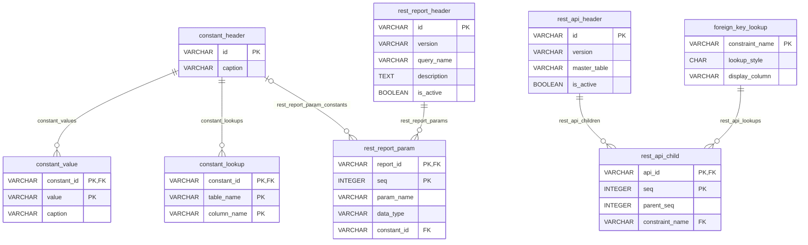
```mermaid
erDiagram
    constant_header ||--o{ constant_value : "constant_values"
    constant_header ||--o{ constant_lookup : "constant_lookups"
    rest_api_header ||--o{ rest_api_child : "rest_api_children"
    foreign_key_lookup ||--o{ rest_api_child : "rest_api_lookups"
    rest_report_header ||--o{ rest_report_param : "rest_report_params"
    constant_header o|--o{ rest_report_param : "rest_report_param_constants"

    constant_header {
        VARCHAR id PK
        VARCHAR caption
    }
    constant_value {
        VARCHAR constant_id PK,FK
        VARCHAR value PK
        VARCHAR caption
    }
    constant_lookup {
        VARCHAR constant_id PK,FK
        VARCHAR table_name PK
        VARCHAR column_name PK
    }
    foreign_key_lookup {
        VARCHAR constraint_name PK
        CHAR lookup_style
        VARCHAR display_column
    }
    rest_api_header {
        VARCHAR id PK
        VARCHAR version
        VARCHAR master_table
        BOOLEAN is_active
    }
    rest_api_child {
        VARCHAR api_id PK,FK
        INTEGER seq PK
        INTEGER parent_seq
        VARCHAR constraint_name FK
    }
    rest_report_header {
        VARCHAR id PK
        VARCHAR version
        VARCHAR query_name
        TEXT description
        BOOLEAN is_active
    }
    rest_report_param {
        VARCHAR report_id PK,FK
        INTEGER seq PK
        VARCHAR param_name
        VARCHAR data_type
        VARCHAR constant_id FK
    }
```

#### Policy and registration

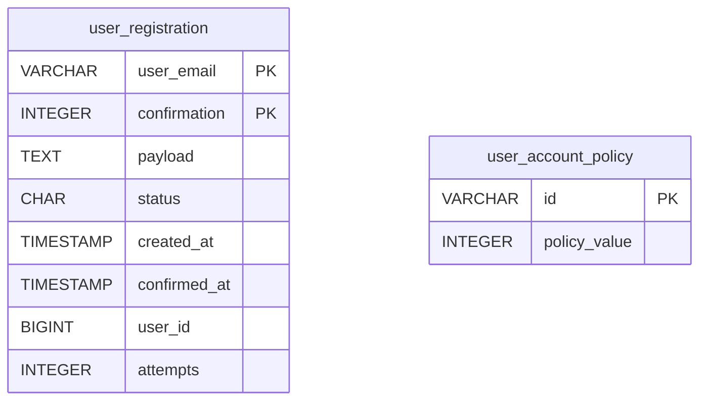
```mermaid
erDiagram
    user_registration {
        VARCHAR user_email PK
        INTEGER confirmation PK
        TEXT payload
        CHAR status
        TIMESTAMP created_at
        TIMESTAMP confirmed_at
        BIGINT user_id
        INTEGER attempts
    }
    user_account_policy {
        VARCHAR id PK
        INTEGER policy_value
    }

```

#### User Management

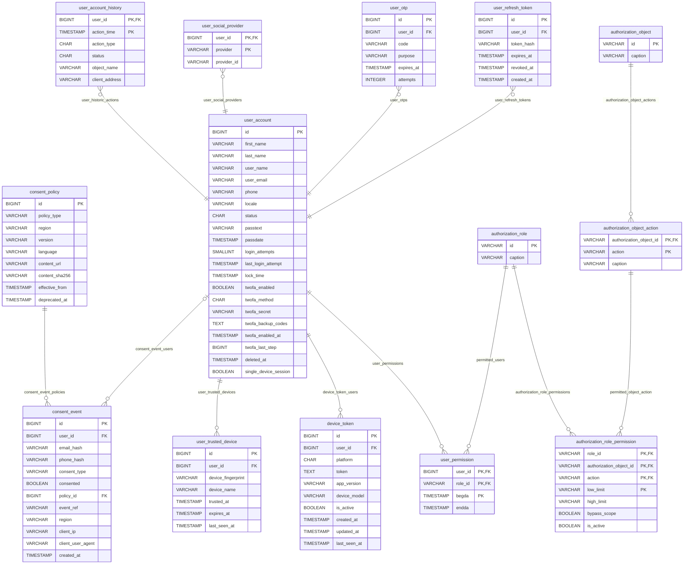
```mermaid
erDiagram

    consent_policy ||--o{ consent_event : "consent_event_policies"

    user_account_history }o--|| user_account : "user_historic_actions"
    user_social_provider }o--|| user_account : "user_social_providers"
    user_otp }o--|| user_account : "user_otps"
    user_refresh_token }o--|| user_account : "user_refresh_tokens"

    user_account o|--o{ consent_event : "consent_event_users"
    user_account ||--o{ user_trusted_device : "user_trusted_devices"
    user_account ||--o{ device_token : "device_token_users"

    user_account ||--o{ user_permission : "user_permissions"
    authorization_role ||--o{ user_permission : "permitted_users"
    authorization_object ||--o{ authorization_object_action : "authorization_object_actions"
    authorization_role ||--o{ authorization_role_permission : "authorization_role_permissions"
    authorization_object_action ||--o{ authorization_role_permission : "permitted_object_action"

    user_account_history {
        BIGINT user_id PK,FK
        TIMESTAMP action_time PK
        CHAR action_type
        CHAR status
        VARCHAR object_name
        VARCHAR client_address
    }
    user_refresh_token {
        BIGINT id PK
        BIGINT user_id FK
        VARCHAR token_hash
        TIMESTAMP expires_at
        TIMESTAMP revoked_at
        TIMESTAMP created_at
    }
    user_trusted_device {
        BIGINT id PK
        BIGINT user_id FK
        VARCHAR device_fingerprint
        VARCHAR device_name
        TIMESTAMP trusted_at
        TIMESTAMP expires_at
        TIMESTAMP last_seen_at
    }
    user_otp {
        BIGINT id PK
        BIGINT user_id FK
        VARCHAR code
        VARCHAR purpose
        TIMESTAMP expires_at
        INTEGER attempts
    }
    user_social_provider {
        BIGINT user_id PK,FK
        VARCHAR provider PK
        VARCHAR provider_id
    }
    device_token {
        BIGINT id PK
        BIGINT user_id FK
        CHAR platform
        TEXT token
        VARCHAR app_version
        VARCHAR device_model
        BOOLEAN is_active
        TIMESTAMP created_at
        TIMESTAMP updated_at
        TIMESTAMP last_seen_at
    }
    user_account {
        BIGINT id PK
        VARCHAR first_name
        VARCHAR last_name
        VARCHAR user_name
        VARCHAR user_email
        VARCHAR phone
        VARCHAR locale
        CHAR status
        VARCHAR passtext
        TIMESTAMP passdate
        SMALLINT login_attempts
        TIMESTAMP last_login_attempt
        TIMESTAMP lock_time
        BOOLEAN twofa_enabled
        CHAR twofa_method
        VARCHAR twofa_secret
        TEXT twofa_backup_codes
        TIMESTAMP twofa_enabled_at
        BIGINT twofa_last_step
        TIMESTAMP deleted_at
        BOOLEAN single_device_session
    }
    consent_policy {
        BIGINT id PK
        VARCHAR policy_type
        VARCHAR region
        VARCHAR version
        VARCHAR language
        VARCHAR content_url
        VARCHAR content_sha256
        TIMESTAMP effective_from
        TIMESTAMP deprecated_at
    }
    consent_event {
        BIGINT id PK
        BIGINT user_id FK
        VARCHAR email_hash
        VARCHAR phone_hash
        VARCHAR consent_type
        BOOLEAN consented
        BIGINT policy_id FK
        VARCHAR event_ref
        VARCHAR region
        VARCHAR client_ip
        VARCHAR client_user_agent
        TIMESTAMP created_at
    }
    authorization_object {
        VARCHAR id PK
        VARCHAR caption
    }
    authorization_object_action {
        VARCHAR authorization_object_id PK,FK
        VARCHAR action PK
        VARCHAR caption
    }
    authorization_role {
        VARCHAR id PK
        VARCHAR caption
    }
    authorization_role_permission {
        VARCHAR role_id PK,FK
        VARCHAR authorization_object_id PK,FK
        VARCHAR action PK,FK
        VARCHAR low_limit PK
        VARCHAR high_limit
        BOOLEAN bypass_scope
        BOOLEAN is_active
    }
    user_permission {
        BIGINT user_id PK,FK
        VARCHAR role_id PK,FK
        TIMESTAMP begda PK
        TIMESTAMP endda
    }
```

### Worker Runtime

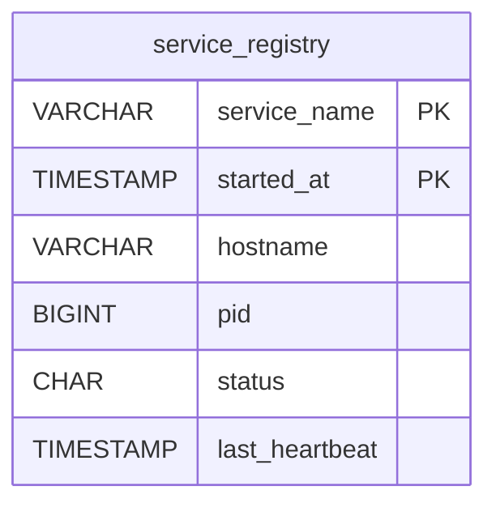
```mermaid
erDiagram
    service_registry {
        VARCHAR service_name PK
        TIMESTAMP started_at PK
        VARCHAR hostname
        BIGINT pid
        CHAR status
        TIMESTAMP last_heartbeat
    }
```

### Geography

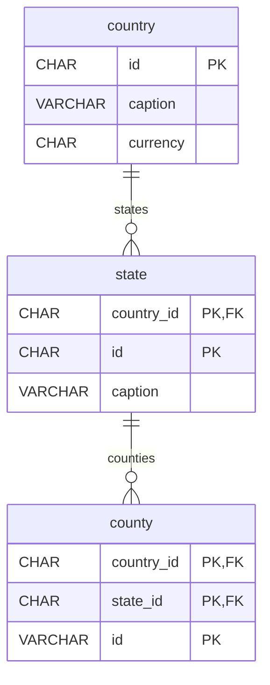
```mermaid
erDiagram
    country ||--o{ state : "states"
    state ||--o{ county : "counties"

    country {
        CHAR id PK
        VARCHAR caption
        CHAR currency
    }
    state {
        CHAR country_id PK,FK
        CHAR id PK
        VARCHAR caption
    }
    county {
        CHAR country_id PK,FK
        CHAR state_id PK,FK
        VARCHAR id PK
    }
```

### Tenant Management

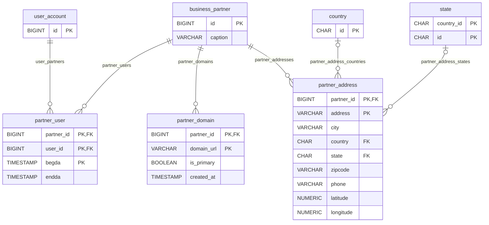
```mermaid
erDiagram
    business_partner ||--o{ partner_user : "partner_users"
    business_partner ||--o{ partner_domain : "partner_domains"
    business_partner ||--o{ partner_address : "partner_addresses"
    user_account ||--o{ partner_user : "user_partners"
    country o|--o{ partner_address : "partner_address_countries"
    state o|--o{ partner_address : "partner_address_states"

    business_partner {
        BIGINT id PK
        VARCHAR caption
    }
    partner_user {
        BIGINT partner_id PK,FK
        BIGINT user_id PK,FK
        TIMESTAMP begda PK
        TIMESTAMP endda
    }
    partner_address {
        BIGINT partner_id PK,FK
        VARCHAR address PK
        VARCHAR city
        CHAR country FK
        CHAR state FK
        VARCHAR zipcode
        VARCHAR phone
        NUMERIC latitude
        NUMERIC longitude
    }
    partner_domain {
        BIGINT partner_id PK,FK
        VARCHAR domain_url PK
        BOOLEAN is_primary
        TIMESTAMP created_at
    }
    user_account {
        BIGINT id PK
    }
    country {
        CHAR id PK
    }
    state {
        CHAR country_id PK
        CHAR id PK
    }
```

### OAuth Authorization Server

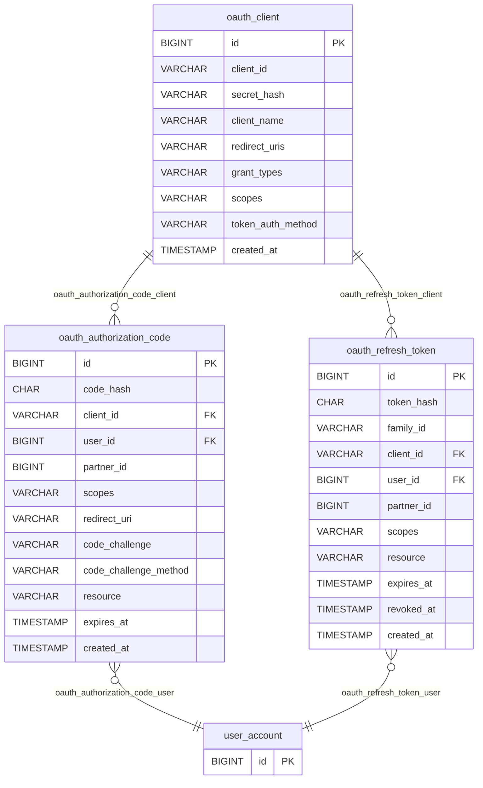
```mermaid
erDiagram
    oauth_client ||--o{ oauth_authorization_code : "oauth_authorization_code_client"
    oauth_client ||--o{ oauth_refresh_token : "oauth_refresh_token_client"
    oauth_authorization_code }o--|| user_account : "oauth_authorization_code_user"
    oauth_refresh_token }o--|| user_account : "oauth_refresh_token_user"

    oauth_client {
        BIGINT id PK
        VARCHAR client_id
        VARCHAR secret_hash
        VARCHAR client_name
        VARCHAR redirect_uris
        VARCHAR grant_types
        VARCHAR scopes
        VARCHAR token_auth_method
        TIMESTAMP created_at
    }
    oauth_authorization_code {
        BIGINT id PK
        CHAR code_hash
        VARCHAR client_id FK
        BIGINT user_id FK
        BIGINT partner_id
        VARCHAR scopes
        VARCHAR redirect_uri
        VARCHAR code_challenge
        VARCHAR code_challenge_method
        VARCHAR resource
        TIMESTAMP expires_at
        TIMESTAMP created_at
    }
    oauth_refresh_token {
        BIGINT id PK
        CHAR token_hash
        VARCHAR family_id
        VARCHAR client_id FK
        BIGINT user_id FK
        BIGINT partner_id
        VARCHAR scopes
        VARCHAR resource
        TIMESTAMP expires_at
        TIMESTAMP revoked_at
        TIMESTAMP created_at
    }
    user_account {
        BIGINT id PK
    }
```

### API Key Management

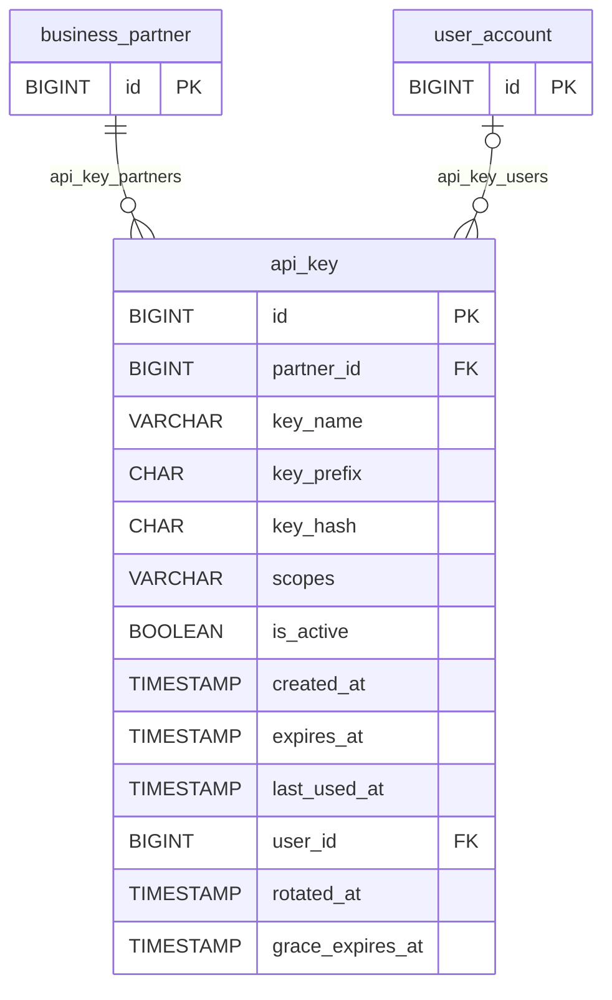
```mermaid
erDiagram
    business_partner ||--o{ api_key : "api_key_partners"
    user_account o|--o{ api_key : "api_key_users"

    api_key {
        BIGINT id PK
        BIGINT partner_id FK
        VARCHAR key_name
        CHAR key_prefix
        CHAR key_hash
        VARCHAR scopes
        BOOLEAN is_active
        TIMESTAMP created_at
        TIMESTAMP expires_at
        TIMESTAMP last_used_at
        BIGINT user_id FK
        TIMESTAMP rotated_at
        TIMESTAMP grace_expires_at
    }
    business_partner {
        BIGINT id PK
    }
    user_account {
        BIGINT id PK
    }
```

### OAuth Connect

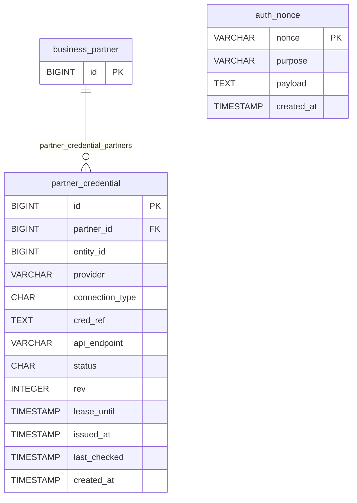
```mermaid
erDiagram
    business_partner ||--o{ partner_credential : "partner_credential_partners"

    partner_credential {
        BIGINT id PK
        BIGINT partner_id FK
        BIGINT entity_id
        VARCHAR provider
        CHAR connection_type
        TEXT cred_ref
        VARCHAR api_endpoint
        CHAR status
        INTEGER rev
        TIMESTAMP lease_until
        TIMESTAMP issued_at
        TIMESTAMP last_checked
        TIMESTAMP created_at
    }
    business_partner {
        BIGINT id PK
    }
    auth_nonce {
        VARCHAR nonce PK
        VARCHAR purpose
        TEXT payload
        TIMESTAMP created_at
    }
```

### Subscription and Quota

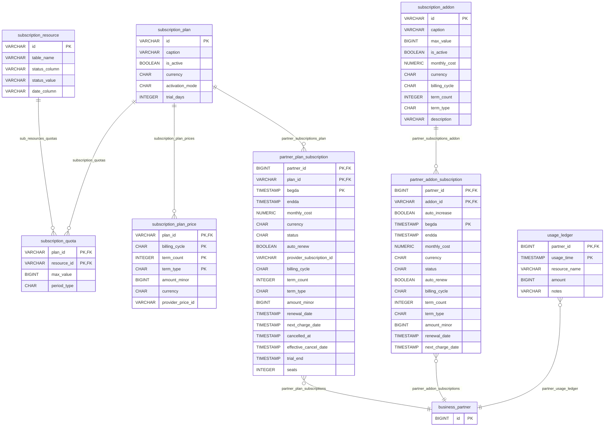
```mermaid
erDiagram
    subscription_resource ||--o{ subscription_quota : "sub_resources_quotas"
    subscription_plan ||--o{ subscription_quota : "subscription_quotas"
    subscription_plan ||--o{ subscription_plan_price : "subscription_plan_prices"
    subscription_plan ||--o{ partner_plan_subscription : "partner_subscriptions_plan"
    subscription_addon ||--o{ partner_addon_subscription : "partner_subscriptions_addon"
    partner_plan_subscription }o--|| business_partner : "partner_plan_subscriptions"
    partner_addon_subscription }o--|| business_partner : "partner_addon_subscriptions"
    usage_ledger }o--|| business_partner : "partner_usage_ledger"

    subscription_plan {
        VARCHAR id PK
        VARCHAR caption
        BOOLEAN is_active
        CHAR currency
        CHAR activation_mode
        INTEGER trial_days
    }
    subscription_plan_price {
        VARCHAR plan_id PK,FK
        CHAR billing_cycle PK
        INTEGER term_count PK
        CHAR term_type PK
        BIGINT amount_minor
        CHAR currency
        VARCHAR provider_price_id
    }
    subscription_resource {
        VARCHAR id PK
        VARCHAR table_name
        VARCHAR status_column
        VARCHAR status_value
        VARCHAR date_column
    }
    subscription_quota {
        VARCHAR plan_id PK,FK
        VARCHAR resource_id PK,FK
        BIGINT max_value
        CHAR period_type
    }
    subscription_addon {
        VARCHAR id PK
        VARCHAR caption
        BIGINT max_value
        BOOLEAN is_active
        NUMERIC monthly_cost
        CHAR currency
        CHAR billing_cycle
        INTEGER term_count
        CHAR term_type
        VARCHAR description
    }
    partner_plan_subscription {
        BIGINT partner_id PK,FK
        VARCHAR plan_id PK,FK
        TIMESTAMP begda PK
        TIMESTAMP endda
        NUMERIC monthly_cost
        CHAR currency
        CHAR status
        BOOLEAN auto_renew
        VARCHAR provider_subscription_id
        CHAR billing_cycle
        INTEGER term_count
        CHAR term_type
        BIGINT amount_minor
        TIMESTAMP renewal_date
        TIMESTAMP next_charge_date
        TIMESTAMP cancelled_at
        TIMESTAMP effective_cancel_date
        TIMESTAMP trial_end
        INTEGER seats
    }
    partner_addon_subscription {
        BIGINT partner_id PK,FK
        VARCHAR addon_id PK,FK
        BOOLEAN auto_increase
        TIMESTAMP begda PK
        TIMESTAMP endda
        NUMERIC monthly_cost
        CHAR currency
        CHAR status
        BOOLEAN auto_renew
        CHAR billing_cycle
        INTEGER term_count
        CHAR term_type
        BIGINT amount_minor
        TIMESTAMP renewal_date
        TIMESTAMP next_charge_date
    }
    usage_ledger {
        BIGINT partner_id PK,FK
        TIMESTAMP usage_time PK
        VARCHAR resource_name
        BIGINT amount
        VARCHAR notes
    }
    business_partner {
        BIGINT id PK
    }
```

### Payment

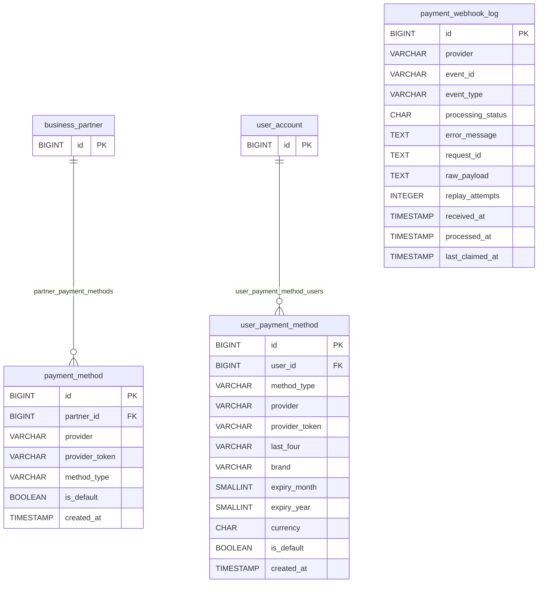
```mermaid
erDiagram
    business_partner ||--o{ payment_method : "partner_payment_methods"
    user_account ||--o{ user_payment_method : "user_payment_method_users"

    payment_webhook_log {
        BIGINT id PK
        VARCHAR provider
        VARCHAR event_id
        VARCHAR event_type
        CHAR processing_status
        TEXT error_message
        TEXT request_id
        TEXT raw_payload
        INTEGER replay_attempts
        TIMESTAMP received_at
        TIMESTAMP processed_at
        TIMESTAMP last_claimed_at
    }
    payment_method {
        BIGINT id PK
        BIGINT partner_id FK
        VARCHAR provider
        VARCHAR provider_token
        VARCHAR method_type
        BOOLEAN is_default
        TIMESTAMP created_at
    }
    user_payment_method {
        BIGINT id PK
        BIGINT user_id FK
        VARCHAR method_type
        VARCHAR provider
        VARCHAR provider_token
        VARCHAR last_four
        VARCHAR brand
        SMALLINT expiry_month
        SMALLINT expiry_year
        CHAR currency
        BOOLEAN is_default
        TIMESTAMP created_at
    }
    business_partner {
        BIGINT id PK
    }
    user_account {
        BIGINT id PK
    }
```

### Payout

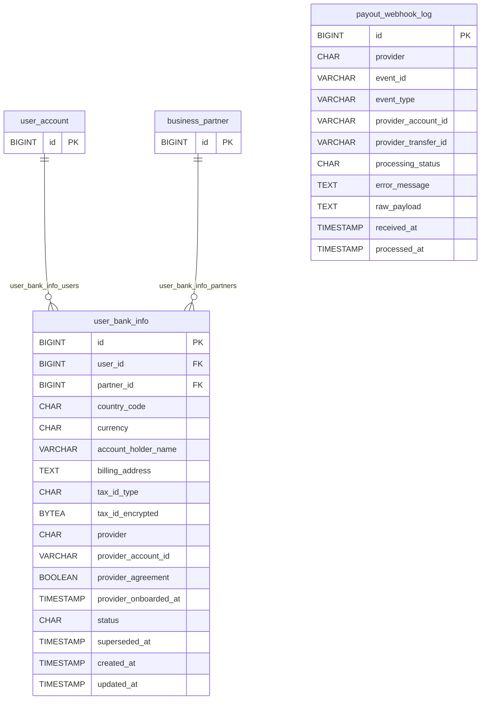
```mermaid
erDiagram
    user_account ||--o{ user_bank_info : "user_bank_info_users"
    business_partner ||--o{ user_bank_info : "user_bank_info_partners"

    user_bank_info {
        BIGINT id PK
        BIGINT user_id FK
        BIGINT partner_id FK
        CHAR country_code
        CHAR currency
        VARCHAR account_holder_name
        TEXT billing_address
        CHAR tax_id_type
        BYTEA tax_id_encrypted
        CHAR provider
        VARCHAR provider_account_id
        BOOLEAN provider_agreement
        TIMESTAMP provider_onboarded_at
        CHAR status
        TIMESTAMP superseded_at
        TIMESTAMP created_at
        TIMESTAMP updated_at
    }
    payout_webhook_log {
        BIGINT id PK
        CHAR provider
        VARCHAR event_id
        VARCHAR event_type
        VARCHAR provider_account_id
        VARCHAR provider_transfer_id
        CHAR processing_status
        TEXT error_message
        TEXT raw_payload
        TIMESTAMP received_at
        TIMESTAMP processed_at
    }
    user_account {
        BIGINT id PK
    }
    business_partner {
        BIGINT id PK
    }
```

### Transactional Outbox

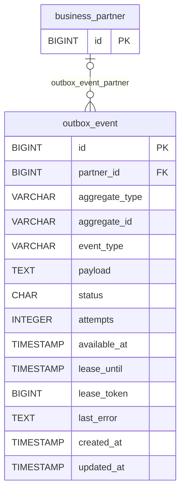
```mermaid
erDiagram
    business_partner o|--o{ outbox_event : "outbox_event_partner"

    outbox_event {
        BIGINT id PK
        BIGINT partner_id FK
        VARCHAR aggregate_type
        VARCHAR aggregate_id
        VARCHAR event_type
        TEXT payload
        CHAR status
        INTEGER attempts
        TIMESTAMP available_at
        TIMESTAMP lease_until
        BIGINT lease_token
        TEXT last_error
        TIMESTAMP created_at
        TIMESTAMP updated_at
    }
    business_partner {
        BIGINT id PK
    }
```

### Billing

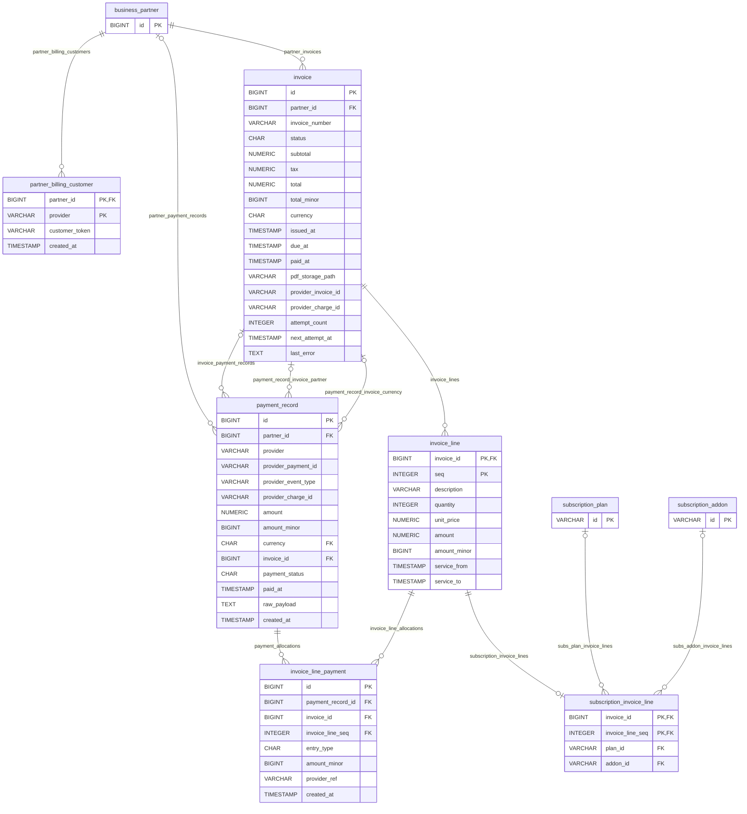
```mermaid
erDiagram
    business_partner o|--o{ payment_record : "partner_payment_records"
    business_partner ||--o{ partner_billing_customer : "partner_billing_customers"
    business_partner ||--o{ invoice : "partner_invoices"
    invoice ||--o{ invoice_line : "invoice_lines"
    invoice o|--o{ payment_record : "invoice_payment_records"
    invoice o|--o{ payment_record : "payment_record_invoice_partner"
    invoice o|--o{ payment_record : "payment_record_invoice_currency"
    payment_record ||--o{ invoice_line_payment : "payment_allocations"
    invoice_line ||--o{ invoice_line_payment : "invoice_line_allocations"
    invoice_line ||--o| subscription_invoice_line : "subscription_invoice_lines"
    subscription_plan o|--o{ subscription_invoice_line : "subs_plan_invoice_lines"
    subscription_addon o|--o{ subscription_invoice_line : "subs_addon_invoice_lines"

    invoice {
        BIGINT id PK
        BIGINT partner_id FK
        VARCHAR invoice_number
        CHAR status
        NUMERIC subtotal
        NUMERIC tax
        NUMERIC total
        BIGINT total_minor
        CHAR currency
        TIMESTAMP issued_at
        TIMESTAMP due_at
        TIMESTAMP paid_at
        VARCHAR pdf_storage_path
        VARCHAR provider_invoice_id
        VARCHAR provider_charge_id
        INTEGER attempt_count
        TIMESTAMP next_attempt_at
        TEXT last_error
    }
    invoice_line {
        BIGINT invoice_id PK,FK
        INTEGER seq PK
        VARCHAR description
        INTEGER quantity
        NUMERIC unit_price
        NUMERIC amount
        BIGINT amount_minor
        TIMESTAMP service_from
        TIMESTAMP service_to
    }
    partner_billing_customer {
        BIGINT partner_id PK,FK
        VARCHAR provider PK
        VARCHAR customer_token
        TIMESTAMP created_at
    }
    payment_record {
        BIGINT id PK
        BIGINT partner_id FK
        VARCHAR provider
        VARCHAR provider_payment_id
        VARCHAR provider_event_type
        VARCHAR provider_charge_id
        NUMERIC amount
        BIGINT amount_minor
        CHAR currency FK
        BIGINT invoice_id FK
        CHAR payment_status
        TIMESTAMP paid_at
        TEXT raw_payload
        TIMESTAMP created_at
    }
    invoice_line_payment {
        BIGINT id PK
        BIGINT payment_record_id FK
        BIGINT invoice_id FK
        INTEGER invoice_line_seq FK
        CHAR entry_type
        BIGINT amount_minor
        VARCHAR provider_ref
        TIMESTAMP created_at
    }
    subscription_invoice_line {
        BIGINT invoice_id PK,FK
        INTEGER invoice_line_seq PK,FK
        VARCHAR plan_id FK
        VARCHAR addon_id FK
    }
    business_partner {
        BIGINT id PK
    }
    subscription_plan {
        VARCHAR id PK
    }
    subscription_addon {
        VARCHAR id PK
    }
```

### Agency

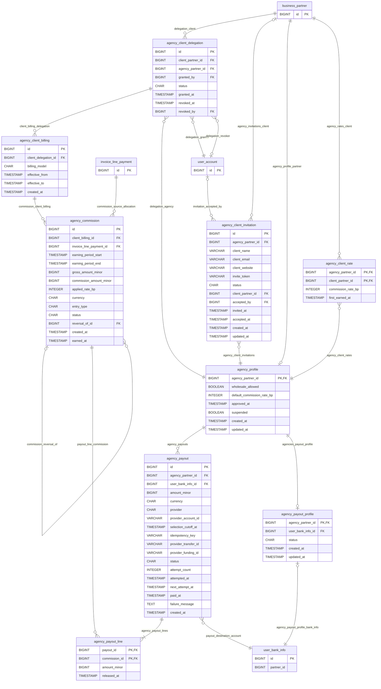
```mermaid
erDiagram

    agency_client_invitation }o--|| agency_profile : "agency_client_invitations"

    business_partner ||--o{ agency_client_delegation : "delegation_client"
    business_partner o|--o{ agency_client_invitation : "agency_invitations_client"
    business_partner ||--o| agency_profile : "agency_profile_partner"
    business_partner ||--o{ agency_client_rate : "agency_rates_client"

    agency_client_rate }o--|| agency_profile : "agency_client_rates"

    agency_profile ||--o{ agency_payout : "agency_payouts"
    agency_profile ||--o| agency_payout_profile : "agencies_payout_profile"

    agency_client_delegation ||--o{ agency_client_billing : "client_billing_delegation"
    agency_client_delegation }o--|| agency_profile : "delegation_agency"

    invoice_line_payment ||--o{ agency_commission : "commission_source_allocation"
    agency_client_billing ||--o{ agency_commission : "commission_client_billing"
    agency_payout ||--|{ agency_payout_line : "agency_payout_lines"
    agency_commission o|--o{ agency_commission : "commission_reversal_of"
    agency_commission ||--o{ agency_payout_line : "payout_line_commission"

    agency_payout_profile |o--|| user_bank_info : "agency_payout_profile_bank_info"
    agency_payout }o--|| user_bank_info : "payout_destination_account"


    agency_client_delegation }o--|| user_account : "delegation_grantor"
    agency_client_delegation }o--o| user_account : "delegation_revoker"
    user_account o|--o{ agency_client_invitation : "invitation_accepted_by"

    agency_profile {
        BIGINT agency_partner_id PK,FK
        BOOLEAN wholesale_allowed
        INTEGER default_commission_rate_bp
        TIMESTAMP approved_at
        BOOLEAN suspended
        TIMESTAMP created_at
        TIMESTAMP updated_at
    }
    agency_client_invitation {
        BIGINT id PK
        BIGINT agency_partner_id FK
        VARCHAR client_name
        VARCHAR client_email
        VARCHAR client_website
        VARCHAR invite_token
        CHAR status
        BIGINT client_partner_id FK
        BIGINT accepted_by FK
        TIMESTAMP invited_at
        TIMESTAMP accepted_at
        TIMESTAMP created_at
        TIMESTAMP updated_at
    }
    agency_client_delegation {
        BIGINT id PK
        BIGINT client_partner_id FK
        BIGINT agency_partner_id FK
        BIGINT granted_by FK
        CHAR status
        TIMESTAMP granted_at
        TIMESTAMP revoked_at
        BIGINT revoked_by FK
    }
    agency_client_billing {
        BIGINT id PK
        BIGINT client_delegation_id FK
        CHAR billing_model
        TIMESTAMP effective_from
        TIMESTAMP effective_to
        TIMESTAMP created_at
    }
    agency_payout_profile {
        BIGINT agency_partner_id PK,FK
        BIGINT user_bank_info_id FK
        CHAR status
        TIMESTAMP created_at
        TIMESTAMP updated_at
    }
    agency_client_rate {
        BIGINT agency_partner_id PK,FK
        BIGINT client_partner_id PK,FK
        INTEGER commission_rate_bp
        TIMESTAMP first_earned_at
    }
    agency_commission {
        BIGINT id PK
        BIGINT client_billing_id FK
        BIGINT invoice_line_payment_id FK
        TIMESTAMP earning_period_start
        TIMESTAMP earning_period_end
        BIGINT gross_amount_minor
        BIGINT commission_amount_minor
        INTEGER applied_rate_bp
        CHAR currency
        CHAR entry_type
        CHAR status
        BIGINT reversal_of_id FK
        TIMESTAMP created_at
        TIMESTAMP earned_at
    }
    agency_payout {
        BIGINT id PK
        BIGINT agency_partner_id FK
        BIGINT user_bank_info_id FK
        BIGINT amount_minor
        CHAR currency
        CHAR provider
        VARCHAR provider_account_id
        TIMESTAMP selection_cutoff_at
        VARCHAR idempotency_key
        VARCHAR provider_transfer_id
        VARCHAR provider_funding_id
        CHAR status
        INTEGER attempt_count
        TIMESTAMP attempted_at
        TIMESTAMP next_attempt_at
        TIMESTAMP paid_at
        TEXT failure_message
        TIMESTAMP created_at
    }
    agency_payout_line {
        BIGINT payout_id PK,FK
        BIGINT commission_id PK,FK
        BIGINT amount_minor
        TIMESTAMP released_at
    }
    business_partner {
        BIGINT id PK
    }
    user_account {
        BIGINT id PK
    }
    user_bank_info {
        BIGINT id PK
        BIGINT partner_id
    }
    invoice_line_payment {
        BIGINT id PK
    }
```
