# Keel

Shared Go module providing infrastructure for backend projects built on the hexagonal (ports & adapters) architecture. Keel started as an ORM library and evolved into a full-stack application framework: configuration, secrets, logging, persistence, REST, auth, payments, messaging, push notifications, object storage, and background workers — all behind small ports with multiple adapters.

## Why Keel Exists

Keel factors the highly abstracted backend code that was repeating across multiple Go services into generic, drop-in components. Consumers import `keel`, wire the adapters they need, and keep their codebase focused on domain logic.

## Upgrading

This README describes the current package. Per-version migration guides — what
changed, breaking notes, adoption steps — live in machine-readable form in
[`migration_guide.json`](migration_guide.json) (newest first, keyed by semver;
`jq '.migrations[0]' migration_guide.json` shows the latest).

## Architecture

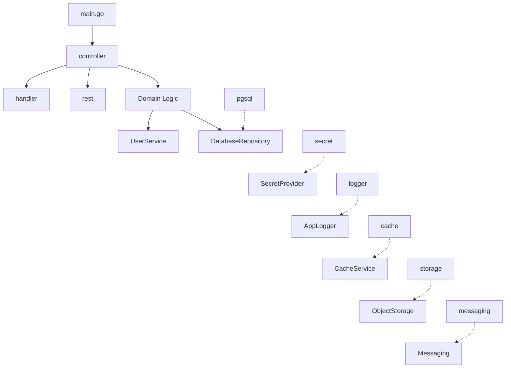

## Package Overview

| Package | Description |
|---------|-------------|
| `common` | Type conversion helpers (`AsString`, `AsInt64`, etc.), string/DB helpers (`NullIfEmpty`, `Slugify`, `GenerateNumericCode`, `ParseDBTimestamp`), email/URL domain helpers (`DomainFromEmail`, `HostFromURL`, `RegistrableDomain`, `DomainsMatch`, `IsPublicDomain`), HTTP response utilities (`WriteJSON`, `WriteError`/`WriteJSONError`), shared HTTP client, bootstrap flag variables, and `BaseConfig` / `common.Config` — the DB-backed runtime configuration (see **Runtime Configuration**) |
| `model` | Domain-agnostic models: `TableDefinition`, `TableColumn`, `ForeignKey`, `UserSession`, `PasswordPolicy`, `QueryResult`, `AppError`, `UserMenu`, `DeviceToken`, `TableChangeLog` |
| `port` | Interface definitions for all pluggable components — **including database access** (`DatabaseRepository`, `QueryService`, `TxQueryService`, `TableService`, `TxView`), plus auth, cache, storage, messaging, login, ID generation, quota, web socket, table change logger, `TrustGuard` admission checks, `FieldCatalog` schema introspection. Depend on these, not on concrete `pgsql`/`data` types. |
| `data` | `AbstractRepository`, `AbstractTableService` (embed-only bases that implement the `port` DB interfaces), file-based `TableLogger`, Snowflake bigint id generator |
| `pgsql` | PostgreSQL implementation using `pgx/v5` — repository, table service, query service, tx-bound query service, tx view. For typed reads against a fixed schema, use [`pgx.CollectRows[T]`](https://pkg.go.dev/github.com/jackc/pgx/v5#CollectRows) directly (already in scope; no keel wrapper needed); reserve `QueryService.Query` for metadata-driven dynamic-schema reads where the `[][]any` shape is intentional. |
| `schema` | YAML-based schema definition + seed loader, plus the `schemagen` model used by `cmd/schemagen` to emit DDL/DML for any supported dialect |
| `schema/dialect` | DDL dialects (PostgreSQL, MySQL) consumed by `schemagen` |
| `cmd/schemagen` | CLI tool that converts `schema/*.yml` files into DDL + seed SQL |
| `user` | `UserService` interface + `LocalUserService` (password / 2FA / OTP / refresh tokens / trusted devices / social login / phone-first auth / consent capture / device-token registry / account deletion) and `RegistrationService` (email-confirmation, OAuth-verified, OAuth + active session) |
| `rest` | Metadata-driven REST engine that reads API definitions from database tables (`rest_api_header`, `rest_api_child`) and generates CRUD endpoints automatically with parent-child relations |
| `handler` | `AbstractHandler` (JWT session parsing + helpers, plus `JSON`/`JSONPublic` body→handler adapter), `PublicHandler` (login with 2FA support), `SecurityHandler` (2FA setup/verify/disable, trusted devices, account deletion), `ProfileHandler` (self-service profile edit + email/phone verify-before-apply), `OTPHandler` (phone/email OTP authentication), `ConsentHandler` (record a consent + export consent history), `SocialLoginHandler` (Google/Apple social login), `PaymentHandler` (webhooks + checkout), `PushHandler` (device-token register/revoke), `RestHandler` (generic CRUD), `CacheHandler` (application data + TypeScript table generation), `CSRF` (double-submit-cookie helper), `AdminSessionStore` (opaque-token in-memory session), `TrustedDeviceCookie` (HttpOnly+Secure+Strict cookie for the 2FA-bypass secret) |
| `crypto` | At-rest field encryption: AES-256-GCM `Seal`/`Open`/`IsSealed`/`DecodeKEK` for TOTP seeds, refresh tokens, vault values; `EncryptToken`/`DecryptToken` string wrappers (`enc:v1:` envelope) for tokens at rest |
| `service` | Cross-cutting services that bind multiple ports: `APIKeyService` (issue/lookup/revoke), `APIKeyAuthMiddleware`, JWT `SSOMiddleware`, `HttpBackend` (HTTP server with hardened defaults), `QuotaServiceDb` (`port.QuotaService` impl) |
| `guard` | Composable `guard.TrustGuard` admission checks for write/queue tools: `DuplicateGuard` (debounce, returns the in-flight id via `guard.DuplicateError`), `MaxCountGuard` / `MinCountGuard` (rate cap / floor), `MinAgeGuard`, composed by `GuardChain`. App-owned named SQL + thresholds injected; no mcp-go dependency. |
| `mcp` | MCP server layer over `mark3labs/mcp-go`: `BaseServer` (stdio/SSE/Streamable HTTP), name-keyed `ToolProvider`/`ResourceProvider` registry, `{data, _meta}` `Envelopes`, `ResourceFunc` adapter, `TextBundle`. Subpackage `mcp/mcptest` ships manifest/text conformance assertions. See **MCP Server Layer** below. |
| `dispatcher` | `MailClient` (SMTP + HTML + attachments + REST mail API), `LocalNotificationService` (channel-keyed registry), `EmailDispatcher` and `NewSMSDispatcher` (Twilio / Telnyx `port.MessageDispatcher` adapters) |
| `secret` | Secret providers: Local (JSON file), Google Secret Manager, AWS Secrets Manager, Azure Key Vault, Infisical + factory |
| `logger` | Application loggers: File-based, GCP Cloud Logging (structured JSON), AWS CloudWatch, Azure Monitor Logs + factory |
| `cache` | Cache service. Single port covers KV + list + pub/sub. Backends: Redis/Valkey (single-node or Redis-Cluster) and an in-process memory implementation that's the default fallback when no `redis_url` / `valkey_url` is set — that keeps OTP and 2FA-verify rate limits effective without a separate cache server. Passwords sourced from secret (`redis_password` / `valkey_password`). |
| `storage` | Object storage: S3 (AWS + Cloudflare R2), GCS (Google Cloud Storage), Azure Blob. `New(ctx, mode, WithSecretProvider(sp))` sources S3 credentials from the keystore instead of the AWS ambient env chain |
| `messaging` | Pluggable publish/subscribe backends behind `port.MessagePublisher` / `port.MessageSubscriber`. Ships GCP Pub/Sub, AWS SNS+SQS, and NATS JetStream impls plus a mode-driven factory (`NewMessagePublisher` / `NewMessageSubscriber`). |
| `payment` | Stripe / LemonSqueezy webhook processor, signature verifiers, event parsers, Stripe checkout + billing-portal client, SQL-backed webhook log repository |
| `billing` | SaaS billing glue over the basis tables: `AbstractBillingService` (`BillingService` + `SubscriptionLifecycle` + `ProviderBillingStore`), `BillingTerms`/`BillingPeriod` + installment math, `BillingEngine` (`ProviderSubscriptionEngine` / `SelfScheduledEngine`), `ProviderSubscriptionEventHandler` |
| `payout` | Out-bound payouts to partner users: hosted-KYC onboarding, webhook-driven activation, instant cash-out. Pluggable providers (Airwallex / Stripe Connect / Wise) behind `PayoutProvider`, plus `OnboardingService` orchestrating the `user_bank_info` basis table |
| `push` | `port.MessageDispatcher` push implementations — FCM (Firebase Cloud Messaging, covers iOS via APNs + Android + Web) + NoOp fallback + factory |
| `worker` | `JobExecutor` — runs background workers with service registry and heartbeat — and `AbstractWorker`, the embed-only one-call worker bootstrap |
| `outbox` | Transactional outbox: `EnqueueTx` captures an event in the same tx as a domain write; `Worker` is a lease-based QueueWorker that drains `outbox_event` with retry/backoff/dead-letter, delivering via an injected `Dispatcher`. No dual-write race. |
| Table actions (basis) | Metadata-driven custom buttons surfaced in sail's CRUD UIs. Insert one row in basis `table_action` + auth_object + grant; mount a Go handler via `handler.WrapTableAction`. See **Table Actions** below. |

## Runtime Configuration

Most runtime settings live in the database, not in flags or recompiled constants.
`common.BaseConfig` is loaded once at startup from two basis tables and read
everywhere as `common.Config`:

- **`application_config_flag`** — the flag catalog (framework-seeded): `id`,
  `data_type` (`string | int | int64 | float | duration` (seconds) `| bool`),
  `needs_restart`, `default_value`, `description`.
- **`application_config_value`** — per-node assignments: `(node_id, flag_id) ->
  assigned_value`. `node_id` identifies the runtime node/process (matched
  against `--node_id`). Most single-node deployments use 0; multi-node
  deployments assign values per node. The reserved **`node_id = -1`** is a
  shared fallback bucket: a flag with no row for the running node inherits its
  `-1` row, so a value identical across every node is written once instead of
  per node. Absent both, `application_config_flag.default_value` applies.

`Load` resolves each flag **node row → `-1` shared row → `default_value`** (two
LEFT JOINs, `COALESCE` picking the precedence) so every catalogued flag
resolves. `-1` is a config-only sentinel — it never seeds the id generator, so
`--node_id` itself always stays a real writer id in `[0, 1023]`. **Only bootstrap settings stay as
`--flags`** — how to reach the DB, the secret provider, the log sink, and
`--node_id`. Everything else moves to the tables. **Store only non-secret values
here**; a flag like `oauth_signing_key_secret` holds a secret *name*, resolved
through the `SecretProvider`.

```go
// main.go — after the DB connection is up (from bootstrap flags + secrets):
cfg := &BaseConfig{}                 // or your app's embedding type (below)
if err := cfg.Load(ctx, db); err != nil { log.Fatal(err) } // fail loudly — never start on a partial config
common.SetConfig(cfg)                // keel packages read common.Config().SmtpUser, etc.
```

`Load` fails hard on any problem — DB error, an empty catalog, or a catalog
missing framework flag rows — so a misconfigured node refuses to start instead
of running on zero values.

**Extending in a downstream app** — embed `BaseConfig` (no field name) and
override `Load`, reusing the shared fetch so there's only one query:

```go
type AppConfig struct {
    common.BaseConfig
    FeatureX string
    MaxFoo   int
}

func (c *AppConfig) Load(ctx context.Context, db port.DatabaseRepository) error {
    m, err := c.LoadValues(ctx, db) // one SELECT, shared
    if err != nil { return err }
    if err := c.ApplyBase(m); err != nil { return err } // framework flags
    c.FeatureX = c.ParseValueS(m["feature_x"].Value, m["feature_x"].Default)
    c.MaxFoo   = c.ParseValueI(m["max_foo"].Value, m["max_foo"].Default)
    return c.ParseErr() // malformed app values abort the load too
}

// main.go:
app := &AppConfig{}
if err := app.Load(ctx, db); err != nil { log.Fatal(err) }
common.SetConfig(&app.BaseConfig) // keel reads the embedded base…
appPkg.Config  = app             // …your packages read app.FeatureX
```

Both handles point at the same embedded `BaseConfig`, so the framework view and
the app view never diverge. Seed your own flags into `application_config_flag`
alongside keel's.

**Runtime reload.** `application_config_flag` is exposed as a REST resource
(with `application_config_value` nested as its child) under a `setup` menu item,
and carries a non-record-specific **RELOAD** table action (`handler.ReloadConfig`,
wired to `common.ReloadFunc`) that re-applies config live. Set `common.ReloadFunc`
in `main` (see above) to enable it — build a fresh config, `Load` into it, and
publish with `common.SetConfig`; never mutate the live instance. The catalog is
seed-managed and display-only in the UI (`needs_restart` and `default_value` are
marked read-only in `column_display_attribute`; `id` is the PK) — admins assign
per-node `application_config_value` rows, which are full CRUD. `needs_restart`
marks construction-captured settings (server wiring, provider selection,
connection URLs, singleton clients) that a RELOAD cannot re-apply; everything
else is read per request/call via `common.Config()` and takes effect on RELOAD.
The catalog's `default_value` is the only default — there are no compiled
fallbacks, and a malformed value fails the load.

## Quick Start

### 1. Add the dependency

```bash
go get github.com/nauticana/keel@latest
```

Or for local development, add a replace directive in your `go.mod`:

```
replace github.com/nauticana/keel => ../keel
```

### 2. Bootstrap your application

```go
package main

import (
    "context"
    "flag"
    "log"

    "github.com/nauticana/keel/common"
    "github.com/nauticana/keel/data"
    "github.com/nauticana/keel/logger"
    "github.com/nauticana/keel/pgsql"
    "github.com/nauticana/keel/secret"
)

func main() {
    flag.Parse()
    ctx := context.Background()

    // 1. Logger
    journal, _ := logger.NewApplicationLogger("myapp")
    defer journal.Close()

    // 2. Secrets
    secrets, _ := secret.NewSecretProvider(ctx)

    // 2a. Boot-time-fatal keys: use secret.MustGet (v0.5.1-G). Returns
    //     the value or terminates the process via log.Fatalf when the
    //     secret is missing. Use this only at boot for genuinely-required
    //     keys (Stripe key, JWT secret, DB password). NEVER call MustGet
    //     from a request path — Fatalf takes the whole process down.
    jwtSecret := secret.MustGet(ctx, secrets, "jwt_secret")

    // 3. Bigint ID generator (fed into the repository for collision-free ids
    //    in federated deployments). See "Bigint ID Generation" below.
    gen, err := data.NewSnowflakeGenerator(int64(*common.NodeId), data.EpochMs2026)
    if err != nil { log.Fatalf("snowflake: %v", err) }

    // 4. Database
    db, _ := pgsql.NewPgSQLDatabase(ctx, secrets, gen)

    // 5. Wire your controller and run
    _ = jwtSecret // pass to user.NewLocalUserService(...)
    // ...
}
```

### 3. Use the REST engine

```go
import (
    "github.com/nauticana/keel/rest"
    "github.com/nauticana/keel/handler"
)

// Initialize REST service — reads API definitions from DB
restService := &rest.RestService{}
apis, reports, _ := restService.Init(ctx, db)

// Create handlers for each API
for name, api := range apis {
    h := &handler.RestHandler{
        AbstractHandler: handler.AbstractHandler{UserService: userSvc},
        Api:             *api,
    }
    backend.Handle(map[string]func(w, r){
        "/api/v1/" + name:          h.Get,
        "/api/v1/" + name + "/list": h.List,
        "/api/v1/" + name + "/post": h.Post,
    })
}
```

### 4. Run a background worker

For binaries that don't need custom database/quota wiring, embed `worker.AbstractWorker` and call `w.Run(ctx, w)` — it is the one-call entry point:

```go
import (
    "context"
    "flag"
    "log"

    "github.com/nauticana/keel/worker"
)

type AnalyticsWorker struct {
    worker.AbstractWorker // supplies GetHealthcheckPort + Run; reads .Secret in ProcessQueue
}

func (w *AnalyticsWorker) GetOLTPQueries() map[string]string { return analyticsQueries }
func (w *AnalyticsWorker) ProcessQueue(ctx context.Context, journal logger.ApplicationLogger,
    db data.DatabaseRepository, quota port.QuotaService, qs data.QueryService) { /* ... */ }

func main() {
    flag.Parse()
    w := &AnalyticsWorker{worker.AbstractWorker{Caption: "analytics", Interval: 3600, HCPort: 8108}}
    if err := w.Run(context.Background(), w); err != nil {
        log.Fatal(err)
    }
}
```

`Run` builds the standard logger, secret provider, snowflake id generator, pgsql database, and `QuotaServiceDb`, loads the DB-backed runtime config into `common.Config` right after the database is up (set `LoadConfig` when the app embeds `BaseConfig` in its own config type; a load failure aborts startup), publishes the secret provider on `.Secret` before the loop, wires everything into a `JobExecutor`, and runs. The embedder implements only `GetOLTPQueries` plus **one processing contract** — `worker.JobWorker` (`ProcessQueue`, shown above) or `worker.QueueWorker` (`QueueQueries` + `HandleJob`, see the next section); `GetHealthcheckPort` comes from `AbstractWorker`. The `, w` is the concrete instance ("self") — Go has no virtual dispatch, so the embedded base can't reach the embedder's processing methods without it.

Use `JobExecutor` directly when you need to inject extra services or a non-default database flavor:

```go
executor := &worker.JobExecutor{
    Caption:     "analytics",
    Interval:    3600,
    Journal:     journal,
    Worker:      &yourworker.AnalyticsWorker{},
    NewDatabase: func(ctx context.Context, sp port.SecretProvider) (port.DatabaseRepository, error) {
        return pgsql.NewPgSQLDatabase(ctx, sp, gen)
    },
    NewQuota: func(db port.DatabaseRepository) port.QuotaService {
        return &myCustomQuotaService{Repo: db}
    },
}
executor.Run(ctx, secrets)
```

### How the background job scheduler works

keel's background processing is **three layers, each at a different cadence**. Keeping them separate is what makes the design robust: each layer is independently testable and reusable, and a single bad job can never take down the daemon.

```
main: w := &PublishWorker{AbstractWorker{Caption, Interval, HCPort}}; w.Run(ctx, w)
  │
  ├─ AbstractWorker.Run            ── once at startup ──
  │     logger → secret provider (published on .Secret) → snowflake → db → config Load → storage → JobExecutor → Run
  │
  ├─ JobExecutor                   ── the PROCESS: 1 per binary, runs forever ──
  │     health server, service-registry + heartbeat, build db/quota/qs ONCE, panic barrier, ticker
  │     every Interval seconds → one tick:
  │        │
  │        ├─ JobLoop              ── the DRAIN of ONE queue: per tick ──
  │        │     Reclaim(ctx)            demote stale 'A' claims (crashed runs) → 'P'
  │        │     Run(ctx, handle):       poll pending → claim each atomically → if won:
  │        │        │
  │        │        └─ HandleJob   ── ONE job: per claimed row ──
  │        │              the worker's business logic for a single job; returns error
```

| Layer | Type | Scope / cadence | Responsibility |
|---|---|---|---|
| Process | `JobExecutor` | one per binary, runs forever | health check, service registry + heartbeat, build db/quota/QS once, ticker, panic recovery |
| Drain | `JobLoop` | one per queue, per tick | reclaim stale claims, poll pending, claim atomically, dispatch each claimed job |
| One job | `HandleJob` / `ProcessQueue` | per claimed row / per tick | the worker's business logic |

**Two worker contracts.** A worker implements exactly one:

- **`QueueWorker`** (recommended for queue drainers) — supply the queue identity and one-job logic; the framework owns the drain. `JobExecutor` detects the contract, builds the `JobLoop` once, and drives `Reclaim` + `Run(HandleJob)` each tick:

  ```go
  type PublishWorker struct{ worker.AbstractWorker }

  func (w *PublishWorker) GetOLTPQueries() map[string]string { return publishQueries }
  func (w *PublishWorker) QueueQueries() (pending, claim, reclaim, name string) {
      return qPendingPublish, qClaimPublish, qReclaimPublish, "publish"
  }
  func (w *PublishWorker) HandleJob(ctx context.Context, journal logger.ApplicationLogger,
      db data.DatabaseRepository, quota port.QuotaService, qs data.QueryService,
      jobID int64, row []any) error {
      // process exactly one job; return err to surface it loudly (framework logs it)
  }
  ```

- **`JobWorker`** (custom / multi-queue / non-queue) — own the whole per-tick pass in `ProcessQueue`. Use this when a tick drains several queues (run multiple `JobLoop`s yourself) or does non-queue work (aggregation, sweeps).

**Why `JobLoop` is a separate class, not folded into `JobExecutor`:** (1) one process can drain several queues — N loops per tick; (2) it is unit-testable with a fake `QueryService` (claim-won / claim-lost / reclaim / handler-error paths) with no HTTP/registry/ticker scaffolding; (3) it is reusable outside a daemon (a CLI one-shot drain or backfill). `JobExecutor` *drives* a `JobLoop`; it does not *become* one. The driver lives in `JobExecutor` because that is where the worker is held as an interface, so it can call `HandleJob` polymorphically.

**Queue table convention.** Status flows `P` (pending) → `A` (active/claimed) → done, with `R` for retry. The claim is an atomic `UPDATE … SET status='A' WHERE id=? AND status IN ('P','R') RETURNING id` so two nodes can't both win. `Reclaim` demotes rows stuck in `A` (a worker that crashed mid-job) back to `P` after a grace period. Route a retryable failure to `R` with a `scheduled_time`, and have the pending query select `R` rows whose time has arrived — backoff is a handler concern, not the loop's.

## Quota Service

`port.QuotaService` enforces per-partner subscription limits. `service.QuotaServiceDb` is the standard implementation: it reads caps from `subscription_quota` (joined to the partner's active `partner_plan_subscription`), caches them per partner (1-hour TTL, singleflight-collapsed), and is **fail-closed** — no active plan, or a resource absent from the plan, denies. A cap of `-1` means unlimited.

```go
allowed, err := quota.CheckQuota(ctx, partnerID, "MEDIA", 1) // room for 1 more?
hasAddon, err := quota.CheckAddon(ctx, partnerID, "PRO_LOCATIONS")
remainingQuota, err := quota.GetPartnerQuota(ctx, partnerID int64, "PRO_LOCATIONS", 20)
quota.LogUsage(ctx, partnerID, "API_CALLS", 1, "public-api")
```

### Two resource categories

How a resource's **current usage** is measured depends on whether it has a count query:

| Category | Usage source | Semantics | Examples |
|---|---|---|---|
| **Live-count** | a `COUNT(*)` query keyed by resource id | concurrent — deletes free quota | `MAX_DOMAINS`, `MEDIA`, `LOCATION` |
| **Metered** | `SUM(usage_ledger)` windowed by `period_type` (`D`/`M`/…/`L`) | cumulative — `LogUsage` ticks it up | `API_CALLS`, `AI_CREDITS` |

Keel ships exactly one default live-count query — `MAX_DOMAINS` (over `partner_domain`, a keel table). Everything else defaults to the ledger.

### Adopting in a downstream project

To live-count **your own** tables, inject per-resource SQL via `QuotaServiceDb.Queries` — a map keyed by **resource id**:

```go
quota := &service.QuotaServiceDb{
    Repo: db,
    Queries: map[string]string{
        // Partner-direct table:
        "BUSINESS": "SELECT COUNT(*) FROM business WHERE partner_id = ? AND deleted_at IS NULL",
        // Child table — scope to the partner via its FK chain:
        "MEDIA":    "SELECT COUNT(*) FROM business_media m JOIN business b ON m.business_id = b.id WHERE b.partner_id = ?",
    },
}
```

Your entries are **merged over** keel's defaults (yours win on a key clash), and `MAX_DOMAINS` stays available unless you override it. Then seed `subscription_resource` + `subscription_quota` rows for those ids and you're done — `CheckQuota` routes to your query automatically. No keel change, no fork.

**Contract for an injected count query** — keel binds and reads it positionally:
- Exactly **one** bound parameter: `partnerID` (a single `?`).
- Returns **one row, one column** = the partner's current usage (an integer).
- Must be **partner-scoped** — directly (`WHERE partner_id = ?`) or via a `JOIN` to a table that has `partner_id`. There's no need for a `partner_id` column on the resource table itself; the join keeps it normalized.
- Use bound `?` params only (never string-interpolate) — these are developer-defined SQL, but treat them as you would any prepared statement.

A `COUNT(*)` query yields concurrent "N at a time" limits; a `SUM(usage_ledger)` query yields lifetime/consumption — the query you write decides the semantics. Caps, caching, period windowing, and fail-closed behavior are unchanged regardless.

## Billing (v1.0.1)

keel already shipped the payment *substrate* — the Stripe/LemonSqueezy webhook pipeline (`payment.WebhookProcessor`), the checkout client (`payment.StripeCheckoutClient`), the quota engine (`service.QuotaServiceDb`), and the canonical `subscription_*` / `partner_plan_subscription` / `usage_ledger` / `payment_method` tables. v1.0.1 adds the repetitive **SaaS billing glue** every downstream project used to re-implement, so a new project gets billing from config + a thin wiring layer. **All additive** — existing consumers compile unchanged; adopt piece by piece.

| New | What it does | Project supplies |
|---|---|---|
| `billing.AbstractBillingService` (+ `BillingService` interface) | `GetSubscription/CreateSubscription/CancelSubscription/GetPlans/GetInvoices/GetUsage` over the basis tables; `GetPlans` returns each plan with its `Prices[]` (one per offered billing interval); `CreateSubscription` takes the chosen interval; returns the `ErrNoSubscription`/`ErrPlanNotFound`/`ErrPriceNotFound` sentinels so a handler can `errors.Is` → 404/400 | `Queries` overrides, `ResourceNames` |
| `billing.AbstractBillingService` provider-driven write helpers (exposed via the `ProviderBillingStore` interface): `RecordProviderInvoice` (writes the `invoice` row on a provider `invoice.paid` so `GetInvoices` isn't empty — keel otherwise writes invoices only in the SelfScheduledEngine; idempotent on `invoice_number`), `LinkCustomer`/`CustomerToken`/`PartnerByCustomer` (partner ↔ provider-customer mapping in the dedicated `partner_billing_customer` table, for the portal + recurring-invoice attribution), `ListPaymentMethods` (the partner's saved methods for sail's `listPaymentMethods()`) | — (call from your `AbstractWebhookEventHandler` hooks / billing bridges) |
| `billing.SubscriptionLifecycle` (on `AbstractBillingService`) | the subscription verbs over `partner_plan_subscription`: `Activate(…, BillingTerms, …)`/`ChangePlan(…, BillingTerms)`/`CreateSubscription(…, BillingTerms)` take the chosen offer (billing cycle + commitment term) — they read the matching `subscription_plan_price` row and snapshot the price, set `renewal_date` (= term end), `next_charge_date`, and the per-installment `monthly_cost`, `CancelByPartner`/`CancelByProviderSubID` (immediate or at-period-end), `ConvertTrial`, `SetSeats`, `Reactivate`, `SetDunningState` | per-plan `activation_mode` + `trial_days` + the `subscription_plan_price` rows; the metadata keys |
| `payment.PaymentEvent.EventKind` + `SubscriptionID`/`InvoiceID` | provider-agnostic normalized event kind (set by every parser) + the ids, so handlers stop digging raw JSON | — |
| `payment.AbstractWebhookEventHandler` | dispatches `EventKind` → nil-safe hooks (`OnCheckoutCompleted/OnInvoicePaid/OnInvoicePaymentFailed/OnSubscriptionUpdated/…`) | the per-kind closures (your domain SQL) |
| `billing.ProviderSubscriptionEventHandler` (a `payment.PaymentEventHandler`) | the **default** provider-driven mapping pre-wired on `AbstractWebhookEventHandler`: `checkout_completed`→`LinkCustomer`+`Activate` (terms from `metadata[BillingCycleKey/TermTypeKey/TermCountKey]`), `invoice_paid`→`RecordProviderInvoice`+`ConvertTrial`, `invoice_payment_failed`→past-due (`X`), `subscription_canceled`→`CancelByProviderSubID` (fallback `CancelByPartner`). Collapses a hand-written `payment_service.go` to wiring | `billing.NewProviderSubscriptionEventHandler(svc, svc, opts)` — partner resolution + metadata keys (`PartnerIDKey`/`PlanIDKey`/`BillingCycleKey`/`TermTypeKey`/`TermCountKey`) |
| `handler.QuotaEnforcer` | HTTP middleware: count new resources in a POST body → `CheckQuota` → **402** + optional post-write `After` hook. `CountOpCodeRows` builds your extractors | `Extractors []ResourceExtractor` |
| `handler.FeatureGate` | entitlement via the `cap<0` flag convention: `FeatureAllowed`, `ListFeatures`, `FilterResponseField` (strip a premium child from a GET) | `Features`, `StripFeature`/`StripRecordKey` |
| `payment.AddonReconciler` + `StripeAddonReconciler` | sync a metered add-on quantity as a subscription item (INERT when `PriceID==""`) | `PriceID`, `DesiredQty`, `SubIDFor` closures |
| `payment.ChargeClient` + `StripeChargeClient` | off-session charge of a vaulted method (handles SCA-required & declines); forwards `ChargeRequest.Metadata` onto the PaymentIntent so the settled charge's webhook can correlate back; `StripeCheckoutClient.PostRaw(ctx, path, form, idemKey)` exposes the 4xx body and threads a caller idempotency key | `ChargeRequest` per call (`AmountMinor`, `IdempotencyKey`, `Metadata`) |
| `worker.AbstractBillingReconciler` | daily backstop pass over active partners (run from a systemd timer, never a CI cron) | `Partners`, `Reconcile` closures |
| `billing.BillingEngine` (+ `ProviderSubscriptionEngine`, `SelfScheduledEngine`) | the recurring-engine strategy: provider runs the cycle **or** we self-schedule (own billing-run → off-session charge → invoice → dunning). `SelfScheduledEngine.BillSubscriptionsFromTable` enables keel's built-in **installment engine**: charges every due `partner_plan_subscription`, computes the per-installment amount from its snapshot terms, advances `next_charge_date`, and rolls to a new term (`auto_renew`) or ends the row at term end | engine choice + the self-scheduled closures (or just the flag for the built-in installment pass) |
| basis: `invoice`/`invoice_line`/`partner_billing_customer`, `subscription_plan_price{plan_id,billing_cycle,term_count,term_type,amount_minor,currency,provider_price_id}` (per-offer prices, nested under `subscription_plan` via `rest_api_child`), `subscription_plan.{activation_mode,trial_days}`, `subscription_addon.{billing_cycle,term_count,term_type}`, `partner_plan_subscription`/`partner_addon_subscription.{billing_cycle,term_count,term_type,amount_minor,renewal_date,next_charge_date,…}` | the missing billing tables/columns | per-env seed of `subscription_plan_price` rows (amount + `provider_price_id`) + `activation_mode` |

### Provider-driven vs self-scheduled

`ProviderSubscriptionEngine` lets Stripe Billing / LemonSqueezy run the recurring cycle (you only react to webhooks via `AbstractWebhookEventHandler`); it carries the provider's recurring fee but is the least code and handles SCA/dunning/retries for you. `SelfScheduledEngine` runs the cycle itself (a systemd-timer billing-run that charges off-session via `ChargeClient`, writes its own `invoice`, and owns dunning + SCA) — it avoids the recurring fee and is maximally provider-agnostic, but you own the money-critical SCA/dunning/proration logic. **Test self-scheduled exhaustively in provider test mode before enabling**, and keep it behind a per-plan flag (it is inert until its closures are wired).

**Money is integer minor units.** Amounts on the charge path are `int64` minor units, never floats: `InvoiceDraft` lines and the authoritative `invoice.total_minor` column carry the exact value, while `invoice.subtotal`/`total` are a display-only major-unit projection. Conversions go through `payment.CurrencyExponent` / `payment.MinorToMajor` / `payment.MajorToMinor`, which derive the decimal places from the ISO‑4217 currency — so JPY (0 minor digits) and BHD (3) are correct, not a hardcoded ×100. Stripe's `amount` is already minor units, so `ChargeRequest.AmountMinor` passes straight through.

**Off-session charge idempotency & atomicity.** `SelfScheduledEngine` charges with the invoice id as Stripe's `Idempotency-Key` (threaded via `StripeCheckoutClient.PostRaw(ctx, path, form, idemKey)`), so a charge retried after an ambiguous transport failure resolves to the original PaymentIntent instead of double-charging. Stripe remembers a key for 24h; a dunning retry past that window is treated as new, so the engine still stops once the invoice flips to paid. The `invoice` header + its lines are written in one `TxQueryService` transaction, so a half-written invoice is never charged.

**Off-session charge metadata.** `ChargeRequest.Metadata map[string]string` is forwarded as PaymentIntent `metadata[k]=v`, so the resulting `charge`/`payment_intent` webhook arrives with the same pairs on `PaymentEvent.Metadata` — the outbound counterpart to the inbound metadata already surfaced to webhook handlers. Use it to carry the originating record's ids (e.g. order/booking id, line splits) and correlate the settled charge back without a Stripe round-trip. It is validated against Stripe's limits **before** the network call (≤49 caller keys, key ≤40 chars, value ≤500 chars; the `idempotency_key` key is reserved); a violation returns the typed `payment.ErrInvalidMetadata` (map to a 4xx at the handler boundary) rather than silently truncating.

### Subscription lifecycle & activation modes

`SubscriptionLifecycle` (default impl on `AbstractBillingService`) owns the verbs every SaaS re-implements over `partner_plan_subscription`. How a checkout *activates* a sub is the plan's **activation mode** (`subscription_plan.activation_mode`, the `SUBSCRIPTION_ACTIVATION_MODE` dictionary) — a small, **open** enum, so a new policy is a dictionary row, not a schema break:

| Mode | Code | Activation |
|---|---|---|
| create-active | `A` | INSERT a fresh active row (provider already created the sub) — the default; preserves the old `CreateSubscription` behavior |
| activate-pending | `P` | flip a pre-seeded `status='P'` row → `'A'` (register-then-pay flows) |
| trial | `T` | start `status='T'` + `trial_end` (from `subscription_plan.trial_days`); `ConvertTrial` flips `T→A` on the first paid invoice |
| free | `F` | active immediately, no provider sub / charge |

These four are mutually-exclusive **policies**. Orthogonal to them are **modifiers** that overlay any policy, so they are *columns, not enum values*: `seats` (seat-based pricing — pairs with `AddonReconciler`), `trial_end`/start-date (scheduling), the engine choice (`ProviderSubscriptionEngine` vs `SelfScheduledEngine`), and the collection method (charge-now vs send-invoice). Putting `seats` in the mode enum would make "seat-based trial" inexpressible — keep it a modifier.

**Billing is three independent axes — payment cadence, commitment term, and price — not one "interval".** Conflating them is the classic billing bug; keel keeps them separate (`billing.BillingTerms`):

- **`billing_cycle`** (`PERIOD_TYPE`: `W`/`M`/`Q`/`A`) — *how often money is taken*. Drives `next_charge_date`.
- **`term_count` × `term_type`** — *the commitment*. Drives `renewal_date` (= **term end**, when it renews or ends) and the no-refund-on-early-cancel behavior. `term_count` is usually 1; `auto_renew` continues past it.
- **`amount_minor`** — *the price for one `term_type` unit* (e.g. $/year), authoritative integer minor units (`payment.MinorToMajor`), never a float. Per-charge = `amount ÷ installments(term_type→billing_cycle)`; contract total = `amount × term_count`.

This expresses every real shape, e.g. **$1000/yr billed monthly** (`billing_cycle=M`, `term=1·A`, `amount=$1000` → twelve $83.33 charges, the last truing up the remainder) or **a 3-year fixed-price contract paid monthly** (`term=3·A`). The offers a plan sells are rows in `subscription_plan_price(plan_id, billing_cycle, term_count, term_type, amount_minor, currency, provider_price_id)` (Stripe Product→Prices), nested under `subscription_plan` via `rest_api_child`; each offer has its own `provider_price_id`. The customer picks one **at checkout** — the terms belong to the *subscription*, not the plan.

- **Activation:** `Activate(…, BillingTerms, …)` / `ChangePlan(…, BillingTerms)` / `CreateSubscription(…, BillingTerms)` read the matching price row (`ErrPriceNotFound` otherwise) and **snapshot** the price onto `partner_plan_subscription`, set `renewal_date = begda + term`, `next_charge_date = begda` (first installment due), `amount_minor`, and the per-installment display `monthly_cost`. All dates are computed in Go and bound — the lifecycle INSERTs carry no dialect-specific `INTERVAL` SQL.
- **Price locks for the term, refreshes on renewal:** the snapshot holds the price steady for the whole committed term, so a long commitment is how you lock a fixed/discount price. At renewal the engine re-reads the current offer and re-snapshots — so a month-to-month sub (1-month term) follows the current price each month, while a 3-year term holds its price for 3 years. If the offer was withdrawn, the term can't renew and the row ends.
- **Cancellation falls out for free:** cancel-at-period-end sets `effective_cancel_date = renewal_date`. A monthly term ends next month; a committed annual/3-yr term keeps billing monthly until the term ends — exactly the discount-commitment rule. `auto_renew` then decides whether a new term begins.
- **Installment engine:** set `SelfScheduledEngine.BillSubscriptionsFromTable = true` and each `RunCycle` charges every due subscription: it computes the installment (exact int64, remainder on the final charge of the term), advances `next_charge_date` by one `billing_cycle`, and at term end either rolls to a new term (`auto_renew`, re-reading the current price) or stops and ends the row. Pure math lives in `BillingTerms`/`InstallmentMinor` (unit-tested); `InstallmentsPerUnit` errors rather than guessing for cycles that don't divide the term unit.
- **Provider-driven path:** `ProviderSubscriptionEventHandler` reads terms from `metadata[BillingCycleKey/TermTypeKey/TermCountKey]` (defaults `billing_cycle`/`term_type`/`term_count`, stamped by the checkout creator from the selected price); a field absent from the metadata falls back to `opts.DefaultTerms` (whose zero value is monthly / 1-month term).
- **Catalog read:** `GetPlans` returns each `Plan` with `Prices []PlanPrice` (cycle, term, `AmountMinor`, major `Amount`, currency, `PriceID`) — the single source of truth for pricing. Build the checkout `AllowedPriceIDs` whitelist from `Prices[].PriceID`.
- **Annual-only products** (e.g. an annually-billed plan) seed a single `A`-term price row per plan and pass `BillingTerms{TermType: PeriodAnnual}` (or, on the provider-driven path, set `opts.DefaultTerms` to the annual offer instead of stamping term metadata); they no longer fork the lifecycle SQL.

`subscription_addon` carries the same `billing_cycle`/`term_count`/`term_type` columns; the built-in installment pass currently covers plan subscriptions (addons via `AddonReconciler` / project closures as before). Multi-currency per term is a future extension (add `currency` to the price PK).

Statuses use the `SUBSCRIPTION_STATUS` dictionary: `A` active · `P` pending payment · `T` trialing · `C` cancelled (voluntary) · `X` expired/past-due (involuntary). `SetDunningState` moves `A↔X`; cancels set `C` (immediate) or `effective_cancel_date` (at-period-end, finalized by `AbstractBillingReconciler`).

*Not* activation modes (handled separately): **metered/usage** (a billing model over an already-active sub), **comp/admin grant** (set `A` via an admin path), and the transitions **change-plan / reactivate / pause** (their own verbs). Further policies — one-time/lifetime, invoice-terms (NET-x), manual/sales-approval — slot into the open dictionary when a project needs them.

> **Note:** `ProviderSubscriptionEventHandler`'s `checkout_completed` always *activates* — it does not detect a plan change, so a re-checkout for a different plan creates a second active row rather than switching. Route upgrades/downgrades through `ChangePlan` (e.g. from `subscription_updated`), not a fresh checkout. Cancels (immediate or at-period-end, by partner or provider-sub-id) act on both active (`A`) and trialing (`T`) subs.

### v0.9.x → v1.0.1 adoption checklist

1. Bump the dependency; run your DB re-init (the new basis tables/columns are additive — regenerate + reinit).
2. Provider-driven billing: register `billing.NewProviderSubscriptionEventHandler(svc, svc, opts)` and your `payment_service.go` collapses to that wiring. (For a non-standard mapping, wire an `AbstractWebhookEventHandler` directly instead.) Either way, delete raw-JSON `subscription`/`invoice` id digging — use `e.SubscriptionID`/`e.InvoiceID`.
3. (Optional) Embed `AbstractBillingService` in your billing service; seed `subscription_plan` (`activation_mode`: paid→`P`, free→`F`, trial→`T`) plus one `subscription_plan_price` row **per offered (billing_cycle, term)** (`amount_minor` = price per `term_type` unit, `provider_price_id`) instead of a Go plan→price/activation map. Annual-only products seed a single `A`-term row and pass `billing.BillingTerms{TermType: billing.PeriodAnnual}`. For keel-run recurring billing set `SelfScheduledEngine.BillSubscriptionsFromTable = true`. **Breaking vs the prior billing API:** prices moved off `subscription_plan` (`monthly_cost`/`annual_cost`/`provider_price_id`) into `subscription_plan_price`; `Activate`/`ChangePlan`/`CreateSubscription` now take a `billing.BillingTerms`; `Plan.PriceID` became `Plan.Prices[].PriceID` and `Plan`/`user.PublicPlan` dropped the `monthlyCost`/`annualCost` fields (read `Prices[]` — the single source of truth); `AbstractBillingService.PriceResolver` was removed; `renewal_date` now means **term end** (the next-charge moment is `next_charge_date`); `ProviderSubscriptionEventHandler` reads `billing_cycle`/`term_type`/`term_count` metadata (was `billing_period`). Migrate plan pricing into the new table and pass the chosen terms.
4. (Optional) Wire `QuotaEnforcer` on your resource-creating POST and `FeatureGate` for premium features.
5. Pick a `BillingEngine`. Provider-driven needs only the webhook hooks; self-scheduled needs the `SelfScheduledEngine` closures + a systemd timer running `AbstractBillingReconciler`/`RunCycle`, fully tested first.

What stays yours: the plan catalog + prices, the resource taxonomy + count SQL, the per-event domain mapping (or just its config when you use `ProviderSubscriptionEventHandler`), add-on economics, feature names, and branding.

## API Key Authentication

Keel ships an end-to-end API-key authentication stack for `/pubapi/*` traffic (REST) and standalone services (e.g. MCP servers exposed over Streamable HTTP). Three pieces, one chain:

```
X-API-Key header → APIKeyAuthMiddleware → APIKeyService.LookupKey → context-injected (partner_id, api_key_id, scopes)
```

### `service.APIKeyService` — key lifecycle + 5-min lookup cache

Manages issued keys: generates the user-visible string, stores its SHA-256 hash + prefix in the `api_key` table, looks up keys with a 5-minute process-local cache, enforces expiry and quotas via `port.QuotaService`. The schema is shipped in `basis.sql` (`api_key` + sequence).

```go
apiKeys := &service.APIKeyService{
    DB:           db,
    QuotaService: quota,
    Journal:      journal,
    KeyPrefix:    "myapp_",  // required — panics at Init if empty
    // QuotaResource: "API_CALLS", // default
    // QuotaCaption:  "public-api", // default
}
apiKeys.Init(ctx)

// Issuing a key (typically from a JWT-authed admin handler):
plainKey, prefix, err := apiKeys.InsertKey(ctx, partnerID, "production-key", "businesses,search")
// plainKey is "myapp_<32-hex>"; show to user once and discard.
```

`KeyPrefix` is intentionally required (panic-on-empty at `Init`) so per-product prefixes never collide across consumers (e.g. `myapp_*`, `inventory_*`). `LookupKey` caches by SHA-256 hash for 5 minutes; `InvalidateKey(hash)` clears a single entry on rotation/revocation. `LogUsage` increments the configured quota resource and updates `last_used_at`.

### `service.APIKeyAuthMiddleware` — the reusable factory

Generic `func(http.Handler) http.Handler` factory that validates `X-API-Key`, looks up via `APIKeyService`, enforces expiry, touches `last_used` async, and injects `common.PartnerID / ApiKeyID / Scopes` into the request context. Quota is a separate concern: compose `service.QuotaMiddleware` after auth so one gate covers X-API-Key and OAuth alike. **No path gating** — wrap arbitrary subtrees yourself.

```go
auth := service.APIKeyAuthMiddleware(apiKeys, journal) // then: service.QuotaMiddleware(quota, "", "", journal)

// Two typical wirings:

// (1) Inside HttpBackend — gated to /pubapi/* automatically (next section).
// Standard REST setup; no extra code needed.

// (2) Standalone service that should auth every request — e.g. an MCP
// server exposed over Streamable HTTP at https://mcp.example.com/:
http.ListenAndServe(":8090", auth(myHandler))
```

The same context-key constants (`common.PartnerID` etc.) are read by `AbstractHandler.PartnerFromCtx`, `HasScope`, and `RequireScope` — so handlers downstream of either wiring use the same accessors.

### `service.HttpBackend.APIKeyMiddleware` — `/pubapi/*` path gate

`HttpBackend` automatically wraps the inbound chain with `APIKeyMiddleware`, which path-gates on `common.PubapiPrefix` and delegates to `APIKeyAuthMiddleware` for actual validation. Non-`/pubapi/*` requests pass through to `SSOMiddleware` (JWT auth). This is the standard wiring for any consumer using `HttpBackend.Run`:

```go
srv := service.HttpBackend{
    Journal:       journal,
    DB:            db,
    Secrets:       secrets,
    Origin:        common.Config().CORSOrigin,
    UserService:   userSvc,
    QuotaService:  quota,
    ApiKeyService: apiKeys,  // already constructed + Init'd
}
srv.Handle(myRoutes)
srv.Run(ctx)
```

For services that don't use `HttpBackend` (workers exposing healthchecks, MCP servers, etc.), use `APIKeyAuthMiddleware` directly per the example above.

### Configuration

| Source | Key | Purpose |
|---|---|---|
| Field | `APIKeyService.KeyPrefix` | Required. Per-product user-visible prefix (e.g., `"myapp_"`). |
| Field | `APIKeyService.QuotaResource` | Optional. Defaults to `"API_CALLS"`. The resource id passed to `QuotaService.LogUsage` and `CheckQuota`. |
| Field | `APIKeyService.QuotaCaption` | Optional. Defaults to `"public-api"`. The caption recorded in usage rows. |
| Schema | `api_key` table + sequence | Already in keel's `schema/security/14_api_key.yml`. No project-side schema. |

### Database Table

| Table | Purpose |
|---|---|
| `api_key` | Issued keys: `id`, `partner_id`, `key_name`, `key_prefix` (visible), `key_hash` (SHA-256), `scopes` (CSV), `is_active`, `expires_at`, `last_used_at`. |

## OAuth 2.1 Resource Server (v1.2.0)

For OAuth-based clients that won't send a custom `X-API-Key` — notably **ChatGPT Apps SDK** — keel validates access tokens issued by an external authorization server and publishes RFC 9728 discovery metadata. Sits beside the X-API-Key / JWT paths; nothing existing changes.

```
Authorization: Bearer <token> → resource.Middleware → TokenValidator (JWKS RS256) → context-injected (principal, subject, scopes, partner_id)
```

**Delegate the authorization server** (external mode). In this mode keel is the *resource server* (token validation + metadata) and does not issue tokens — front it with an IdP that provides OAuth 2.1 + PKCE + Dynamic Client Registration (Auth0, Stytch, WorkOS, Clerk, Keycloak), and keel verifies that IdP's RS256 tokens against its JWKS. To have keel issue its own tokens instead, use the v1.2.1 local authorization server (above).

### Wiring (standalone — e.g. an MCP server)

```go
// 1. Validator from --oauth_* flags (nil when oauth_issuer is empty; error on misconfig).
validator, err := resource.NewJWTValidatorFromConfig(common.HTTPClient())
if err != nil { log.Fatal(err) }

// 2. Optional account-linking: map token subject → keel partner id (0 = unlinked).
resolve := func(ctx context.Context, p *port.Principal) (int64, error) {
    return myDirectory.PartnerForSubject(ctx, p.Issuer, p.Subject)
}

// 3. Keyless metadata route + Bearer auth on the protected handler.
meta := resource.ProtectedResourceMetadataFromConfig()
mw := resource.Middleware(validator, meta.Resource+resource.ProtectedResourceMetadataPath, journal, resolve)

mux := http.NewServeMux()
mux.HandleFunc(resource.ProtectedResourceMetadataPath, resource.ProtectedResourceMetadataHandler(meta))
mux.Handle("/", mw(mcpHandler)) // tokens required on the MCP route; metadata stays keyless
http.ListenAndServe(":8091", mux)
```

Downstream handlers read identity with the same accessors as the X-API-Key path — `common.PartnerID` (when a resolver maps one) and `common.Scopes` (so `AbstractHandler.HasScope` / `RequireScope` work) — plus `resource.PrincipalFromContext(ctx)` for subject / issuer / raw claims.

### Configuration

| Flag | Purpose |
|---|---|
| `oauth_issuer` | AS issuer URL trusted by the validator. Empty = OAuth disabled. |
| `oauth_jwks_url` | JWKS URL for token signatures (often `<issuer>/.well-known/jwks.json`). |
| `oauth_audience` | Expected token audience = this resource's id (RFC 8707). |
| `oauth_resource` | Canonical resource URL in the metadata doc. Empty → `oauth_audience`. |
| `oauth_scopes_supported` | CSV scopes advertised in metadata. Optional. |

All non-secret. For multiple issuers, construct one `resource.JWTValidator` per issuer and dispatch on the token's `iss`.

## MCP Server Layer (v1.2.4)

`keel/mcp` is the horizontal layer every keel-based MCP server would otherwise copy. It sits on `mark3labs/mcp-go` and reuses keel's existing auth, quota, and query primitives — an MCP server is just another transport in front of the same services. Apps supply only domain logic: concrete tools, their SQL, and their text.

### Tools as objects, not slice indices

A tool implements `mcp.ToolProvider` (`Name()`, `Definition()`, `Handle()`); a browsable resource implements `mcp.ResourceProvider`. `BaseServer.Register` binds each by `Name()`/`URI()`, so registration order is irrelevant and a reordered list can't silently mis-wire a handler.

```go
srv := mcp.NewServer(mcp.ServerConfig{
    Name:         "acme-intel",
    Version:      "1.0.0",
    Instructions: bundle.Instructions(),
    Source:       "acme",                 // stamped into every envelope's _meta.source
    // ClientIPHook defaults to handler.WithClientIPContext (gated by trusted_proxy_cidr)
})
srv.Register(summaryTool, topActionsTool)     // []mcp.ToolProvider
srv.RegisterResource(categoriesResource)      // []mcp.ResourceProvider

// transport chosen in the binary; wrap with keel's APIKey/OAuth middleware for remote
_ = srv.ServeStdio()
```

### Response envelope

`srv.Envelopes()` returns an `Envelopes` builder stamped with the server's `Source`. Tool handlers shape every result as `{data, _meta}`:

```go
env := srv.Envelopes()
return env.WrapWithPagination(rows, limit, offset, len(rows), hasMore), nil
return env.WrapWithProvenance(profile, prov), nil
return mcp.WrapError(err), nil   // tool-execution error, so the model can self-correct
```

The `model.Envelope` / `EnvelopeMeta` / `ProvenanceMeta` / `PaginationMeta` DTOs carry no mcp-go dependency, so an HTTP or chat surface can reuse the same shape.

### Trust guards (write/queue tools)

A retry loop must not flood a worker queue or double-write. Compose `guard` guards into a `GuardChain` and run it before persisting. keel ships the mechanism; the app owns the named SQL and thresholds.

```go
guards := guard.NewGuardChain(
    guard.NewMinAgeGuard("qKeyAge", 7*24*time.Hour),
    guard.NewDuplicateGuard("qDupeJob", 5*time.Minute),         // debounce window
    guard.NewMaxCountGuard("qDailyRate", "daily rate", 100, 24*time.Hour),
)

in := port.GuardInput{PartnerID: pid, DedupKey: dedup, ClientIP: ip, Now: time.Now().UTC()}
if err := guards.Check(ctx, qs, in); err != nil {
    var dup *guard.DuplicateError
    if errors.As(err, &dup) {
        return existingJob(dup.ExistingID), nil   // return the in-flight job, don't re-enqueue
    }
    return mcp.WrapError(err), nil                 // ErrGuardRejected → refuse
}
```

`GuardInput.Now` is injected so guards are deterministic in tests. The `port.TrustGuard` contract takes a `port.GuardQuerier` (which `data.QueryService` satisfies) and is independent of mcp-go — usable from any REST write handler too.

### Manifest conformance

`mcp/mcptest` keeps a published server manifest honest. In a `_test.go`:

```go
mcptest.AssertToolsMatchManifest(t, tools, manifest.ToolNames())
mcptest.AssertToolTextComplete(t, tools, bundle)
```

### What the application owns

Concrete `ToolProvider`/`ResourceProvider` implementations, the named-SQL strings and thresholds the guards run, the populated `BaseTextBundle`, the field-catalog descriptors (core slice + `DescriptorProvider` SQL/mappers), and the published manifest file. keel owns the transport, registry, envelope, guard mechanism, field-catalog merge/dispatch, and conformance helpers.

## Reusable Primitives (upstreamed from downstream services)

Small, generic building blocks that downstream apps were each reinventing — now part of keel. Adopt them by importing the package; no wiring change needed beyond the example below.

### `crypto` — AES-256-GCM seal/open

At-rest encryption for sensitive fields (TOTP seeds, refresh tokens, secret-manager values). Sealed output is tagged `enc:v1:` + base64(nonce‖ciphertext), so callers can dual-read during migration — `IsSealed` distinguishes new vs legacy values, `Open` returns `(nil, false)` on any failure so the caller falls back to plaintext.

```go
import "github.com/nauticana/keel/crypto"

kek, _ := crypto.DecodeKEK(secrets.MustGet(ctx, "field_kek")) // 32-byte AES-256 key, hex-encoded
sealed, _ := crypto.Seal(kek, []byte(totpSeed))               // store in DB
if plain, ok := crypto.Open(kek, row); ok { use(plain) } else { use([]byte(row)) /* legacy */ }
```

### `handler.JSON` / `handler.JSONPublic` — typed JSON endpoint adapter

Eliminates the method-check / auth / decode / dispatch / error-map / write prologue every JSON handler otherwise repeats. Available as methods on `AbstractHandler`, so any handler that embeds it gets them for free. Return `*handler.APIError` to set a specific status; any other error → 500.

```go
type MyHandler struct{ handler.AbstractHandler; svc *MyService }

mux.Handle("/api/v1/widget", h.JSON("POST", func(ctx context.Context, s *model.UserSession, body json.RawMessage) (any, error) {
    var req CreateWidget
    if err := json.Unmarshal(body, &req); err != nil {
        return nil, handler.NewAPIError(http.StatusBadRequest, "bad request: "+err.Error())
    }
    w, err := h.svc.Create(ctx, s.UserID, req)
    if errors.Is(err, ErrConflict) { return nil, handler.NewAPIError(http.StatusConflict, "exists") }
    return w, err
}))

mux.Handle("/public/lookup", h.JSONPublic("GET", func(ctx context.Context, _ json.RawMessage) (any, error) { ... }))
```

### `handler.CSRF` — double-submit-cookie helper

For server-rendered admin pages in downstream services (keel's own JWT API doesn't need this). `Issue` mints a token and sets it in an HttpOnly/Secure/Strict cookie; `Validate` constant-time compares it against the form field. Cookie name / path / TTL are struct fields.

```go
csrf := &handler.CSRF{CookieName: "myapp_csrf", Path: "/", TTL: 2 * time.Hour}
// GET render: tok, _ := csrf.Issue(w); render with hidden <input name="csrf_token" value="{{tok}}">
// POST handler: if !csrf.Validate(r, "csrf_token") { http.Error(w, "forbidden", 403); return }
```

### `handler.AdminSessionStore` — opaque-token in-memory session

Replaces the "cookie value == static admin secret" anti-pattern with a revocable, expiring, server-minted token. Cookies are the caller's concern — the store is just the token→expiry map, so it composes with any handler stack. In-memory: tokens are lost on restart, which is usually the right behavior for an admin/console area.

```go
store := handler.NewAdminSessionStore(2*time.Hour, 10_000)
// login: tok, _ := store.Create(); http.SetCookie(w, ...{Value: tok})
// guard: c, _ := r.Cookie(...); if !store.Valid(c.Value) { http.Error(w, "forbidden", 403); return }
// logout: store.Delete(tok)
```

### `data.ScanRows[T]` — generic `*sql.Rows` scanner

Collapses the `rows.Next` / `rows.Scan` / `rows.Err` boilerplate that recurs once per typed query. Pair it with a single-row scan closure.

```go
type Widget struct{ ID int64; Name string }

rows, err := db.QueryContext(ctx, `SELECT id, name FROM widget WHERE owner = $1`, ownerID)
if err != nil { return nil, err }
widgets, err := data.ScanRows(rows, func(r *sql.Rows) (Widget, error) {
    var w Widget
    return w, r.Scan(&w.ID, &w.Name)
})
```

**For pgx consumers (anything wired through keel/pgsql), use [`pgx.CollectRows[T]`](https://pkg.go.dev/github.com/jackc/pgx/v5#CollectRows) directly** — pgx ships an equivalent helper with the same shape, plus `CollectOneRow`, `AppendRows`, and `ForEachRow` siblings. `data.ScanRows` exists for `database/sql` callers (downstream services with non-pgx stores) where no built-in helper is available.

```go
// pgx-native equivalent — no keel helper needed:
rows, err := pool.Query(ctx, `SELECT id, name FROM widget WHERE owner = $1`, ownerID)
if err != nil { return nil, err }
widgets, err := pgx.CollectRows(rows, func(r pgx.CollectableRow) (Widget, error) {
    var w Widget
    return w, r.Scan(&w.ID, &w.Name)
})
```

For metadata-driven dynamic-schema reads, keep using `QueryService.Query` — the `[][]any` shape is intentional for the REST engine and table-action handlers; replacing it with typed scans would defeat the purpose.

## Two-Factor Authentication (2FA) & Trusted Devices

Keel includes built-in TOTP-based 2FA with trusted device management. The login endpoints (`LoginLocal`, `LoginGmail`) automatically check `TwoFactorEnabled` on the user session and return a conditional response.

### Trusted-device model (v0.9 — server-minted secret, SHA256-at-rest)

The "trusted device" credential is a **server-minted 32-byte secret** kept in an HttpOnly + Secure + SameSite=Strict cookie (default name `keel_td`). The DB stores only the secret's hex SHA256 — never the raw value — and `IsTrustedDevice` constant-time compares against the active rows for the user. This replaces the earlier "client-supplied fingerprint string" pattern, which had two weaknesses: the client picked the value (so a malicious client could re-use a known fingerprint across users), and the value was stored plaintext (so a DB leak handed an attacker direct bypass material).

Lifecycle:
1. `POST /public/2fa/verify` with `trustDevice:true` → server calls `UserService.RegisterTrustedDevice(userID, deviceName)`, which mints a fresh secret, stores its SHA256, and **returns the raw secret** to the handler. The handler immediately sets the `keel_td` cookie via `handler.DefaultTrustedDeviceCookie.Set(w, secret)`. The secret never appears in the JSON response body.
2. On the next `POST /public/login/local` (or `/public/login/gmail`), the handler reads the cookie via `handler.DefaultTrustedDeviceCookie.Get(r)` and passes the value to `IsTrustedDevice`, which hashes it and looks for a matching row. Match → skip 2FA.
3. `POST /api/user/trusted-device/revoke` removes the row; the next request from that device has no usable cookie.

### Login Flow with 2FA

```
POST /public/login/local   (or /public/login/gmail)
  Cookie:  keel_td=<secret> (sent by browser when set during a previous 2FA verify)
  Request: { "username": "...", "password": "..." }

  // If 2FA NOT enabled (or keel_td cookie maps to a trusted row):
  Response: { "token": "jwt...", "userId": 1, "partnerId": 1, "menu": [...], "twoFactorRequired": false }

  // If 2FA enabled AND device NOT trusted:
  Response: { "twoFactorRequired": true, "loginToken": "12345678" }
```

When `twoFactorRequired` is `true`, the frontend redirects to a 2FA verification page and submits the code via the public verify endpoint. The verify request opts into device trust with `trustDevice:true` + an optional human-readable `deviceName`; on success the server sets the `keel_td` cookie.

### Migration from v0.8 trusted-device API (breaking)

Three changes to the public surface:

- **JSON `deviceFingerprint` field removed** from `LoginLocal`, `LoginGmail`, and `Verify2FA` request bodies. The value moves into the `keel_td` cookie, set automatically by the server. Frontends that previously sent the field can drop it — extra fields are ignored.
- **`UserService.RegisterTrustedDevice` signature changed**: `(userID, fingerprint, name) error` → `(userID, name) (secret string, err error)`. Downstream callers that wrap this API must update; the raw `secret` is the value to feed into a cookie (use `handler.DefaultTrustedDeviceCookie.Set` for the default attributes).
- **`TrustedDevice.Fingerprint` field removed** from the `[]TrustedDevice` returned by `GetTrustedDevices` (was leaking the bypass credential to the API). `ID`, `Name`, `LastUsedAt`, `CreatedAt` remain.

**Existing data**: rows written under the old plaintext-fingerprint scheme are orphaned — they will never match a hashed lookup, and expire naturally via their 30-day `expires_at`. No data migration script needed; affected users will be prompted for 2FA on their next login and can opt into "trust this device" again. Downstream apps that need to clean up early can `DELETE FROM user_trusted_device WHERE LENGTH(device_fingerprint) <> 64` (new hashes are exactly 64 hex chars).

**Custom cookie attributes**: instantiate a `handler.TrustedDeviceCookie{Name: ..., Path: ..., TTL: ...}` in your `SecurityHandler`/`PublicHandler` wiring instead of relying on `DefaultTrustedDeviceCookie`.

### Security Endpoints

**Public (no JWT required)** -- used during login-time 2FA verification:

| Method | Path | Description |
|--------|------|-------------|
| POST | `/public/2fa/verify` | Verify TOTP code with `loginToken`, returns JWT on success |
| POST | `/public/2fa/backup-verify` | Verify backup code with `loginToken`, consumes the code |

**Authenticated (JWT required)** -- used for 2FA setup, device management, session revocation, and account deletion:

| Method | Path | Description |
|--------|------|-------------|
| POST | `/api/user/2fa/setup` | Generate TOTP secret, QR URI, and 10 backup codes. **Side effect:** revokes all active refresh tokens (user re-auths on next refresh). |
| POST | `/api/user/2fa/verify` | Confirm 2FA setup by verifying a TOTP code |
| POST | `/api/user/2fa/disable` | Disable 2FA (requires current TOTP code). **Side effect:** revokes all active refresh tokens. |
| GET | `/api/user/trusted-device/list` | List trusted devices for the authenticated user |
| POST | `/api/user/trusted-device/revoke` | Revoke a trusted device by ID. **Side effect:** revokes all active refresh tokens. |
| POST | `/api/user/logout-everywhere` | Revoke every active refresh token (user will re-auth on every device) |
| DELETE | `/api/user/account` | Soft-delete the caller's account (anonymize + cascade revoke). Body `{reason}` optional. Returns 204. |

**Self-service profile (`ProfileHandler`)** -- a logged-in user editing their own account. Construct with a `port.NotificationSender`; mount the routes returned by `GetAuthRoutes()` behind your JWT middleware. Name/locale apply immediately; email/phone are verify-before-apply (a code is sent to the NEW value, change lands on confirm). If `Notify` is nil, phone change returns 503 so email change can ship before an SMS provider is wired.

| Method | Path | Description |
|--------|------|-------------|
| GET | `/api/user/profile` | Read own profile: `firstName`/`lastName`/`email`/`phoneNumber`/`language`/`twoFactorEnabled` |
| POST | `/api/user/profile` | Update own `firstName`/`lastName`/`locale` immediately |
| POST | `/api/user/profile/email` | Request email change — code sent to the new email. Body `{value}` |
| POST | `/api/user/profile/email/confirm` | Apply email change. Body `{value, code}` |
| POST | `/api/user/profile/phone` | Request phone change — code via SMS (503 if `Notify` unset). Body `{value}` |
| POST | `/api/user/profile/phone/confirm` | Apply phone change. Body `{value, code}` |

### Session-hygiene behavior bump (v0.3)

`SetPassword`, `Setup2FA`, `Disable2FA`, and `RevokeTrustedDevice` now invalidate every active refresh token for the user. Rationale: a stale refresh token that survived a credential rotation is an attacker's foothold. Consumers upgrading from v0.2 should expect users to re-authenticate after these events.

The access token (JWT) remains valid until its natural expiry — only the refresh path is affected. For an immediate global logout (e.g., incident response), use the new `/api/user/logout-everywhere` endpoint.

### Single-device session policy (v0.4)

Some roles (ride-share drivers, medical-device operators, any high-trust account) must be signed in on exactly one device at a time. Keel exposes a per-user primitive via `user_account.single_device_session BOOLEAN`:

```go
// Typical pattern: consumer flips the bit on role creation.
if err := userSvc.SetSingleDevicePolicy(driverUserID, true); err != nil { ... }
```

When the bit is on, every call to `CreateRefreshToken(userID)` first revokes all prior active refresh tokens for that user. The device that most recently authenticated is the device that stays signed in. Riders, regular users — default off, normal multi-device behavior.

### Registering Security Routes

`SecurityHandler` provides `GetPublicRoutes()` and `GetAuthRoutes()` methods that return route maps. Any project using keel can register them:

```go
securityHandler := handler.SecurityHandler{
    AbstractHandler: handler.AbstractHandler{UserService: userSvc},
}
srv.Handle(securityHandler.GetPublicRoutes())  // /public/2fa/*
srv.Handle(securityHandler.GetAuthRoutes())    // /api/user/2fa/*, /api/user/trusted-device/*
```

### Database Tables

These tables must exist (defined in `schema/security/`):

| Table | Purpose |
|-------|---------|
| `user_account` | `twofa_enabled`, `twofa_method`, `twofa_secret`, `twofa_backup_codes`, `twofa_enabled_at`, `passtext` (nullable — NULL = social/OTP-only), `deleted_at` (nullable — set by `DeleteAccount`), `status` (`A`/`X`/`E`/`S`/`I`/`D`). |
| `user_trusted_device` | `device_fingerprint`, `device_name`, `trusted_at`, `expires_at` (30-day), `last_seen_at` |
| `user_registration` | Reused for login tokens (`payload='LOGIN'`, 5-minute expiry) |

### Account-deletion semantics

`DeleteAccount` is a **soft delete**, not a hard DELETE. Ride history, invoices, payment records, audit rows — anything that FK's back to `user_account(id)` — stays pointing at the same row. What changes: PII is anonymized (`first_name`→`Deleted`, `last_name`→`User`, `user_email`→`deleted+<id>@local.invalid`, `phone`→NULL, `passtext`→NULL, 2FA cleared, `user_name`→`deleted-<id>`), status flips to `'D'`, `deleted_at` stamps, all refresh tokens revoked, trusted devices deleted, social-provider links deleted, `UserActivityDelete` history row written with the supplied reason.

Consumers that own domain tables cascading off `user_id` (e.g. profiles, history rows, payment records) should implement their own `DeleteAccount` wrapper that runs keel's method plus their cascade in a coordinated flow.

## OTP Authentication (Phone/Email)

Keel includes OTP-based authentication for mobile-first applications. Users can sign in or register using a one-time code. Phone numbers are first-class in v0.3 — raw user input (e.g. `(416) 555-1234`, `416-555-1234`, `+14165551234`) is normalized to E.164 before lookup or insert, and phone registrations write to `user_account.phone` directly (no `user_social_provider` row).

### OTP Flow

```
1. POST /public/otp/send
     { "contact": "(416) 555-1234", "purpose": "register", "defaultRegion": "CA",
       "policyVersion": "v1", "consents": {"privacy_policy": true, "cross_border": true} }
   → server normalizes contact to "+14165551234", creates user with passtext=NULL
     (purpose=register only), records consent if ConsentService is registered.
   Response: { "otpToken": "<32-byte base64>" }

2. Backend generates 6-digit code, stores with 2-minute expiry, sends via NotificationService.

3. POST /public/otp/verify    { "otpToken": "<from step 1>", "code": "847291" }
   Response: { "token": "jwt...", "userId": 42, "partnerId": 1 }
```

`purpose` values: `login` (lookup-or-noop on unknown phone), `register` (lookup-or-create via `GetOrCreateUserByPhone`), `verify` (explicit contact verification). `defaultRegion` is the ISO country code used as a hint when parsing local-format numbers — defaults to `"US"`.

The `otpToken` is a server-issued opaque value (32 random bytes, base64-URL) bound in `Cache` to the user_id for `OTPTokenTTL` (5 minutes). Verify and Resend require the token; an attacker who guesses arbitrary user_ids cannot reach the verify path because the cache lookup fails. The login path returns the same response shape on unknown phone (no SMS dispatched), so an attacker cannot enumerate registered numbers by comparing 200 vs 404.

### OTP Endpoints

| Method | Path | Description |
|--------|------|-------------|
| POST | `/public/otp/send` | Generate and send OTP. Rate limited: **3 per contact / 10 min** (keyed on the E.164 form so unnormalized variants share the quota) AND **10 per caller IP / 10 min** (mitigates SMS-pumping across enumerated numbers). |
| POST | `/public/otp/verify` | Verify OTP code, returns JWT on success (max 5 attempts) |
| POST | `/public/otp/resend` | Clear and regenerate OTP for an existing session |

### Registering OTP Routes

```go
otpHandler := handler.OTPHandler{
    AbstractHandler: handler.AbstractHandler{UserService: userSvc},
    NotificationSvc: notificationSvc,
    Cache:           cacheService,
}
srv.Handle(map[string]func(w, r){
    "/public/otp/send":   otpHandler.SendOTP,
    "/public/otp/verify": otpHandler.VerifyOTP,
    "/public/otp/resend": otpHandler.ResendOTP,
})
```

### Database Tables

| Table | Purpose |
|-------|---------|
| `user_otp` | `user_id`, `code` (6-digit), `purpose`, `expires_at` (2 min), `attempts` (max 5) |

## Social Login (Google & Apple)

Keel supports social login via Google and Apple ID tokens. The handler verifies the token then delegates to a single service entry point that handles the full three-branch ladder atomically.

### Social Login Flow

```
POST /public/login/social  { "provider": "google", "token": "eyJhbG..." }

1. Verify token (Google: tokeninfo endpoint, Apple: JWT decode)
2. Service.GetOrCreateUserFromSocial(...) runs the ladder:
     a. Existing social link on (provider, providerId)?   → return session.
     b. emailVerified && existing account on email?       → link social provider to it.
     c. Otherwise                                         → INSERT user_account + user_social_provider
                                                            in one transaction.
3. Return JWT.

Response: { "token": "jwt...", "userId": 42, "partnerId": 1, "isNewUser": false }
```

Branch (c) runs inside `DatabaseRepository.BeginTx` so a link failure rolls back the orphan `user_account` row. Socially created accounts carry `passtext = NULL`; a subsequent password-login attempt against the same account is rejected with `"password authentication not enabled for this account"` *before* bcrypt runs.

### Service API

```go
GetOrCreateUserFromSocial(
    email, firstName, lastName, phone, provider, providerID string,
    emailVerified bool,
    signupConsent *port.SignupConsent,
) (session *model.UserSession, created bool, err error)
```

This is the only public social-login method on `port.UserService`. The older `CreateUserFromSocial` and `GetUserBySocialProvider` methods were consolidated into this single entry point.

`emailVerified` reflects the provider's verified-email claim. `verifyGoogleToken` extracts Google's `email_verified` (string `"true"`/`"false"`) from the tokeninfo response; `verifyAppleToken` reads it from the Apple ID-token JWT (handles both bool and string encoding). The handler passes the parsed value straight through. When `false`, branch (b) is skipped — which avoids account takeover via an unverified provider-asserted email.

### Apple "Hide My Email" handling

Apple sets `email_verified=true` for relay addresses (`*@privaterelay.appleid.com`), but those addresses are stable per app and **never** match a password-signup account's email. Branch (b) explicitly skips relay addresses so an Apple sign-in cannot link onto an unrelated password account that happens to share the same relay string.

### Email normalization

Every email read/write goes through a private `normalizeEmail` helper (lowercase + trim) at the service boundary: `GetUserByEmail`, `GetOrCreateUserFromSocial`, `insertUserAccount`, and the `RegistrationService` paths (`SendConfirmation`, `Register`, `SendPasswordChangeConfirmation`, `ConfirmPasswordChange`). Result: `Foo@Gmail.com` at password signup and `foo@gmail.com` from a Google ID token collapse to the same canonical row instead of silently creating duplicates.

### Audit trail

Every social-create, social-re-auth, phone-create, and phone-re-auth path now writes a `user_account_history` row:

- `UserActivityCreate` with object name `social:<provider>` or `phone` on first signup.
- `UserActivityLogin` with the same object name on subsequent re-auths.

Combined with the password-login history that was already written by `GetUserByLogin` / `GetUserByEmail`, every authenticated session in the system now leaves an audit-trail entry — answering "when did this user first sign in?" and "when did this social-only user last log in?" without ambiguity.

### Empty contact fields → SQL NULL

`insertUserAccount` converts an empty `email` or `phone` to SQL `NULL` rather than the empty string. The UNIQUE indexes described next treat NULL as distinct, so multiple accounts can legitimately have no email or no phone without colliding. `user_account.user_email` is `NULL`-able as of v0.5; phone-OTP and Apple "Hide My Email" flows that have no usable address rely on this.

### Duplicate prevention — UNIQUE indexes on email and phone

`schema/security/04_user_account.yml` declares two unique indexes:

| Index | Column | What it prevents |
|---|---|---|
| `user_account_email_uq` | `user_email` | Two active accounts with the same canonical email |
| `user_account_phone_uq` | `phone` | Two active accounts with the same E.164 phone |

Combined with the entry-point normalization (`normalizeEmail` lowercases + trims; `normalizePhone` rewrites to E.164), the indexes guarantee at most one active account per contact value. `INSERT` failures are surfaced as typed sentinel errors so callers can route the user to a "sign in instead" flow:

```go
_, err := userSvc.GetOrCreateUserFromSocial(...)
if errors.Is(err, user.ErrDuplicateEmail) { ... }
if errors.Is(err, user.ErrDuplicatePhone) { ... }
```

Soft-deleted accounts (`status='D'`) don't compete for the index — `DeleteAccount` rewrites email to `deleted+<id>@local.invalid` (unique per id) and phone to `NULL` (multiple NULLs allowed). A user can re-register with the same email/phone after deletion.

**Not yet handled:** if two accounts already exist for the same person (one created via email-password, another via phone-OTP) and the user wants to merge them or add the missing contact to an existing account, keel has no built-in flow for that. The UNIQUE indexes prevent *new* duplicates from being created via the standard `GetOrCreateUserFromSocial` / `GetOrCreateUserByPhone` / registration paths, but they do not resolve duplicates that already exist or back a "verified add" flow. That is intentionally deferred until a consumer requires it.

### Social Login Endpoint

| Method | Path | Description |
|--------|------|-------------|
| POST | `/public/login/social` | Authenticate via provider ID token (Google or Apple) |

### Registering Social Login Routes

```go
socialHandler := handler.SocialLoginHandler{
    AbstractHandler: handler.AbstractHandler{UserService: userSvc},
}
srv.Handle(map[string]func(w, r){
    "/public/login/social": socialHandler.LoginSocial,
})
```

### Database Tables

| Table | Purpose |
|-------|---------|
| `user_social_provider` | `user_id`, `provider` (google/apple), `provider_id` (sub claim from token). **Phone is NOT a provider here** — `GetOrCreateUserFromSocial` rejects `provider == "phone"` at runtime; phone registrations live in `user_account.phone` directly and are handled via `GetOrCreateUserByPhone`. |
| `user_account.passtext` | Nullable. NULL means "this account authenticates via social/OTP only; password login is disabled." |

## Consent Capture (PIPEDA / GDPR)

Keel exposes an optional `port.ConsentService` that signup flows (social login, phone OTP) call after account creation. Any consumer that needs regulator-visible consent audit trails can register one at `LocalUserService` construction.

### Consent DB tables

| Table | Purpose |
|-------|---------|
| `consent_policy` | Versioned policy text registry. Unique on `(policy_type, region, version, language)`. |
| `consent_event` | One row per (user × consent_type × policy version) decision. Stores `email_hash` / `phone_hash` fallbacks when the row predates (or isn't tied to) user_account creation — the `phone_hash` links an SMS/10DLC opt-in to its number — plus `client_ip` / `client_user_agent` for the audit trail. `ConsentService.Withdraw` records opt-outs (STOP); `History(subject)` returns the full opt-in/opt-out trail for a user/email/phone (carrier + DSAR export). |

### Wiring

```go
consentSvc, _ := user.NewLocalConsentService(ctx, db, journal)
userSvc, _ := user.NewLocalUserService(ctx, db, jwtSecret, "myapp")
userSvc.ConsentService = consentSvc  // optional; leave nil to skip consent recording
```

Social-login and OTP request bodies accept optional `policyType`, `policyVersion`, `policyRegion`, `policyLanguage`, `region`, and `consents: {<type>: <bool>}` fields. On a new-user signup they're recorded. On re-auth they're ignored. When no `ConsentService` is registered the handlers accept the fields but skip the recording — consumers that don't need consent audit trails are unaffected.

If the user is created but the subsequent consent insert fails, handlers return **HTTP 425 Failed Dependency** with the session context so clients can retry the consent write rather than recreate the account.

### HTTP surface (`ConsentHandler`)

Signup-time recording bundles every consent in the call under one policy version. To record a *single* consent under its own policy after login (e.g. terms acceptance separate from the SMS opt-in), or to let a user export their trail, mount `ConsentHandler`:

```go
consentHandler := handler.ConsentHandler{AbstractHandler: base, Consent: consentSvc}
// merge consentHandler.GetAuthRoutes() into your authenticated route table
```

| Method | Route | Purpose |
|---|---|---|
| POST | `/api/user/consent` | Record one decision. Body `{consentType, consented, policyType, policyVersion, policyRegion?, policyLanguage?, region?, eventRef?}`. Identity (user/email/phone) + IP/UA are taken from the session/request — never the body. `consented=false` is a first-class opt-out. **424** if the referenced `consent_policy` row isn't seeded. |
| GET | `/api/user/consent` | Export the session user's audit trail (`{items:[…]}`, newest first). |

Nil-safe: with `Consent` unset both routes return **503**.

### Canonical consent type labels (port constants)

- `port.ConsentTypePrivacyPolicy`, `port.ConsentTypeTerms`, `port.ConsentTypeCrossBorder`, `port.ConsentTypeVideoOptIn`, `port.ConsentTypeVideoSession`, `port.ConsentTypeMarketing`

Consumers may record additional custom types just by passing their own string — keel does not enforce the label set.

### Spoof-safe client IP — `bhandler.TrustedClientIP(r)`

The `client_ip` column on `consent_event` is part of the regulator-visible audit trail; it must reflect the real caller, not whatever an attacker types into `X-Forwarded-For`. Keel ships `handler.TrustedClientIP(r *http.Request) string` (exported in v0.4.7) that honors `X-Forwarded-For` / `X-Real-IP` **only** when the inbound socket address falls inside `trusted_proxy_cidr`. With an empty CIDR config the helper returns `RemoteAddr`'s host part — a fail-closed default per P0-15.

Use this helper anywhere a downstream consumer would otherwise reach for `r.RemoteAddr` or read forwarding headers directly:

```go
import "github.com/nauticana/keel/handler"

func (h *MyHandler) Register(w http.ResponseWriter, r *http.Request) {
    consent := &port.SignupConsent{
        ClientIP:        handler.TrustedClientIP(r), // gated; safe behind a trusted proxy
        ClientUserAgent: r.UserAgent(),
        // …
    }
}
```

Keel's own consent-capturing handlers (`SocialLoginHandler.LoginSocial`, the OTP flows, the Google login activity-history insert) all use this helper internally, so they're safe by default. Consumers writing their own handlers should call it explicitly rather than re-implementing the gate — the obvious-looking `r.Header.Get("X-Forwarded-For")` shortcut accepts spoofed values whenever the deployment isn't behind a CIDR-restricted proxy.

**Production startup check.** The empty-config default is library-friendly but operationally dangerous: every audit row would attribute traffic to the load balancer's peer IP and the spoof-gated `TrustedClientIP` would never promote XFF. Production binaries should call:

```go
flag.Parse()
handler.MustRequireTrustedProxyCIDR() // log.Fatalf if trusted_proxy_cidr is empty / all-invalid
```

(Or the error-returning variant `handler.RequireTrustedProxyCIDR()` if you prefer to handle the failure yourself.) This converts the silently-broken-attribution failure mode into a deploy-time crash. The validator parses the CIDR list with the same logic the runtime uses — a config that splits to zero valid nets fails too, since that's behaviorally identical to "empty" at request time. Skip the helper for unit tests, localhost-only deployments, or consumers that genuinely do not record client IPs.

## Push Notifications (FCM)

Keel ships a push-notification subsystem behind `port.MessageDispatcher` (legacy alias `port.PushProvider`). The `device_token` table stores per-user FCM tokens (iOS devices use Firebase's APNs integration, so one provider covers both platforms). Non-mobile consumers get a NoOp provider by default and are unaffected.

### Wiring

Select the provider via `push_mode=fcm|noop` (default `noop`):

```go
// In main.go, after UserService is constructed:
pushProvider, err := push.NewPushProvider(ctx, userSvc, journal)
if err != nil { ... }

// Register the mobile-facing endpoints on SecurityHandler or a dedicated PushHandler:
pushHandler := &handler.PushHandler{
    AbstractHandler: handler.AbstractHandler{UserService: userSvc},
}
srv.Handle(pushHandler.GetAuthRoutes())
```

FCM mode resolves credentials via Google's Application Default Credentials. Three working setups, listed best-first:

1. **Workload Identity on GCP** — running on GCE / GKE / Cloud Run with an attached service account that holds `roles/firebasecloudmessaging.admin` (or a custom role with `cloudmessaging.messages.create`). The Firebase SDK pulls a short-lived token from the metadata server; nothing to mount, nothing to rotate. **Recommended.**
2. **Workload Identity Federation on AWS/other** — set `GOOGLE_APPLICATION_CREDENTIALS` to a credential-config JSON that exchanges the local-cloud OIDC token for a GCP access token. No static key on disk.
3. **Static service-account key (legacy)** — set `GOOGLE_APPLICATION_CREDENTIALS` to a downloaded Firebase Admin SDK private-key JSON. Works everywhere but you own the rotation; GCP org policies increasingly force short key lifetimes (~14 days) making this unsustainable. Prefer (1) or (2).

### Device-token endpoints

| Method | Path | Description |
|--------|------|-------------|
| POST | `/api/push/register` | Idempotent upsert. Body: `{ "platform": "I\|A\|W", "token": "<fcm token>", "appVersion": "1.2.3", "deviceModel": "iPhone 15" }`. Called by the mobile SDK after each login + on token-refresh events. |
| POST | `/api/push/revoke` | Mark a token inactive. Body: `{ "token": "<fcm token>" }`. Called on explicit logout. |

### Dispatch

Server-side code that decides a push is warranted calls the provider directly:

```go
err := pushProvider.Dispatch(ctx, userID, "Order shipped", "Your order is on the way", map[string]string{
    "order_id": "o-123",
    "type":     "order_shipped",
})
```

FCM-reported stale tokens (the `registration-token-not-registered` error) are automatically marked `is_active=false` so subsequent dispatches skip them. `Dispatch` against a user with zero active devices is a silent no-op, not an error.

### device_token table

Columns: `id`, `user_id` (FK → user_account), `platform` (`CHAR(1)` — I=iOS, A=Android, W=Web), `token` (TEXT — FCM token), `app_version`, `device_model`, `is_active`, `created_at`, `updated_at`, `last_seen_at`. Unique index on `(user_id, token)` to keep re-registration idempotent. `DeleteAccount` cascades to deactivate every token for the user.

## Notifications & Messaging

Keel exposes a channel-keyed dispatcher abstraction so consumer code can fire `notif.Send({Channel: "email", UserID: 42, Title: ...})` without caring whether email/push/sms is wired up underneath. Email (SMTP/API via `MailClient`), push (FCM), and SMS (Twilio) all ship in keel; custom channels are consumer-supplied implementations of the same interface.

### `port.MessageDispatcher`

Single-channel delivery contract with two entry points. **`Dispatch`** resolves a `userID` to the channel-specific address (via `RecipientResolver`) and sends. **`Send`** delivers to an explicit `to` address — for recipients that aren't users (e.g. a business contact during claim verification). Returning `nil` for an empty/absent address is correct (the channel-level "nobody to notify" no-op); reserve non-nil errors for transport failures.

```go
type MessageDispatcher interface {
    Dispatch(ctx context.Context, userID int, title, body string, data map[string]string) error
    Send(ctx context.Context, to string, title, body string, data map[string]string) error
}
```

`Send`'s arguments carry per-channel meaning:

- **Email** — `to` = address, `title` = subject, `body` = text.
- **SMS** — `to` = E.164 or a national number; `data["country"]` = ISO-3166 region used to normalize a national number to E.164 (ignored once `to` starts with `+`); `title` is unused (SMS has no subject).
- **Push** — `to` = device token; `title`/`body` = the notification. Unlike `Dispatch`, `Send` can't auto-revoke a stale token (no userID), so the caller handles delivery errors.

> Note the two same-named methods at different layers: `NotificationService.Send(req)` is the **router** (picks a channel, then calls `Dispatch` or the dispatcher's `Send`); `MessageDispatcher.Send(ctx, to, …)` is a **channel's** explicit-address delivery.

`port.PushProvider` is now a deprecated alias of `MessageDispatcher` (same shape). FCM continues to satisfy both names; new code should depend on `MessageDispatcher`.

### `dispatcher.LocalNotificationService` — registry + router

Default keel implementation of `port.NotificationService`. Holds a channel name → dispatcher map; `Send(req)` routes by `req.Channel`, then delivers via the dispatcher's `Send` when `req.To` is set (explicit recipient) or `Dispatch` otherwise (resolve from `req.UserID`):

```go
notif := dispatcher.NewLocalNotificationService()
notif.Register("email", &dispatcher.EmailDispatcher{Mail: mailClient, Users: userSvc})
notif.Register("push",  fcmProvider)             // FCMPushProvider satisfies MessageDispatcher
notif.Register("sms",   smsDispatcher)           // dispatcher.NewSMSDispatcher (Twilio / Telnyx)

// Resolve the recipient from a userID:
err := notif.Send(ctx, port.NotificationRequest{
    UserID:  42,
    Channel: "email",
    Title:   "Receipt",
    Body:    "Thanks for your order…",
})

// …or deliver to an explicit address (no userID needed):
err = notif.Send(ctx, port.NotificationRequest{
    Channel: "sms",
    To:      "9493946318",
    Data:    map[string]string{"country": "US"}, // → +19493946318
    Body:    "Your verification code is 123456",
})
```

Unknown channel returns a typed error so callers can distinguish "channel not configured" from "dispatcher failed". `Channels()` lists registered channel names — useful for admin/diagnostic surfaces.

### `dispatcher.EmailDispatcher` — MailClient adapter

Wraps the existing `MailClient` so SMTP/API email plugs into the dispatcher registry:

```go
&dispatcher.EmailDispatcher{Mail: mailClient, Users: userSvc}
```

`Users` is a `port.RecipientResolver` (just `EmailFor` and `PhoneFor`) — the keel-shipped `LocalUserService` satisfies it directly, and consumers can wire a thinner address-only resolver (e.g. one backed by a recipient cache) if they don't want dispatcher to import the user package. Returns `nil` (no-op) when the user has no email on file — correct for deleted accounts and social-only signups that never set one.

### `dispatcher.NewSMSDispatcher` — provider-agnostic SMS (Twilio / Telnyx)

Sends SMS through the provider selected by config `sms_provider`. Both providers implement `port.MessageDispatcher` behind one factory, so they plug into `LocalNotificationService` on the `"sms"` channel and share the same sender-pool model — switching providers is a config + secret change, no code edits:

```go
sms, err := dispatcher.NewSMSDispatcher(ctx, secrets, userSvc, journal)
if err != nil {
    journal.Error("SMS disabled: " + err.Error()) // run cleanly with SMS off
} else {
    notif.Register("sms", sms)
}
```

Configuration:

| Source | Key | Purpose |
|---|---|---|
| Config | `sms_provider` | `twilio` (default) or `telnyx`; empty disables SMS |
| Config | `sms_service_sid` | Sender pool: Twilio Messaging Service SID (`MG…`) or Telnyx Messaging Profile ID |
| Secret provider | `sms_auth_token` | Twilio auth token, **or** Telnyx API key (Bearer) |
| Secret provider | `sms_account_sid` | Twilio account SID (basic-auth username). Unused by Telnyx. |

The sender pool (`sms_service_sid`) routes each outbound message to the right sender (CA long code, US 10DLC, UK/EU alphanumeric, …) from the senders/numbers attached in the provider console — adding regional coverage is a console-only change. **Telnyx** is the cost-effective alternative to Twilio and uses the same interface here (Bearer-auth JSON to the Messages v2 API vs Twilio's basic-auth form POST — the difference is entirely inside the provider adapter).

The factory fails fast when the provider is unset/unknown or a required credential/id is missing, so callers `Register` only on success. `Dispatch` resolves `userID` to an E.164 phone via the `RecipientResolver`, returning `nil` when there's no phone on file (the "nobody to notify" no-op); `Send` targets an explicit recipient. Non-2xx and transport failures are wrapped as errors so the worker logs and leaves the notification pending for retry.

## Payments (Stripe & LemonSqueezy)

Keel ships a provider-agnostic payment layer: HMAC signature verification,
idempotent webhook processing, canonical event parsing, and a Stripe checkout
client. Each consumer project implements a ~15-line `PaymentEventHandler`
that maps canonical events into its domain actions (activate subscription,
record ride payment, extend license, etc.). See
[SHARED_PAYMENT.md](SHARED_PAYMENT.md) for the full design rationale.

### Webhook Lifecycle

```
POST /public/webhook/{provider}
  1. Read body (MaxBytesReader, 256 KiB cap)
  2. Peek event id + type via EventParser.PeekEventMeta — reject empty id
  3. Verify signature BEFORE any DB write — bad signatures never touch storage
  4. Idempotency check on (provider, event_id) — duplicates → return without dispatching
  5. Insert log row (unique-index race guard catches concurrent retries)
  6. Parse into canonical PaymentEvent (amount in major units, metadata flattened)
  7. Call project's PaymentEventHandler.OnPaymentEvent(event)
  8. AfterHandler hook (optional, idempotent) — e.g. attach SetupIntent's PaymentMethod
  9. Update log status → 'P' (processed), 'F' (failed), 'S' (skipped), or 'D' (duplicate)
```

The verify-before-log ordering is load-bearing: an attacker pumping invalid-signature requests never reaches the DB, so `payment_webhook_log` cannot be filled with unsigned junk. Step 4 is the cheap-path dedupe; step 5's unique index on `(provider, event_id)` is the authoritative race guard for the TOCTOU window between them.

### Signature replay protection per provider

| Provider | Signed payload | Replay window | What stops replay |
|---|---|---|---|
| **Stripe** | `<unix_ts>.<body>` (HMAC-SHA256) | ±5 min (`Stripe-Signature: t=...,v1=...`) | Bidirectional timestamp window in `StripeSignatureVerifier`. A captured signed pair becomes invalid 5 minutes after Stripe emitted it. |
| **LemonSqueezy** | `<body>` (HMAC-SHA256, no timestamp) | none — see below | **The `(provider, event_id)` unique index on `payment_webhook_log` is the sole replay defence.** |

**LemonSqueezy specifics — read carefully if you integrate a non-LemonSqueezy.com source against this verifier.** LemonSqueezy's webhook signature is HMAC-SHA256 over the raw body alone — no timestamp is in the signed payload, so the signature itself stays valid forever. The only thing preventing an attacker who captured a single legitimate webhook+signature pair from replaying it indefinitely is the idempotency layer:

- [payment/parser_lemosqueezy.go](payment/parser_lemosqueezy.go) **rejects** payloads whose `data.id` is missing (no synthetic-id fallback).
- [payment/webhook_processor.go](payment/webhook_processor.go) treats any prior `(provider, event_id)` row — even in status 'R' (in flight) — as a duplicate and never re-dispatches.
- The unique index on `payment_webhook_log(provider, event_id)` is the authoritative race guard at the DB layer.

Operational implications:

1. If you point this verifier at a webhook source that emits non-unique or stable `data.id` values, idempotency collapses and the first signed event will be the only one ever processed. Verify your source emits a fresh id per event.
2. If your `payment_webhook_log` schema lacks the UNIQUE constraint on `(provider, event_id)`, replay protection degrades to a non-atomic "exists check then insert" — a concurrent retry can sneak past. The v0.9 schema-invariant check (see `SQLWebhookRepository.VerifySchema`) asserts the constraint at boot; run it.
3. LemonSqueezy webhooks are NOT safe to log to a non-deduplicating sink and replay later by hand — the deduplication is the security boundary.

### Core Interfaces

Defined in [port/payment.go](port/payment.go):

| Interface | Purpose |
|-----------|---------|
| `PaymentEventHandler` | Implemented by each project — maps `PaymentEvent` → domain action |
| `SignatureVerifier` | Validates a provider's webhook signature |
| `EventParser` | Converts raw provider body → canonical `PaymentEvent` |
| `PaymentProvider` | Bundles name + signature header + verifier + parser |
| `WebhookRepository` | Persists log rows (idempotency + audit) — `SQLWebhookRepository` is the default |
| `CheckoutClient` | Outbound checkout / billing-portal API (Stripe impl: `StripeCheckoutClient`) |

### Wiring Example

```go
import (
    "github.com/nauticana/keel/handler"
    "github.com/nauticana/keel/payment"
)

stripeClient := payment.NewStripeCheckoutClient(secrets)

repo := payment.NewSQLWebhookRepository(db)
processor := payment.NewWebhookProcessor(
    repo,
    journal,
    payment.NewStripeProvider(secrets),
    payment.NewLemonSqueezyProvider(secrets),
).
    // v0.5.1-E: fail-closed on dashboard misconfiguration. Events not
    // listed here are logged with status='S' and never dispatched.
    // Omit the call to allow every signed event through (v0.5.0 behavior).
    WithAllowedEventTypes(
        "checkout.session.completed",
        "setup_intent.succeeded",
        "invoice.paid",
        "customer.subscription.deleted",
    )

// v0.5.1-F: optional follow-up hook for cross-cutting work that must
// run AFTER OnPaymentEvent succeeded — e.g. attaching a freshly-saved
// PaymentMethod to the customer for default-payment-method routing.
// MUST be idempotent — Stripe re-delivers on a 5xx and OnPaymentEvent
// will run again on the retry.
processor.AfterHandler = func(ctx context.Context, e *payment.PaymentEvent) error {
    if e.EventType != "setup_intent.succeeded" || e.SetupIntentID == "" {
        return nil
    }
    // Read the SetupIntent to recover the PaymentMethod, then attach it.
    body, err := stripeClient.Get(ctx, "/setup_intents/"+e.SetupIntentID, nil)
    if err != nil { return err }
    // ... extract pm_xxx from body, then:
    _, err = stripeClient.Post(ctx, "/payment_methods/pm_xxx/attach",
        url.Values{"customer": {e.CustomerID}})
    return err
}

paymentHandler := &handler.AbstractPaymentHandler{
    Processor: processor,
    Handler:   &myDomainHandler{db: db},       // implements port.PaymentEventHandler
    Checkout:  stripeClient,
    Journal:   journal,
}

srv.Handle(map[string]func(http.ResponseWriter, *http.Request){
    "/public/webhook/stripe":       paymentHandler.HandleStripeWebhook,
    "/public/webhook/lemonsqueezy": paymentHandler.HandleLemonSqueezyWebhook,
    "/api/billing/checkout":        paymentHandler.CreateCheckout,
})
```

### Project-Specific Handler

`OnPaymentEvent` receives a typed `*PaymentEvent` with the setup-mode fields pre-extracted as of v0.5.1 — branch on `e.Mode == "setup"` instead of unmarshalling `e.RawPayload`. The JWT-gated checkout path also injects `user_id` into metadata automatically (v0.5.1-A), so consumers no longer round-trip the id through the client.

```go
func (h *myDomainHandler) OnPaymentEvent(ctx context.Context, e *payment.PaymentEvent) error {
    userID := e.Metadata["user_id"] // auto-injected by CreateCheckout for JWT-gated callers
    switch e.EventType {
    case "checkout.session.completed":
        if e.Mode == "setup" {
            // PaymentMethod-capture flow; the SetupIntent fires its own event.
            return nil
        }
        return h.activateSubscription(ctx, userID, e.Metadata["plan"], e.MinorUnits)
    case "setup_intent.succeeded":
        // e.SetupIntentID and e.CustomerID are pre-extracted (v0.5.1-D).
        return h.recordPaymentMethod(ctx, userID, e.SetupIntentID, e.CustomerID)
    case "invoice.paid":
        return h.recordRenewal(ctx, e)
    case "customer.subscription.deleted":
        return h.cancelSubscription(ctx, userID)
    }
    return nil
}
```

### Outbound Stripe API calls — `StripeCheckoutClient.Get` / `Post` (v0.5.1-C)

Webhook handlers and after-hooks often need to read or mutate Stripe resources synchronously (e.g. expand a SetupIntent to get the attached PaymentMethod, or attach a PaymentMethod to a Customer). Use the same `StripeCheckoutClient` you already constructed for `CreateCheckoutSession` — it carries the secret, retry budget, and 1 MiB response cap.

```go
// Read: GET /v1/setup_intents/{id}?expand[]=payment_method
body, err := client.Get(ctx, "/setup_intents/"+id, url.Values{
    "expand[]": {"payment_method"},
})

// Write: POST /v1/payment_methods/{id}/attach
form := url.Values{"customer": {"cus_abc"}}
body, err := client.Post(ctx, "/payment_methods/pm_xyz/attach", form)
```

`Get` does NOT send the `Idempotency-Key` header (Stripe rejects it on read endpoints); `Post` does. Both apply the shared 5xx/429 retry with exponential backoff.

### Secrets

| Secret name | Used by | Purpose |
|-------------|---------|---------|
| `stripe_secret_key` | `StripeCheckoutClient` | Basic-auth to `api.stripe.com` |
| `stripe_webhook_secret` | `StripeSignatureVerifier` | HMAC key for Stripe webhook validation |
| `lemonsqueezy_webhook_secret` | `LemonSqueezySignatureVerifier` | HMAC key for LS webhook validation |

### Database Tables

| Table | Purpose |
|-------|---------|
| `payment_webhook_log` | Raw inbound webhooks — idempotency key on `(provider, event_id)` + audit |
| `payment_method` | Partner-owned provider customer tokens (`stripe cus_...`) |
| `payment_record` | Completed / failed / refunded transactions |

### Checkout modes

`POST /api/billing/checkout` accepts three Stripe modes via the `mode` field:

| Mode | `priceId` required | Use case |
|------|--------------------|----------|
| `subscription` (default) | yes — must be in `AllowedPriceIDs` | Recurring billing — subscriptions, seats |
| `payment` | yes — must be in `AllowedPriceIDs` | One-off charge |
| `setup` | **must be empty** | Capture a payment method without charging (SetupIntent flow). `line_items` are omitted from the Stripe request; a non-empty `priceId` here is rejected because Stripe ignores it anyway. |

Setup mode returns the same `{ "checkoutUrl": "..." }` shape; Stripe persists a SetupIntent on the resulting session that consumers can read from `setup_intent.succeeded` webhooks. The handler enforces the `mode` allowlist (one of the three values above) before reaching the port — unknown modes fail with 400, not a downstream Stripe 502.

**`AllowedRedirectHosts` matching (v0.4.7+):** an entry without a colon matches the URL's hostname port-insensitively, so listing `"app.example"` accepts both `https://app.example/` and `https://app.example:8443/`. An entry containing a colon (e.g. `"app.example:8443"`) stays port-strict — useful when you intentionally want to gate by exact `host:port`. Pre-v0.4.7 matched against the raw `host:port` pair, which silently 400'd legitimate non-default ports.

### What each project still owns

- **Event → domain action mapping** — your `OnPaymentEvent` switch.
- **Plan ↔ Price ID table** — hardcode, flag, or DB; keel's checkout takes any `price_xxx`.
- **Accounting / journaling** — keel is provider-neutral; per-project until a pattern clearly repeats.
- **Success / cancel URLs** — computed from each project's `ConfirmBaseURL`.

## Payout (Airwallex / Stripe Connect / Wise)

`keel/payout` is the out-bound counterpart to `keel/payment`. It abstracts the third-party providers that hold bank routing details and disburse payouts to partner users (marketplace sellers, contractors, creators, gig-economy workers — keel is domain-neutral). The application never sees raw IBAN / SWIFT / ABA / institution numbers; only the provider's account handle.

### Provider feature matrix

| Provider | Code | Onboarding | Webhook | Instant payout | Notes |
|---|---|:--:|:--:|:--:|---|
| Airwallex      | `AW` | ✅ | ✅ | ✅ | Hosted KYC + connected-account model. Production-shaped. |
| Stripe Connect | `SC` | ✅ | ✅ | ✅ | Express accounts via `/v1/account_links`. Requires email at onboarding. |
| Wise           | `WI` | ✅ | ✅ | ⚠️ unfunded | Email-recipient model — no hosted KYC; **transfer is created but not funded** (see below). |

### `PayoutProvider` interface

```go
type PayoutProvider interface {
    Code() string
    StartOnboarding(ctx, StartOnboardingInput) (*PayoutOnboardingSession, error)
    VerifyAndParseWebhook(headers, rawBody) (*PayoutWebhookEvent, error)
    RequestInstantPayout(ctx, InstantPayoutInput) (*InstantPayoutResult, error)
}
```

Events are normalized into a small taxonomy (`account.created` / `activated` / `updated` / `rejected`) — service layer never reads provider-native event names. Webhook signature verification is per-provider HMAC; failures surface as the typed error and the handler replies 401 to trigger provider retry with backoff.

### `user_bank_info` table (basis)

Ships with basis.sql. Keyed on `(user_id, partner_id)` — one bank account per (user, partner). Multi-partner users get one row per partner, with the option to **share one `provider_account_id` across rows** via `OnboardingService.LinkReusableAccount` (no provider call — the account already cleared KYC on the provider's side).

Columns: `country_code`, `currency`, `account_holder_name`, `billing_address`, `tax_id_type`, `tax_id_encrypted`, `provider`, `provider_account_id`, `provider_agreement`, `provider_onboarded_at`. PartnerSpecific auto-filter applies via the `partner_id` FK.

### Downstream wiring

```go
provider, err := payout.NewProvider(*kcommon.PayoutProvider, apiKey, webhookSecret, journal)
svc := &payout.OnboardingService{
    DB:                  db,
    Provider:            provider,
    OnboardingReturnURL: *kcommon.PayoutReturnURL,
    WebhookCallbackURL:  *kcommon.PayoutWebhookURL,
    Journal:             journal,
}
h := &handler.PayoutHandler{
    AbstractHandler: handler.AbstractHandler{UserService: userSvc},
    PayoutService:   svc,
}
mux.Handle(h.Routes(kcommon.RestPrefix + "/v1"))
```

Routes registered:

| Method | Path | Auth | Purpose |
|---|---|---|---|
| POST | `/api/v1/payout/onboard/start` | session | Mint hosted-KYC link |
| POST | `/api/v1/payout/reusable`      | session | List user's other-partner accounts |
| POST | `/api/v1/payout/reusable/link` | session | Reuse an account on the current partner |
| POST | `/api/v1/payout/status`        | session | "Onboarding complete?" boolean |
| POST | `/api/v1/webhook/payout/{AW\|SC\|WI}` | signature | Provider webhook intake |

### Flags

| Flag | Default | Purpose |
|---|---|---|
| `payout_provider` | `AW` | Active provider code (`AW` / `SC` / `WI`) |
| `payout_return_url` | (empty) | Deep-link the provider redirects to after hosted KYC |
| `payout_webhook_url` | (empty) | Public host the provider posts webhooks to |
| `airwallex_api_base` | `https://api-demo.airwallex.com` | Airwallex REST API base — flip to `https://api.airwallex.com` for production |
| `wise_api_base` | `https://api.sandbox.transferwise.tech` | Wise Platform REST API base — flip to `https://api.wise.com` for production |
| `wise_profile_id` | (empty) | Wise platform profile id (numeric). **Required** when `payout_provider=WI` |

### Wise specifics — recipient model + funding gap

Wise's Platform API does not have a hosted KYC flow for platform-paid recipients. Bank details flow through the platform's own UI, then the platform creates the recipient via API. To stay within `user_bank_info`'s schema (no IBAN/sort_code/BIC columns), the keel implementation uses **`type=email` recipients** — Wise sends the recipient an email claim link and they enter their own bank details on Wise's side. `StartOnboarding` returns an empty `URL` and a numeric recipient id in `ExternalAccountID`; sail's frontend should render "linked, awaiting recipient email confirmation" when `URL` is empty.

**Funding is not wired.** `RequestInstantPayout` creates the Wise transfer via `POST /v3/profiles/{profile}/quotes` + `POST /v1/transfers`, but it does NOT call `POST /v3/profiles/{profile}/transfers/{id}/payments` to fund it. Wise's funding endpoint requires SCA challenge handling (browser-based 2FA / approval) that keel does not surface today. After `RequestInstantPayout` returns successfully, the transfer sits in `status="incoming_payment_waiting"` indefinitely until something funds it.

Three options for downstream apps:

1. **Manual funding from the Wise dashboard.** Cheapest path. An operator logs into Wise and clicks "Pay" on the transfer. Fine for low-volume / B2B use cases.
2. **Bridge to a downstream funding worker.** The app polls or listens for Wise webhook `transfers#updated → status=incoming_payment_waiting`, then calls `/v3/profiles/.../payments` from a context that can handle SCA (typically a browser-bridge flow).
3. **Skip Wise.** Stripe Connect's `transfers` API funds atomically; Airwallex's `payouts` API does the same. Wise is the odd one out — its split-quote-then-fund model is by design.

If you intend to ship Wise-backed payouts to production, choice 2 is the realistic path. Track the Wise transfer state alongside your payout ledger and surface the unfunded state to operators / the recipient until the payment leg lands.

### Secrets

| Secret | Required | Source |
|---|---|---|
| `payout_provider_key` | yes (when payouts enabled) | Provider dashboard — API key / bearer token |
| `payout_webhook_secret` | yes (when payouts enabled) | Same dashboard — HMAC signing key |

### What the application owns

`OnboardingService` deliberately stops at the bank-info table. The calling application is responsible for:

- **Fee / minimum / cooldown** policy on `RequestInstantPayout`. Keel runs the transfer; the application gates whether it should.
- **Payout ledger** — recording the returned `ProviderPayoutID` against the application's domain table.
- **Idempotency cache** — Valkey dedupe keyed on `RawEventID` is recommended for high-volume webhooks.

## Table Actions

`table_action` is a basis table that surfaces custom buttons in sail's generic CRUD screens (table_list, table_detail, table_search) — collapsing the five-piece boilerplate every "Set Default" / "Enable" / "Calculate" / "Assign" button used to need (handler + route + Angular button + click handler + permission grant) down to **one seed row + one Go handler + one auth grant**.

### Schema

```sql
CREATE TABLE table_action (
    table_name      VARCHAR(80)  NOT NULL,
    action_name     VARCHAR(30)  NOT NULL,
    caption         VARCHAR(80)  NOT NULL,
    icon            VARCHAR(40),
    record_specific BOOLEAN      NOT NULL DEFAULT FALSE,
    method_name     VARCHAR(80),
    display_order   SMALLINT     NOT NULL DEFAULT 10,
    confirm_message VARCHAR(200),
    PRIMARY KEY (table_name, action_name)
);
```

`record_specific=TRUE` renders the button next to each row's edit/delete icons. `record_specific=FALSE` renders it on the toolbar next to "New Record".

`action_name` is lowercase; the framework uppercases it for authorization lookups. Names that collide with generic-CRUD subpaths (`list`, `get`, `post`, `delete`, `get-paginated`) are rejected at REST service boot — fail-fast safety net.

### Authorization

Each table that owns custom actions registers its **own** `authorization_object`. The action becomes an `authorization_object_action` row under it. This keeps per-table namespacing — `ASSIGN` on `PROJECT_WBS_ITEM` is a distinct grant from `ASSIGN` on `ORDER_LINE`.

```yaml
- table: authorization_object
  rows:
    - [USER_PAYMENT_METHOD, "User Payment Method Actions"]

- table: authorization_object_action
  rows:
    - [USER_PAYMENT_METHOD, SET_DEFAULT, "Set Default"]

- table: authorization_role_permission
  rows:
    - [APP_USER, USER_PAYMENT_METHOD, SET_DEFAULT, "user_payment_method"]
```

The `low_limit` column carries the table_name (lowercase), matched the same way as standard `TABLE` CRUD grants: an **exact** scope match or a literal `'*'` grants access (KR-003). Glob patterns other than `'*'` and `low_limit`/`high_limit` ranges are **not** evaluated — `QCheckAuthorization` filters them out, so a grant whose `low_limit` is neither the exact value nor `'*'` silently denies. Use one grant row per scope, or `'*'` for all.

### URL convention

`POST /api/v1/{table_name}/{action_name}` — no `/action/` segment, version segment matches the table's `rest_api_header.version`. Request body carries the record's primary key columns (record-specific) or `{}` (table-level).

Override via the `table_action.method_name` column when two tables need to route to one shared handler — keel uses `{method_name}` in place of `{table}/{action_name}` on the URL.

### Backend wiring

Downstream apps register the handler in their existing `Routes(prefix)` map, wrapped in `handler.WrapTableAction` for the auth gate:

```go
func (h *UserPaymentMethodHandler) Routes(prefix string) map[string]http.HandlerFunc {
    return map[string]http.HandlerFunc{
        handler.TableActionPath(prefix, "user_payment_method", "set_default"):
            handler.WrapTableAction(h.DB, h.UserService,
                "USER_PAYMENT_METHOD", "SET_DEFAULT", "user_payment_method",
                h.SetDefault),
    }
}
```

`handler.TableActionPath(prefix, table, action)` returns the conventional URL. `handler.WrapTableAction` runs the auth check before delegating to the inner handler — denied callers get 403 (RFC 7807).

### Frontend behaviour

Sail's `BaseTable.getActions(recordSpecific)` returns the `TableAction[]` for the active table, sorted by `displayOrder`. The three CRUD components consume it:

- `table_list` and `table_detail` render record-specific actions next to edit/delete and table-level actions next to "New Record".
- `table_search` renders table-level actions only (no per-row context).

Each render is gated by `BaseAuthService.canExecute(authorityObject, authorityCheck, tableName)`. Click fires `BackendService.executeAction(action.method, body)` — for record-specific actions the body is the row's primary key (lifted via `BaseTable.primaryKeyValues`); for table-level it's `{}`. The list re-fetches on success.

### What the application owns

- The Go method that runs when the button is clicked (writes to the DB, calls keel services, etc.).
- The auth grant deciding which roles can fire the action.
- Optional confirm-prompt text on the `table_action` row.
- The icon name (any Material icon) per row.

### What sail / keel own

- Button rendering, ordering, permission gating, click → HTTP dispatch, primary-key extraction, list-refresh-on-success.
- Reserved-subpath safety guard at boot.

## Multi-Cloud Support

Keel supports multiple cloud providers through its port/adapter pattern:

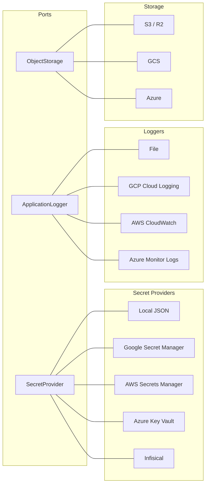

Selection is driven by flag variables:
- `--secret_mode=local|gsm|aws|azure|infisical`
  - `azure` reads from Azure Key Vault; set `--azure_keyvault_url=https://<vault>.vault.azure.net/`. Auth uses `azidentity.DefaultAzureCredential` (managed identity on Azure VM/AKS, or the `AZURE_*` env fallback), so no secret material passes through the process config.
  - `infisical` reads from [Infisical](https://infisical.com) — the production-grade option for deployments **not** on AWS/GCP/Azure (so they need not fall back to the local `secrets.json` file). Set `--infisical_project_id`, `--infisical_environment` (default `prod`), and `--infisical_host` (default `https://app.infisical.com`; override for a self-hosted instance). Auth uses an Infisical **machine identity** via Universal Auth: the SDK reads `INFISICAL_UNIVERSAL_AUTH_CLIENT_ID` / `INFISICAL_UNIVERSAL_AUTH_CLIENT_SECRET` from the environment, so — like the gsm/aws/azure backends — the credential is owned by the vendor SDK's chain and never passes through a keel flag. Universal Auth is chosen because it is platform-agnostic; the native AWS/Azure/GCP/Kubernetes machine-identity methods only apply when running on that platform.
- `--log_type=local|gcp|aws|azure`
  - `azure` ships records to Azure Monitor / Log Analytics via the Logs Ingestion API; set `--azure_logs_endpoint` (DCE), `--azure_logs_dcr` (rule immutable id), and `--azure_logs_stream`. Auth uses `azidentity.DefaultAzureCredential` (managed identity with the "Monitoring Metrics Publisher" role on the DCR). `gcp` already emits structured JSON to stdout, which Azure container platforms (AKS / Container Apps / App Service) and the Azure Monitor Agent on VMs also ingest — use `azure` only when you need the app to push directly to a Log Analytics table.
- `storage_mode=s3|gcs|azure`
  - Build a backend with `storage.New(ctx, common.Config().StorageMode)`; it is also wired onto `HttpBackend.Storage` and `JobExecutor.Storage` (populated by `worker.AbstractWorker.Run` when `storage_mode` is set), so app code calls `svc.Storage.Upload(...)` and `svc.Storage.PublicURL(...)`. Empty `storage_mode` disables storage (the field stays `nil`).
  - **Cloudflare R2 / S3-compatible**: use `s3` plus `s3_endpoint=https://<account>.r2.cloudflarestorage.com` (this switches the client to path-style addressing). `s3_endpoint` replaces the former `S3_ENDPOINT` env var. AWS/R2 credentials still resolve through the AWS SDK's own chain (`AWS_ACCESS_KEY_ID` / `AWS_SECRET_ACCESS_KEY`, `AWS_REGION=auto` for R2) — that is the SDK's concern, not a keel knob.
  - **Public URLs**: `ObjectStorage.PublicURL(bucket, key)` returns a stable, non-expiring served URL (no signing, no API call) for publicly-readable buckets. GCS → `https://storage.googleapis.com/<bucket>/<key>`; S3/R2 → `<storage_public_base_url>/<key>` (set `storage_public_base_url` to an R2 custom domain or `*.r2.dev` host — the bucket is not in the path because the domain already maps to it; empty returns `""`); Azure → `<account-url>/<container>/<key>`. Use `GetSignedURL` instead when the bucket is private.
  - **Azure**: requires `storage_account_url=https://<account>.blob.core.windows.net/`; auth via `azidentity.DefaultAzureCredential`.
- `messaging_mode=gcp|aws|nats`

## Messaging (publisher / subscriber)

Keel ships a portable pub/sub abstraction so app code can publish events without knowing which broker is wired underneath:

```go
type MessagePublisher interface {
    Publish(ctx context.Context, topic string, data []byte, attributes map[string]string) error
    Close() error
}

type MessageSubscriber interface {
    Subscribe(ctx context.Context, subscription string, handler MessageHandler) error
    Close() error
}

type MessageHandler func(ctx context.Context, msg *Message) error

type Message struct {
    ID         string
    Data       []byte
    Attributes map[string]string
    Ack        func()
    Nack       func()
}
```

### Backends

| Mode | Publisher | Subscriber | Config |
|------|-----------|------------|--------|
| `gcp` | `PubSubPublisher` (Cloud Pub/Sub) | `PubSubSubscriber` | `--gcp_project_id` |
| `aws` | `SNSPublisher` (looks up topic ARN by name) | `SQSSubscriber` (long-poll, ack via `DeleteMessage`, nack via `ChangeMessageVisibility(0)`) | Standard AWS SDK credentials chain |
| `nats` | `NATSPublisher` (JetStream, work-queue retention, lazy stream creation) | `NATSSubscriber` (durable pull consumer; `MaxDeliver=3`, `AckWait=30s`) | `nats_url`; optional `nats_name` config + `nats_creds_secret` (secret NAME holding the .creds content) |

The factory dispatches on the `messaging_mode` flag:

```go
pub, err := messaging.NewMessagePublisher(ctx, common.Config().MessagingMode, secrets)
if err != nil {
    journal.Error("publisher unavailable: " + err.Error())
}

sub, err := messaging.NewMessageSubscriber(ctx, common.Config().MessagingMode, secrets)
```

Empty / unknown modes return an error — deployments fail fast on misconfiguration. Callers that want graceful degradation (e.g. notifications fall back to DB-only when publishing is unavailable) treat the error as "broker not configured" and continue without the publisher.

### NATS direct connection

`messaging.NATSConnect(ctx, secrets)` returns a raw `*nats.Conn` for callers that need plain NATS (e.g. WebSocket fan-out hubs that want low-latency core pub/sub without JetStream overhead). It honors the same `nats_url` / `nats_name` / `nats_creds_secret` configuration used by the JetStream publisher and subscriber, so a single deployment configures all three from one set of values.

## Bigint ID Generation

Primary-key ids on tables are minted one of two ways:

1. **PostgreSQL sequence** — a table declares `sequence:` in its YAML, `nextval('<seq>')` fills the id. The historical default; still used by most tables.
2. **Snowflake-style bigint generator** — a table declares `id BIGINT` with no `sequence:` block; ids come from an injected `port.BigintGenerator`. This is how `user_account.id` works in v0.5+.

### Why Snowflake

In a federated deployment (one central identity plane + per-region data planes), more than one writer may end up inserting into the same table. PostgreSQL sequences are per-database and cannot guarantee global uniqueness across independent databases. A Snowflake id embeds the writer's `node_id` in the id itself, so 1024 independent writers can coexist in a shared id space with zero collisions.

A full 128-bit GUID does not fit in `BIGINT`. Snowflake trades down to 64 bits cleanly:

```
MSB -------------------------- 63 usable bits (sign bit = 0) -------------------------- LSB
[41 bits: ms since 2026-01-01][10 bits: node_id (0..1023)][12 bits: per-ms sequence]
```

One node emits up to 4096 ids/ms (~4M/s). The 41-bit timestamp spans ~69 years.

### Components

| File | What it is |
|------|------------|
| [port/id_generator.go](port/id_generator.go) | `BigintGenerator` interface — `NextID() int64` |
| [data/generator_snowflake.go](data/generator_snowflake.go) | `SnowflakeGenerator` implementation + `NewSnowflakeGenerator(nodeID, epochMs)` + `EpochMs2026` |
| [common/variables.go](common/variables.go) | `--node_id` flag (default 0) |

### DI flow

The host app creates **one** `*SnowflakeGenerator` at startup and injects it into `pgsql.NewPgSQLDatabase`. Keel threads it through:

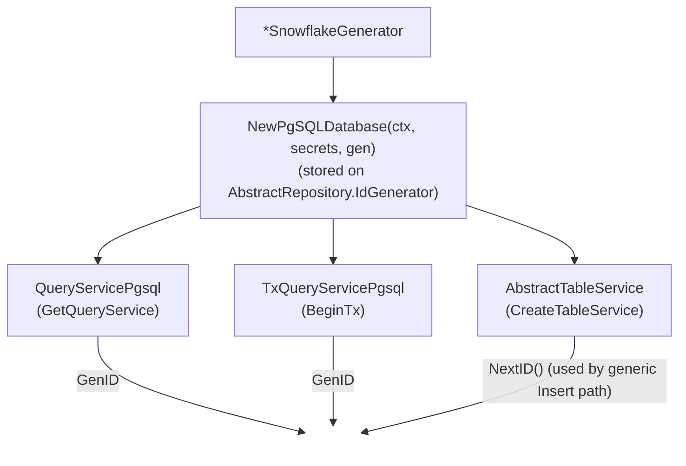

Services in `package service` (registration, user) mint ids through the transaction they already hold:

```go
id := tx.GenID()
_, err := tx.Query(ctx, qCreateSocialUser, id, firstName, lastName, email, phone, username)
```

The generic `TableService.Insert` path (used by REST + downstream services) auto-calls `IdGenerator.NextID()` when a table's single-column int PK has no `SequenceName`. No caller changes required.

### Opting a new table in

1. In the YAML, declare `id BIGINT` as the single PK; **omit** the `sequence:` block.
2. Either route inserts through `DB.GetTableService("<table>").Insert(...)` (framework fills `id` automatically) or write hand-coded SQL that binds `tx.GenID()` as the id parameter.

### Node ID assignment

- Single-DB deployments: leave `--node_id=0`.
- Federated deployments: assign a distinct value in `[0, 1023]` to each independent writer (central instance = 0, tenant A = 1, tenant B = 2, …). Track assignments in ops runbooks; never reuse a retired node_id while its ids are still alive in the DB.

### JS client precision caveat

Snowflake ids are always > 2^52, so naive JavaScript `JSON.parse` will lose precision. Browser / React-Native clients that read `user.id` as a number will see truncation. Serialize the id as a string in REST responses when any JS consumer is in the read path.

## Database Schema Requirements

Keel expects certain tables to exist in your PostgreSQL database. These are described in YAML under `schema/basis/` and `schema/security/`. The companion CLI [`cmd/schemagen`](cmd/schemagen) compiles those YAML files into DDL + seed SQL for the chosen dialect (PostgreSQL by default).

### Geographic & tax reference data

Keel ships `country`, `state`, and `county` as pure reference tables, seeded in [schema/geo_seed.yml](schema/geo_seed.yml). Scope: countries for N+S America / Turkey / Europe; states for US + Canada; counties for US only (FIPS-derived).

Tax lives in the consumer, not in keel. Apps that charge tax define their own `tax_jurisdiction` table that FK's to keel's `country` / `state`, with their own rate/caption columns. This keeps keel provider-neutral and lets each app model its jurisdictions independently (US sales tax by county, Canadian GST/HST/PST/QST by province, EU VAT by country, etc.).

Cities are not normalized in keel. Consumer address tables carry city as a free-form string and use it only for display.

### ER Diagram — Framework Tables

Dictionary add-ons
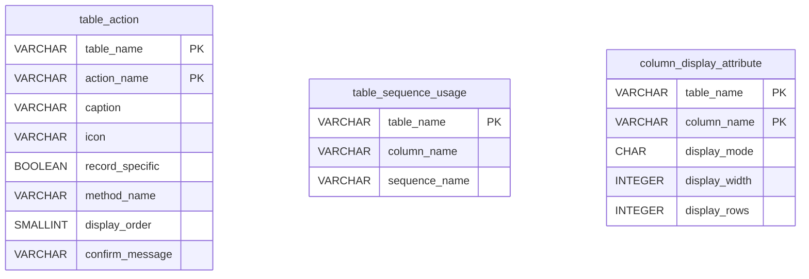

Lookup constants

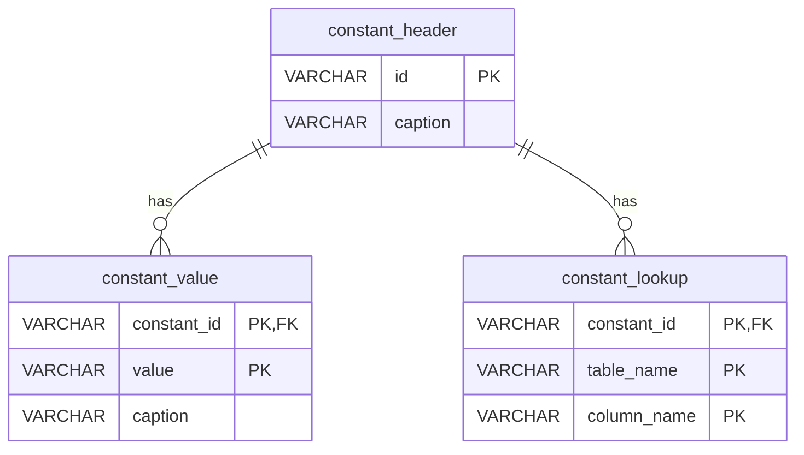

REST API for CRUD and Reporting

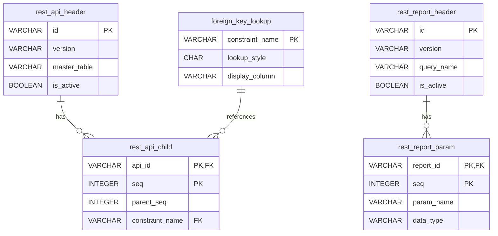

Application Menu, GEO locations

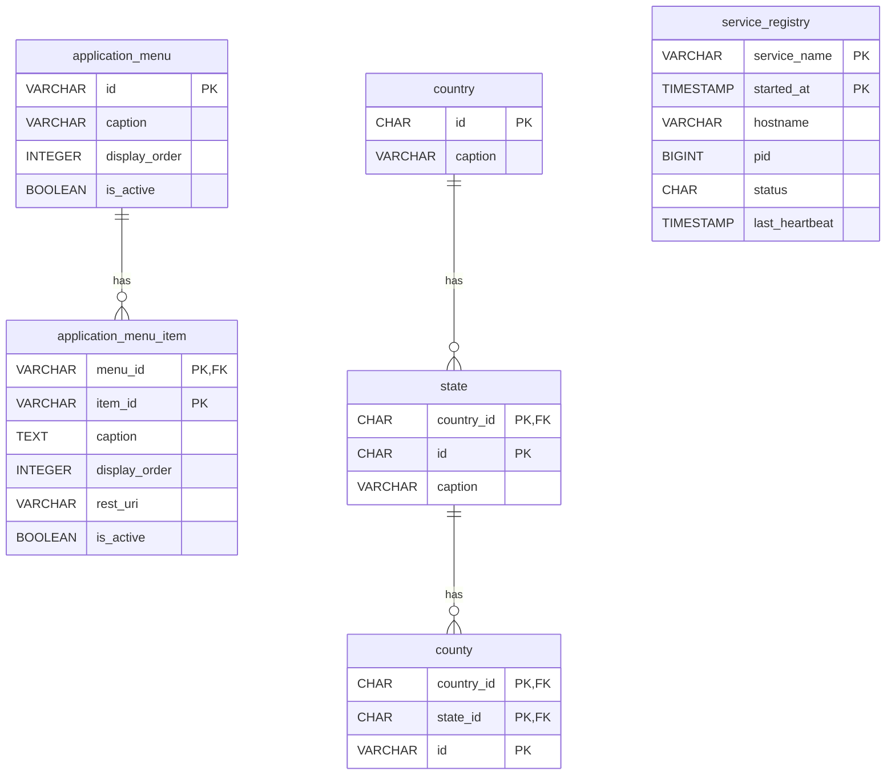

### ER Diagram — Security Tables

Policy and registration

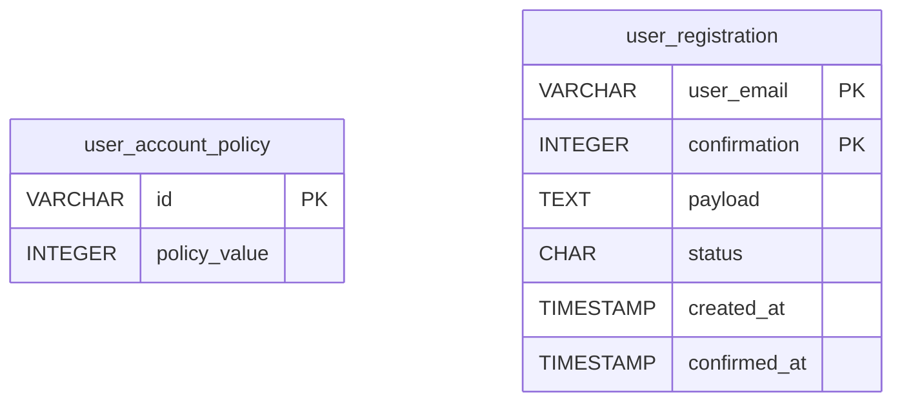

Roles and permitted actions

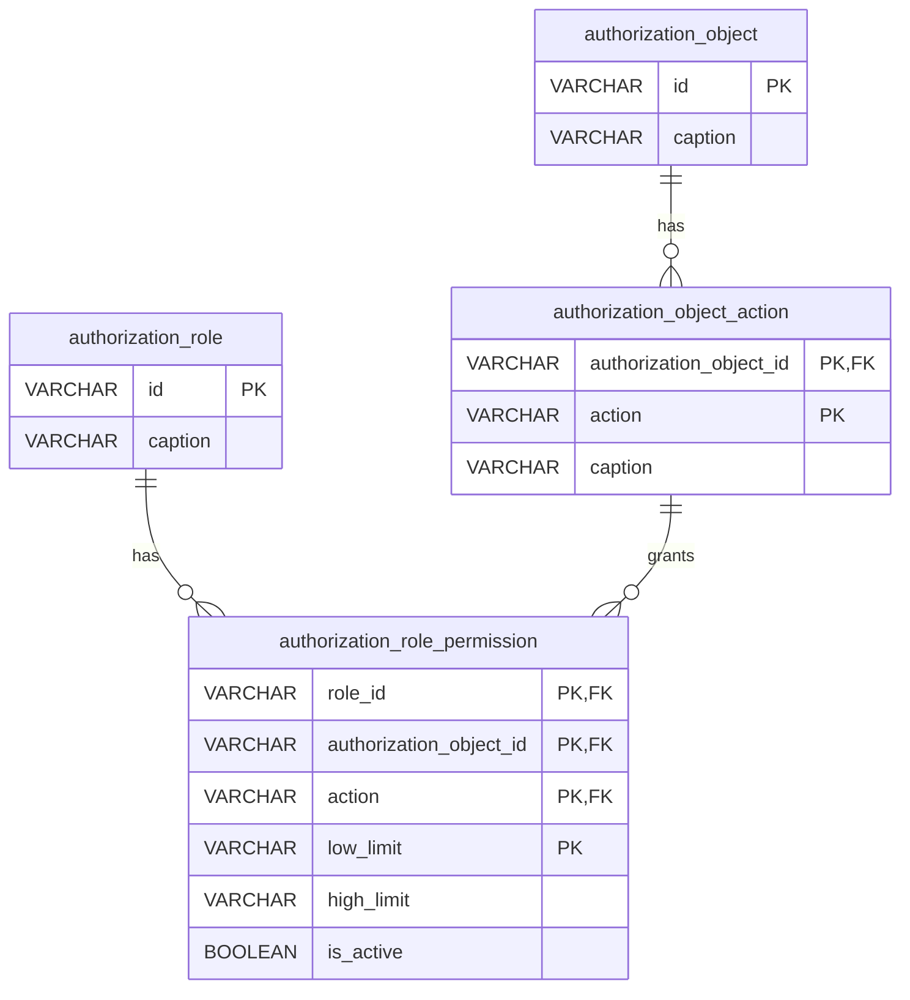

User accounts

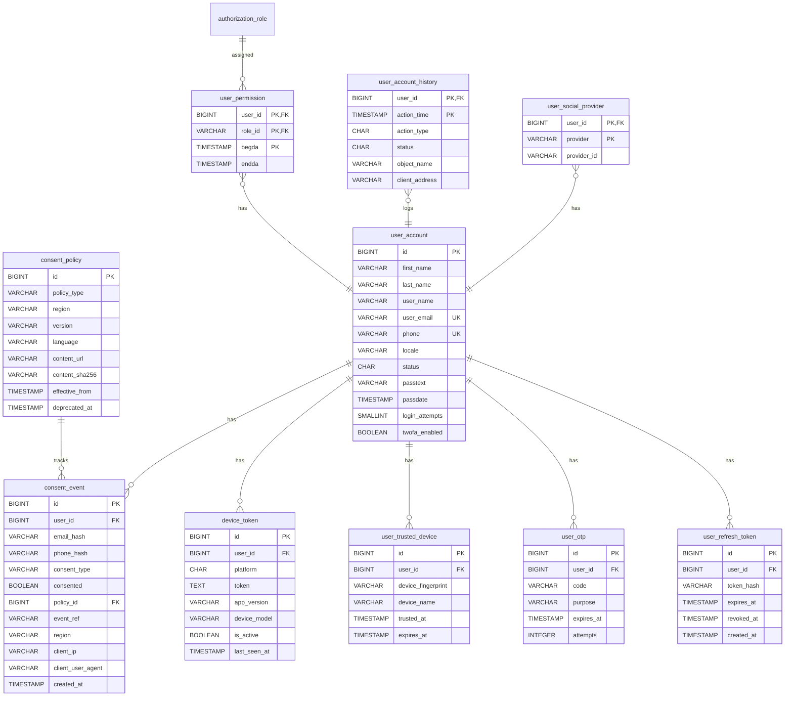

### ER Diagram — Subscription Tables

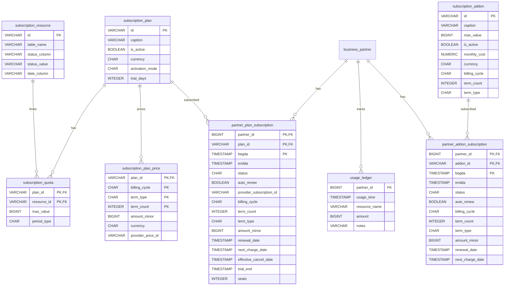

### ER Diagram — Payment + Payout Tables

Provider log

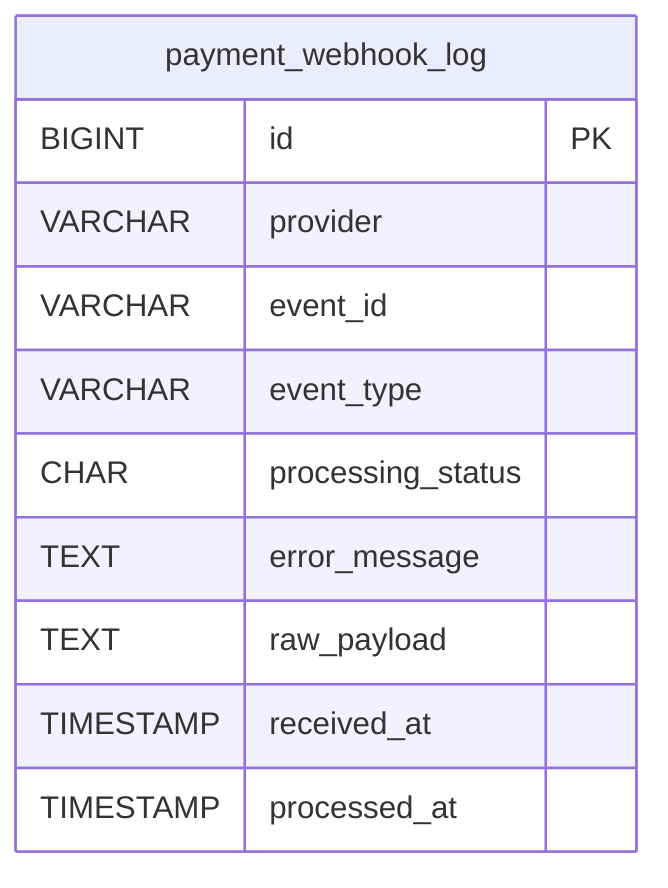

Psyment, billing and invoice

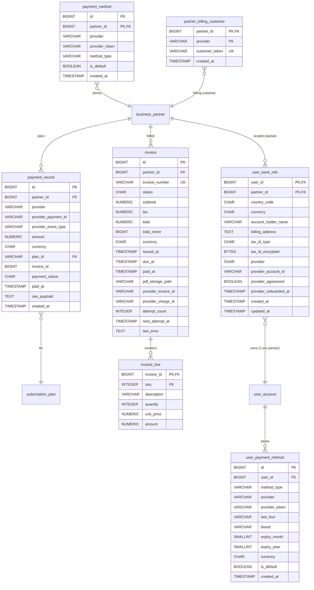

## Business Partners
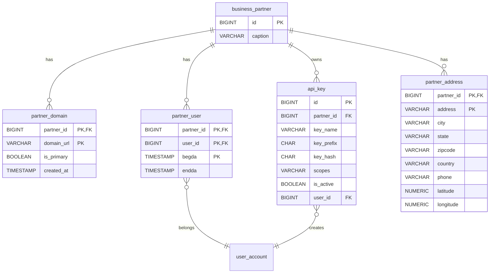

### Table Summary

| Table | Purpose |
|-------|---------|
| `constant_header` / `constant_value` | Dropdown/enum lookup values |
| `constant_lookup` | Maps constants to table columns |
| `foreign_key_lookup` | Controls FK display behavior |
| `rest_api_header` / `rest_api_child` | REST API definitions (metadata-driven) |
| `rest_report_header` / `rest_report_param` | Report definitions with parameters |
| `table_sequence_usage` | Maps tables to PostgreSQL sequences |
| `application_menu` / `application_menu_item` | Navigation menu structure |
| `authorization_object` / `authorization_object_action` | RBAC object definitions |
| `authorization_role` / `authorization_role_permission` | Role-based permissions |
| `user_account` | User accounts with password, 2FA fields |
| `user_account_policy` | Password/account policy settings |
| `user_permission` | User-to-role assignments |
| `user_account_history` | Login audit trail |
| `user_registration` | Email confirmation flow |
| `user_refresh_token` / `user_trusted_device` | Session and device management |
| `user_otp` | OTP codes with expiry and attempt tracking |
| `user_social_provider` | Social login provider links (Google, Apple) |
| `business_partner` / `partner_user` | Multi-tenant partner structure |
| `partner_address` / `partner_domain` | Partner locations and domains |
| `api_key` | API key management per partner |
| `subscription_plan` / `subscription_quota` | Subscription plans with resource limits |
| `subscription_plan_price` | Per-offer prices (billing cycle + commitment term) for a plan |
| `subscription_resource` | Quota-tracked resources |
| `subscription_addon` | Optional add-on features |
| `partner_plan_subscription` / `partner_addon_subscription` | Active subscriptions per partner |
| `usage_ledger` | Resource usage tracking for quota enforcement |
| `payment_webhook_log` | Raw inbound provider webhooks with idempotency + audit |
| `payment_method` | Stored payment methods per partner (provider customer tokens) |
| `payment_record` | Completed/failed/refunded payment transactions |
| `country` / `state` / `county` | Geographic hierarchy |
| `service_registry` | Background worker registration and heartbeat |

## Flag Variables

Keel keeps only **bootstrap** settings as command-line flags, declared in
`common/variables.go`: what is needed before the database connection exists —
the log sink, the secret provider, the DB coordinates, and `--node_id`. Every
other runtime setting lives in the `application_config_*` tables and is read
through `common.Config` (see **Runtime Configuration** above).

> **Rule: flags or DB config, never environment variables.** `os.Getenv` is
> NEVER used for configuration. Bootstrap knobs are `--flag=value`; everything
> else is a row in `application_config_flag` (+ optional per-node
> `application_config_value`). If you see `os.Getenv` in a keel file, that's a
> bug to fix, not a pattern to copy.

| Flag | Default | Description |
|------|---------|-------------|
| `--log_type` | `local` | Logger: local, gcp, aws, azure |
| `--log_root` | `/opt/app/log` | Log directory |
| `--azure_logs_endpoint` | `` | Azure Monitor DCE URL (required when `--log_type=azure`) |
| `--azure_logs_dcr` | `` | Azure Monitor DCR immutable id (required when `--log_type=azure`) |
| `--azure_logs_stream` | `` | Azure Monitor DCR stream name (required when `--log_type=azure`) |
| `--keystore` | `/opt/app/sec/secrets.json` | Secrets file path (local secret provider) |
| `--secret_mode` | `local` | Secret provider: local, gsm, aws, azure, infisical |
| `--aws_region` | `` | AWS region for Secrets Manager (required when `--secret_mode=aws`) |
| `--gcp_project_id` | `` | GCP project for the GSM secret provider and Pub/Sub messaging |
| `--azure_keyvault_url` | `` | Azure Key Vault URL (required when `--secret_mode=azure`) |
| `--infisical_project_id` | `` | Infisical project (workspace) ID (required when `--secret_mode=infisical`) |
| `--infisical_environment` | `prod` | Infisical environment slug: dev, staging, prod (used when `--secret_mode=infisical`) |
| `--infisical_host` | `https://app.infisical.com` | Infisical API host; override for a self-hosted instance |
| `--db_host` | `localhost` | PostgreSQL host |
| `--db_port` | `5432` | PostgreSQL port |
| `--db_name` | `app` | Database name |
| `--db_user` | `app` | Database user |
| `--db_schema` | `public` | Database schema |
| `--db_sslmode` | `disable` | SSL mode |
| `--db_pool_max` | `4` | Maximum database pool connections |
| `--node_id` | `0` | Identifies this runtime node/process: seeds the bigint ID generator (assign distinct values per writer in federated deployments) and selects this node's `application_config_value` rows, which fall back to the shared `node_id = -1` bucket then the catalog default. Must stay in `[0, 1023]` for the id generator — `-1` is a config-only sentinel, never a valid `--node_id` |

## Cache Service

`cache` is the unified cache port — KV (`Get`/`Set`/`Delete`/`Increment`), list (`RPush`/`LPopAll`), and pub/sub (`Publish`/`Subscribe`) on a single `port.CacheService` interface. Two concrete backends ship with keel: a Redis/Valkey adapter built on `redis.UniversalClient` that handles both single-node and Redis-Cluster topologies (the wire protocol is identical between Redis and Valkey), and an in-process `MemoryCacheService` that backs deployments without a separate cache server.

### Backend selection

`cache.NewCacheService(ctx, secrets)` reads the keel common flags and decides which backend to construct, in this precedence:

1. `valkey_url` set → Valkey path. Honors `valkey_cluster`. Reads the `valkey_password` secret.
2. `redis_url` set → Redis single-node path. Reads the `redis_password` secret.
3. neither set → `MemoryCacheService`. KV + Increment with lazy TTL expiration backed by a single mutex; pub/sub fans out to subscribers in the same process.

Setting both `redis_url` and `valkey_url` is a configuration error and the constructor returns a non-nil error so the app fails fast at startup.

### `MemoryCacheService` — when it's safe

The memory backend is the default fallback because the alternative (NoOp) silently disables rate limits — `Increment` returns `0`, `count > 3` is never true, and an attacker can pump unlimited OTP SMS/email or 2FA-verify attempts. Memory at least bounds abuse to `cap × N processes`.

It is correct for any deployment where:

- There is exactly one backend process per region, **or**
- The load balancer pins a client to one process for the OTP flow (Caddy `lb_policy ip_hash` or session cookie), **or**
- The deployment doesn't use OTP / does not need cross-process pub/sub.

It is **not** correct when multiple non-sticky processes serve `/public/otp/send` and `/public/otp/verify`: the verify can land on a process that never minted the token, producing a phantom miss. Multi-instance OTP deployments must provision Valkey or Redis. Pub/Sub is also single-process — `Publish` does not reach subscribers in other processes.

Rate-limit caps multiply by process count. With the OTP send cap of `3/contact` and 4 instances, an attacker hitting all four can send `12/contact` per window. Still bounded; tune the per-handler cap if a tighter ceiling matters.

### Connection string forms

- `host:port` — plain, no TLS
- `redis://host:port/db` — RESP URL, plaintext
- `rediss://host:port/db` — RESP URL, TLS (Memorystore TLS, Upstash, etc.)

**Passwords MUST NOT be embedded in the URL.** They are pulled from the secret provider so they can be rotated without redeploying. The constructor injects the password into the parsed `*redis.Options` before instantiating the client.

### Wiring example

```go
secrets, _ := secret.NewSecretProvider(ctx)
cache, err := cache.NewCacheService(ctx, secrets)
if err != nil {
    log.Fatalf("cache: %v", err)
}

otp := handler.OTPHandler{
    AbstractHandler: handler.AbstractHandler{UserService: userSvc},
    NotificationSvc: notificationSvc,
    Cache:           cache,
}
```

A worker that drains a Valkey list:

```go
items, err := cache.LPopAll(ctx, "events:batch")
```

A WebSocket-fanout publisher:

```go
cache.Publish(ctx, "user-events", payload)
ch, _ := cache.Subscribe(ctx, "user-events")
for msg := range ch { … }
```

## Extending Keel

### UserService

Keel provides a full `UserService` implementation with:
- **Password auth** with policy enforcement (complexity, expiry, lockout)
- **JWT** token creation and parsing
- **2FA (TOTP)** setup, verify, disable, backup codes
- **Refresh tokens** with revocation
- **Trusted devices** with 30-day expiry
- **OTP authentication** (phone/email) with rate limiting
- **Social login** (Google, Apple) via single `GetOrCreateUserFromSocial` — atomic transactional create, verified-email account linking, NULL `passtext` for social-only accounts
- **Phone-first auth** via `GetOrCreateUserByPhone` — E.164 normalization (libphonenumber), `phone` stored in `user_account.phone` directly (no `user_social_provider` shim), `passtext=NULL` on OTP registrations
- **Session hygiene** — `SetPassword`, `Setup2FA`, `Disable2FA`, `RevokeTrustedDevice` automatically revoke all active refresh tokens; public `LogoutEverywhere(userID)` for explicit "log out of all devices"
- **Single-device policy** — `SetSingleDevicePolicy(userID, on)` primitive; when on, `CreateRefreshToken` revokes all prior tokens on issue (e.g. drivers must be signed in on one device at a time)
- **Account deletion** — `DeleteAccount(userID, reason)` anonymizes in place, revokes tokens, drops trusted devices, deactivates device tokens, drops social links; App Store / Play Store compliant
- **Consent capture** — optional `port.ConsentService` called from signup flows; PIPEDA / GDPR audit trail in `consent_policy` + `consent_event` tables
- **Push notifications (FCM)** — channel-keyed `port.MessageDispatcher` (FCM and `NoOp` push impls ship; email adapter wraps `MailClient`), `device_token` table, register/revoke endpoints, stale-token auto-deactivation. `port.PushProvider` is now a deprecated alias of `MessageDispatcher`.

`RegistrationService` exposes three entry points:
- `Register(ctx, email, confirmation)` — standard email-confirmation two-step (`SendConfirmation` followed by `Register`). Created `user_account` lands at `status='I'`; the email-confirmation step flips it to `'A'`.
- `RegisterImmediately(ctx, *PartnerRegistration)` — for OAuth-verified signups (Google Business Profile, Apple Sign-In, etc.) where the upstream provider has already verified the email. Skips the `user_registration` round-trip and runs the full transactional create directly. Created `user_account` is left at `status='I'` (consistent with `Register`); a follow-up confirmation step is expected. Caller is responsible for bcrypt-hashing `data.Password` (or passing empty for password-less social signups).
- `RegisterImmediatelyWithSession(ctx, *PartnerRegistration) (result, *model.UserSession, error)` — like `RegisterImmediately`, but additionally activates the new `user_account` (`status='A'`) and returns an in-memory `*model.UserSession` ready for `UserService.CreateJWT(session)`. Removes the otherwise-needed `GetUserByLogin` round-trip on OAuth-verified flows that have no password to bcrypt-check. `data.Password` may be empty.

Use the built-in `LocalUserService` directly:

```go
userSvc, _ := user.NewLocalUserService(ctx, db, jwtSecret, "myapp")
```

Or embed it to add project-specific methods:

```go
type MyUserService struct {
    *user.LocalUserService
    customQS port.QueryService
}
```

### Custom Handlers

Embed `handler.AbstractHandler` to get JWT parsing and a set of common request-handling helpers for free:

```go
type MyDomainHandler struct {
    handler.AbstractHandler
    MyService *MyDomainService
}

func (h *MyDomainHandler) UpdateItem(w http.ResponseWriter, r *http.Request) {
    if !h.RequireMethod(w, r, http.MethodPost) { return }   // 405 if not POST
    id, ok := h.RequireQueryInt64(w, r, "id")
    if !ok { return }                                       // 400 if missing/invalid
    var req UpdateItemReq
    session, ok := h.ReadAuthRequest(w, r, &req)
    if !ok { return }                                       // 401 (no JWT) / 400 (bad body)
    if !h.RequireFields(w, map[string]string{"name": req.Name}) {
        return                                              // 400 lists missing field names
    }
    item, err := h.MyService.Update(r.Context(), session.PartnerId, id, req)
    if err != nil {
        h.WriteError(w, http.StatusInternalServerError, "Internal Server Error", err.Error())
        return
    }
    common.WriteJSON(w, http.StatusOK, item)
}
```

#### AbstractHandler request helpers

All methods are stateless — they only inspect the JWT or request context and write the canonical RFC 7807 envelope via `h.WriteError`. Every handler that embeds `AbstractHandler` inherits them automatically.

| Method | Purpose |
|---|---|
| `ParseSession(r)` | Returns the JWT session, or nil. Read-only — no error envelope. |
| `GetUser(r) / GetPartner(r)` | Convenience accessors; -1 when absent. |
| `RequireSession(w, r) (*Session, bool)` | 401 if no session. Use when you need the full session. |
| `RequireUser(w, r) (int, bool)` | 401 if no user id. |
| `RequirePartner(w, r) (int64, bool)` | 401 if `partner_id < 0`. |
| `ReadRequest(w, r, &req) bool` | `MaxBytesReader(common.Config().MaxRequestSize)` + JSON unmarshal; 400 on failure. Public endpoints. |
| `ReadAuthRequest(w, r, &req) (*Session, bool)` | `RequireSession + ReadRequest` combined. Authenticated endpoints with a JSON body. |
| `RequireMethod(w, r, methods...string) bool` | 405 + `Allow` header if `r.Method` doesn't match any of the allowed methods. One-line guard for HTTP-method-restricted handlers. |
| `RequireQueryInt64(w, r, name string) (int64, bool)` | Reads `?name=<int>` from the URL, parses to int64. 400 on missing or unparseable value. |
| `RequireFields(w, fields map[string]string) bool` | 400 listing any empty (after `TrimSpace`) values. |
| `PartnerFromCtx(r) int64` | Reads `common.PartnerID` from the request context (injected by `APIKeyMiddleware` for `/pubapi/*` traffic). -1 when absent. |
| `HasScope(r, scope) bool` | Checks the API key's `common.Scopes` context value. |
| `RequireScope(w, r, scope) bool` | 403 if scope missing. |
| `WriteError(w, status, title, detail)` | RFC 7807 problem+json envelope writer used by every method above. The single canonical error path — handlers should never call `http.Error`. |

In-repo demos: [handler/rest_handler.go](handler/rest_handler.go) `Post` uses `ReadRequest`. [handler/payment_handler.go](handler/payment_handler.go) keeps a bespoke 256 KiB cap for webhook traffic — that's a deliberate exception, not a pattern to copy. `RequireMethod` and `RequireQueryInt64` are not yet used inside keel (added for downstream consumers that have many `?id=<int>` and method-restricted endpoints); when an in-keel handler adopts them, add a citation here.

#### Query-result projection

`*model.QueryResult` carries a `.AsMaps()` method that projects rows into `[]map[string]any` keyed by `Columns`. Useful when a handler needs to JSON-encode an ad-hoc query response without defining a typed model:

```go
res, _ := qs.Query(ctx, "list_active_partners")
common.WriteJSON(w, http.StatusOK, res.AsMaps())
```

Returns an empty slice (not nil) when there are no rows, so JSON encoding always emits `[]`.

## Directory Structure

```
keel/
├── cmd/
│   └── schemagen/             # CLI: YAML schema → DDL + seed SQL
├── common/                    # Type helpers, HTTP response envelope, shared HTTP client, flag variables
├── model/                     # Domain-agnostic data shapes (UserSession, TableDefinition, AppError, ...)
├── port/                      # Pluggable component interfaces (login, messaging, notification, quota,
│                              #   table change logger, web socket hub, ID generator)
├── data/                      # AbstractRepository, AbstractTableService, DatabaseRepository / TxView /
│                              #   QueryService interfaces, file TableLogger, SnowflakeGenerator
├── pgsql/                     # PostgreSQL adapter (pgx/v5): repository, table service,
│                              #   query service, tx-bound query service, tx view
├── schema/                    # YAML schema definitions + seed loader + schemagen model
│   ├── basis/                 # Framework tables (constants, REST metadata, geo, subscriptions, ...)
│   ├── security/              # Auth tables (users, roles, permissions, OTP, social, devices, ...)
│   ├── dialect/               # DDL dialects: PostgreSQL, MySQL
│   ├── basis_seed.yml         # Framework seed data
│   ├── geo_seed.yml           # Country / state / county reference data
│   ├── security_seed.yml      # Built-in roles + permissions
│   ├── subscription_seed.yml  # PARTNER_ADMIN permissions for the subscription tables
│   ├── schema.go              # Schema model + parser + Validate
│   └── seed.go                # Seed-file parser + GenerateSeedSQL (FK-safe topo sort)
├── rest/                      # Metadata-driven REST engine + parent-child relation CRUD
├── handler/                   # AbstractHandler + login / 2FA / OTP / social / payment / push / REST / cache
├── user/                      # UserService interface + LocalUserService + RegistrationService +
│                              #   ConsentService
├── service/                   # APIKeyService + JWT/API-key middleware + HttpBackend + QuotaServiceDb
├── dispatcher/                # MailClient + LocalNotificationService + Email & Twilio dispatchers
├── worker/                    # JobExecutor + AbstractWorker one-call bootstrap
├── secret/                    # Local JSON / GCP Secret Manager / AWS Secrets Manager / Azure Key Vault / Infisical + factory
├── logger/                    # File / GCP Cloud Logging / AWS CloudWatch / Azure Monitor Logs + factory
├── cache/                     # Redis / Valkey single-node + cluster + NoOp fallback
├── storage/                   # S3 (AWS + Cloudflare R2) / GCS / Azure Blob
├── messaging/                 # GCP Pub/Sub + AWS SNS+SQS + NATS JetStream + factory
├── payment/                   # Stripe + LemonSqueezy webhook processor, signatures, parsers,
│                              #   SQL webhook log repo, Stripe Checkout client
├── billing/                   # SaaS billing: AbstractBillingService, lifecycle, BillingEngine,
│                              #   installment math, provider webhook→billing handler
└── push/                      # FCM + NoOp port.MessageDispatcher implementations + factory
```

## Role Matrix

```
A = Access    S = Select    I = Insert    U = Update    D = Delete
```

Keel defines 6 shared roles. Projects may add domain-specific roles (e.g., SEO_ADMIN, SEO_OPER).

| Type | Object | SUPER | APP_ADMIN | SECURITY_ADMIN | SECURITY_OPER | BUSINESS_ADMIN | PARTNER_ADMIN |
|------|--------|-------|-----------|----------------|---------------|----------------|---------------|
| PAGE | * | A | | | | | |
| TABLE | * | SIUD | | | | | |
| REPORT | * | A | | | | | |
| **Security** | | | | | | | |
| PAGE | authorization_roles | | A | A | A | A | |
| PAGE | authorization_objects | | A | A | A | A | |
| PAGE | user_accounts | | A | A | A | | |
| PAGE | user_account_policies | | A | A | A | A | |
| TABLE | authorization_role | | S | SIUD | S | S | |
| TABLE | authorization_role_permission | | S | SIUD | S | S | |
| TABLE | authorization_object | | SIUD | S | S | S | |
| TABLE | authorization_object_action | | SIUD | S | S | S | |
| TABLE | user_account | | S | SIUD | SIU | | |
| TABLE | user_permission | | S | SIUD | SIUD | | S |
| TABLE | user_account_history | | S | S | S | | |
| TABLE | user_account_policy | | S | SIUD | S | S | |
| TABLE | partner_user | | S | SIUD | S | | S |
| **Framework** | | | | | | | |
| PAGE | application_menus | | A | A | A | A | |
| PAGE | constant_headers | | A | A | | A | |
| PAGE | foreign_key_lookups | | A | A | | A | |
| PAGE | rest_api_headers | | A | A | | A | |
| TABLE | application_menu | | SIUD | S | S | S | |
| TABLE | application_menu_item | | SIUD | S | S | S | |
| TABLE | constant_header | | SIUD | S | | S | |
| TABLE | constant_value | | SIUD | S | | S | |
| TABLE | constant_lookup | | SIUD | S | | S | |
| TABLE | foreign_key_lookup | | SIUD | S | | S | |
| TABLE | rest_api_header | | SIUD | S | | S | |
| TABLE | rest_api_child | | SIUD | S | | S | |
| TABLE | service_registry | | S | | | | |
| **Business Partner** | | | | | | | |
| PAGE | partner_registrations | | A | A | A | A | |
| PAGE | api_keys | | A | A | | | |
| TABLE | business_partner | | S | S | S | SIUD | SU |
| TABLE | partner_address | | S | | | | SIUD |
| TABLE | partner_domain | | S | | | | SIUD |
| TABLE | api_key | | S | S | | S | S |
| **Subscriptions** | | | | | | | |
| PAGE | subscription_plans | | A | | | A | S |
| PAGE | subscription_resources | | A | A | | A | |
| PAGE | subscription_addons | | | | | A | |
| PAGE | partner_quota_usages | | | | | A | |
| TABLE | subscription_plan | | S | | | SIUD | S |
| TABLE | subscription_plan_price | | S | | | SIUD | S |
| TABLE | subscription_quota | | S | | | SIUD | S |
| TABLE | subscription_resource | | SIUD | S | | S | |
| TABLE | subscription_addon | | S | | | SIUD | |
| TABLE | partner_plan_subscription | | S | | | SIUD | S |
| TABLE | partner_addon_subscription | | S | | | SIUD | S |
| TABLE | usage_ledger | | S | | | S | S |
| **Payments** | | | | | | | |
| PAGE | payment_records | | A | | | A | A |
| PAGE | payment_methods | | A | | | A | A |
| PAGE | payment_webhook_logs | | A | | | A | |
| TABLE | payment_record | | S | | | S | S |
| TABLE | payment_method | | S | | | SIUD | SIUD |
| TABLE | payment_webhook_log | | S | | | S | |
| **Geo** | | | | | | | |
| PAGE | countries | | | | | | A |
| TABLE | country | | | | | | S |
| TABLE | state | | | | | | S |
| TABLE | county | | | | | | S |

## Status

Keel is **pre-1.0** and under active development. Public APIs (interfaces in
`port/`, exported types in `model/`, handler method signatures) are kept stable
across minor releases so downstream consumers can bump without rewrites, but
internal implementations can change. A full security audit is in progress
ahead of the 1.0 tag — until then, treat the security-sensitive subsystems
(auth, payments, webhook signature verification) as production-tested but not
independently verified.

## Security

If you discover a security vulnerability in keel, please **do not open a
public GitHub issue.** Report it privately by emailing the maintainer; you
should expect an acknowledgement within 72 hours and a coordinated disclosure
timeline thereafter. Vulnerabilities in dependencies (pgx, jwt, redis,
firebase, AWS/GCP/Azure SDKs, Stripe webhooks) are tracked the same way.

## Contributing

Contributions are welcome via GitHub pull requests. A few ground rules:

- **Don't break method signatures.** Downstream consumers depend on the
  signatures of every exported function in `port/`, `service/`, `handler/`,
  `data/`, and `worker/`. Additive changes (new methods on a struct, new
  optional struct fields) are fine; renames, parameter reordering, and return
  shape changes are not.
- **Ports are minimal.** New interfaces in `port/` should expose the
  smallest surface that a consumer or implementation needs. Adapters in
  `service/<area>/` may carry richer types internally.
- **Write Go that gofmt is happy with.** Run `go vet ./...` and
  `go test ./...` before submitting. If you add a new adapter, include at
  least one no-op or in-memory test.
- **Doc-comment every exported symbol.** This repo is the public surface for
  several downstream projects; opaque exports cost everyone time.
- **Follow the Development Standards below.** Every contribution — internal
  or external — is expected to honour the patterns the rest of the codebase
  has converged on. Reviewers will reject PRs that bypass them without a
  written rationale.

## Development Standards

Keel is Apache-2.0 licensed and consumed by multiple downstream projects plus the [sail](https://github.com/nauticana/sail)
Angular frontend. The following standards exist so contributions stay
predictable across all of those consumers and so the codebase grows without
turning into a yard sale of one-off patterns.

These are NOT suggestions. A PR that violates them needs to either fix the
violation or include a `Why:` paragraph in the description explaining the
constraint that justified the deviation.

### 1. Object-orientation via composition

Go has no classical inheritance, so "OOP" in keel means **struct embedding +
narrow interfaces**, applied in this fixed order:

1. **Abstraction** — every cross-cutting concern (HTTP handler base, webhook
   provider, payout provider, table service) has an `Abstract<Name>` struct
   that holds the shared state and methods.
   - `handler.AbstractHandler` — session parsing, RFC 7807 envelopes,
     request reading.
   - `handler.AbstractPaymentHandler` — webhook lifecycle + checkout
     redirect-host / price allowlist enforcement.
   - `payment.AbstractProvider` — provider Name / SignatureHeader / Verify
     / Parse plumbing shared by Stripe + LemonSqueezy.
2. **Inheritance** — concrete types embed the abstract by value (not by
   pointer) at the top of the struct declaration. Method promotion gives
   the "extends" feel without runtime cost.

   ```go
   type StripeProvider struct{ AbstractProvider }
   type UserPaymentMethodHandler struct{ AbstractHandler; … }
   ```

   Never re-implement a method the embedded abstract already provides —
   override it only when the concrete genuinely differs (e.g. Stripe's
   `setup_intent` mode in [payment/stripe_client.go](payment/stripe_client.go)).
3. **Polymorphism** — consumers depend on **interfaces**, never on the
   concrete struct. Interfaces live next to the abstraction
   (`payment.PaymentProvider`, `payout.PayoutProvider`,
   `payment.SignatureVerifier`, `payment.EventParser`,
   `payment.CheckoutClient`, `payment.WebhookRepository`,
   `port.UserService`, etc.). New providers add a file, implement the
   interface, register themselves in the factory — nothing else
   changes. The 2026-Q2 payout migration added Airwallex / Stripe
   Connect / Wise with three files and one switch arm in
   [payout/factory.go](payout/factory.go) precisely because the
   interface was already in place.

Every concrete type that implements an interface MUST include a
compile-time assertion at the bottom of the file:

```go
var _ payout.PayoutProvider = (*AirwallexProvider)(nil)
```

This catches drift the moment the interface evolves — the build fails
where the contract breaks, not at runtime in a downstream project.

### 2. Don't reinvent the standard library

Reaching for a homegrown utility when `strings`, `strconv`, `path`, `net/url`,
or `net/http` already covers the case is a regression. Some patterns we keep
catching in review:

| Don't write                | Use instead                              |
|----------------------------|------------------------------------------|
| local `upper(s string)` / `toUpperASCII` | `strings.ToUpper(s)`              |
| local `equalFold`          | `strings.EqualFold(a, b)`               |
| manual last-segment split  | `path.Base(urlPath)`                    |
| string-concat URL building | `url.URL{}` / `url.Values.Encode()`     |
| `time.Now().Sub(t).Abs()` reimplemented | `time.Since(t)` / `Sub` then abs |

Exception: helpers that genuinely don't have a stdlib equivalent (e.g.
`common.AsInt64`, `common.PascalCase`) belong in
[common/functions.go](common/functions.go) and are reused everywhere.

### 3. No magic strings — constants and `constant_header`

Two distinct tools, two distinct purposes. Get them right.

**Code-level constants** for any literal that's referenced from more than
one place or carries semantic meaning (provider names, status codes, event
types, URL prefixes, header names). They live in the package they describe:

```go
// payment/webhook_repository_sql.go
const (
    StatusReceived  = "R"
    StatusProcessed = "P"
    StatusFailed    = "F"
    StatusDuplicate = "D"
    StatusSkipped   = "S"
)

// payout/airwallex.go
const airwallexCode = "AW"
```

If a literal appears in more than one file in a package, hoist it to a
package-level `const` block. If it appears in more than one package, it
belongs in [common/variables.go](common/variables.go) (configuration) or
the relevant `port/` interface file (protocol-level constant).

**`constant_header` / `constant_value` tables** are the runtime equivalent
for domain enumerations that the **UI** has to render — order status,
payout provider code, payment method type, country code. Sail reads these
through `GetClientCache` and auto-renders dropdowns; the Go side reads them
through `RestService.GetConstantCache`. Always add a `constant_header` row
+ `constant_value` rows + a `constant_lookup` row pointing the column at
the header — never hardcode the dropdown options in TypeScript.

The two complement each other: the `const` block in Go enforces type-safety
at compile time; the `constant_header` row makes the same value editable
through the admin UI without a redeploy. New domain enums add both.

### 4. Flag variables for every deployable knob

Anything an operator might want to change between environments — host,
port, credential location, feature toggle, provider selector, return URL —
goes through `flag` in [common/variables.go](common/variables.go).

Rules:

- One flag per knob. Don't overload a single flag with multiple meanings
  (the v0.4.1 `--keystore` / `--aws_region` split is the cautionary tale).
- Documented default that's safe for local dev. `cors_origin` defaults
  to empty (deny all); `--secret_mode` to `local`; `push_mode` to `noop`.
  Deny-by-default beats permissive defaults that bite you on a fresh
  install.
- Doc-comment **at the variable declaration** explaining what it does,
  what the valid range is, what depends on it, and what the consequence of
  the empty/zero value is. The flag's `Description` argument is short
  user-facing help; the Go doc-comment is the engineering reference.
- Add a corresponding row to the **Flag Variables** table in this README
  so downstream consumers can `Cmd-F` for it.
- Validate combinations at startup, not at first-use. `handler.MustRequireTrustedProxyCIDR`
  is the pattern: fail fast in `main`, not on the first signed-in user.

**Flags, never environment variables.** keel does NOT read `os.Getenv` for
configuration anywhere. Every deployable knob is a `flag.*` declaration in
[common/variables.go](common/variables.go), period. The reason is uniformity:
one override surface (`--flag=value`), one place to grep, one table in this
README that documents the whole set. If you find yourself reaching for
`os.Getenv`, stop and declare a flag instead. A PR that adds an env-var
read will be rejected.

### 5. SQL: parameterised, cached, schema-aware

- **No string-built SQL.** Every query goes through
  `data.QueryService.Query(ctx, queryName, args...)` with a query map
  registered once per package (see
  [payment/webhook_repository_sql.go](payment/webhook_repository_sql.go) for
  the canonical shape). The placeholder rewriter handles `?` → `$N` per
  driver.
- **Cache the QueryService** with `sync.Once` at the struct level
  (see `SQLWebhookRepository`). Re-rewriting the same query map per call
  burns CPU on the hot webhook path.
- **Idempotency via unique indexes**, not application-side checks.
  Concurrent retries from a payment provider WILL race the cheap-path
  existence check; the unique-index insert is the authoritative gate
  (SQLSTATE 23505 → treat as duplicate, see
  [payment/webhook_processor.go](payment/webhook_processor.go)).
- **`UserSpecific` / `PartnerSpecific` row scoping** is automatic via the
  table flag — don't re-implement scoping in raw SQL unless the operation
  legitimately crosses actors (e.g. `OnboardingService.ListReusableAccounts`
  spans partners by design).

### 6. HTTP handlers: thin, RFC-compliant, deny-by-default

- Embed `AbstractHandler`. Use `RequireSession`, `RequireMethod`,
  `ReadAuthRequest`, `WriteError`, `WriteJSON` — not their hand-rolled
  equivalents. If you find yourself reading `Authorization` directly,
  stop and use `ParseSession`.
- 4xx responses pass the caller's `detail` through (validation messages
  are intentionally user-facing); 5xx responses replace `detail` with a
  generic message and surface a `request_id` so the user-visible error
  correlates to the application log.
- **Allowlists default to empty = deny.** `AllowedPriceIDs`,
  `AllowedRedirectHosts`, `AllowedEventTypes`, `TrustedProxyCIDR` — every
  one of these is permissive ONLY when the operator explicitly populates
  it. A zero-value struct should never be exploitable.
- Mount custom table-row actions through `WrapTableAction` (see
  [handler/table_action_middleware.go](handler/table_action_middleware.go))
  so the authorization gate is consistent with the generic-CRUD path.
  Don't reimplement `CheckActionPermission` per handler.

### 7. The sail (Angular frontend) contract

Sail consumes keel JSON shapes directly. Breaking the wire contract breaks
sail with no compile-time signal, so the following are HARD constraints:

- **PascalCase JSON keys** for every table row and `model/` struct that
  rides the wire (`Id`, `PartnerId`, `Caption`). The data layer's
  `PascalCase()` does the column → field translation; new JSON-tagged
  fields on hand-written types must match.
- **`TableAction.Method`** is the absolute URL path sail POSTs against
  (`/v1/{table}/{action}` or `/v1/{method_name}`). Don't change the path
  scheme without coordinating with sail's table-action dispatcher.
- **`canExecute()` on the sail side** matches `authorityObject` /
  `authorityCheck` from the `TableAction` JSON against the user's
  permission set. Authorisation seeds MUST include the
  `authorization_object` + `authorization_object_action` row for every
  custom action, or sail will show the button greyed out.
- **`ProblemDetail`** (RFC 7807) is the error envelope sail expects.
  Don't return bare strings or custom shapes.
- **`MainMenu` / `Permissions` / `TableDefinitions`** in
  `RestService.GetClientCache` are sail's bootstrap payload. Adding a new
  metadata table for sail to consume = add a slot to `GetClientCache` and
  invalidate the cache (`RestService.InvalidateCache`) after admin tooling
  edits the source table.

### 8. Security defaults are non-negotiable

- **Verify signatures BEFORE writing to the DB.** Don't log unsigned
  webhook bodies — an unauthenticated attacker would otherwise fill the
  log table with garbage.
- **Bound every external input.** `MaxBytesReader` for HTTP bodies
  (`common.Config().MaxRequestSize` global cap; `MaxWebhookBodyBytes` tighter cap
  for webhooks); `MaxSigHeaderBytes` for signature headers;
  `stripeMaxResponseBytes` for upstream responses. A missing bound is a
  DoS vector.
- **Use `crypto/rand`** for any token that an attacker shouldn't be
  able to predict. `math/rand` is never appropriate for security
  contexts.
- **`hmac.Equal` and `subtle.ConstantTimeCompare`** for signature
  comparisons — `bytes.Equal` leaks timing.
- **No PII in error responses.** "user not found" is more dangerous
  than it looks: it confirms whether an email is registered. Prefer
  generic "credentials rejected" / "request rejected".

### 9. Testing

- Every adapter / provider gets at least a no-op or in-memory test that
  exercises the public surface — `payment/webhook_test.go`,
  `payment/signature_test.go`, `payment/parser_test.go` are the canonical
  shapes.
- Signature verifiers MUST have a known-good vector test and at least one
  tamper-detection test (flipped byte → reject).
- Webhook processors MUST have an idempotency test (same event id twice →
  one handler invocation).
- Tests live next to the code (`*_test.go` in the same package). No
  separate `tests/` tree.

### 10. Doc comments are the public surface

Every exported symbol (`Capitalised`) carries a doc comment that explains:

- What it does (one line, complete sentence).
- What the non-obvious constraints are — preconditions, idempotency
  guarantees, security implications, why this exists rather than the
  obvious-looking alternative.
- For deprecated APIs, what replaces them and the cutover date.

The doc comments on `payment.WebhookProcessor.Process` and
`handler.AbstractPaymentHandler.CreateCheckout` are good references —
they describe WHY the order of operations matters and what attack each
step defends against, not just WHAT the function does.

### 11. Versioning and breaking changes

- Public APIs in `port/`, `model/`, `handler/`, `data/`, `worker/`,
  `service/`, `payment/`, `payout/` are **stable across minor releases**.
  Renames, parameter reordering, and return-shape changes go in a major
  bump (v1.0 → v2.0).
- Additive changes (new method on a struct, new optional struct field,
  new constant, new interface impl) are minor-version-safe.
- New SQL columns are added NULL-able with a default so old schemas
  continue to read; column removals wait one major release.
- `TODO.md` tracks deferred work with `why deferred / acceptance / effort`
  so cross-version follow-up isn't lost.

### 12. Commit & PR hygiene

- One logical change per PR. A "v0.X.Y: add foo" commit is fine; a "v0.X.Y:
  add foo, fix bar, refactor baz" commit is not.
- Commit messages cite the release tag (`v0.7.0`, `v0.8.0`) when the PR
  ships a tagged release.
- README + role matrix + flag table + schema changelog update in the
  SAME commit as the code change. A schema row without a README row is a
  bug.

---

These standards apply equally to the keel maintainers and to external
contributors — same review bar, same rationale.

## License

Apache License 2.0 — see [LICENSE](LICENSE) and [NOTICE](NOTICE).
