# Keel

Shared Go module providing infrastructure for backend projects built on the hexagonal (ports & adapters) architecture. Keel started as an ORM library and evolved into a full-stack application framework: configuration, secrets, logging, persistence, REST, auth, payments, messaging, push notifications, object storage, and background workers — all behind small ports with multiple adapters.

## Why Keel Exists

Keel factors the highly abstracted backend code that was repeating across multiple Go services into generic, drop-in components. Consumers import `keel`, wire the adapters they need, and keep their codebase focused on domain logic.

## Migration Guide (v0.5 — adopting from the legacy repo)

Downstream projects adopting keel from the legacy repository should expect the breaking changes below. Each item has a 1-line "what changed" and the call-site rewrite needed.

| Area | Before | After | Why |
|---|---|---|---|
| `RegistrationService.Mail` | `Mail *dispatcher.MailClient` | `Mail user.MailSender` (interface in user) | Breaks the `user ↔ dispatcher` import cycle. `dispatcher.MailClient` already satisfies the interface; no wiring change needed. |
| `dispatcher.EmailDispatcher.Users` | `user.UserService` | `port.RecipientResolver` (`EmailFor` only) | Dispatchers depend on a narrow port. `LocalUserService` now implements `RecipientResolver`; existing wiring continues to compile. |
| `dispatcher.TwilioSMSDispatcher.Users` (and `NewTwilioSMSDispatcher` arg) | `user.UserService` | `port.RecipientResolver` | Same — narrows the dispatcher's dependency surface. |
| `dispatcher.MessageDispatcher` | concrete interface in `dispatcher/` | type alias for `port.MessageDispatcher` | Contract lives in `port/` alongside other ports; the alias keeps legacy code compiling. |
| `port.PushProvider` | parallel interface | `type PushProvider = MessageDispatcher` (alias) | One canonical contract. |
| `OTPHandler.SendOTP` response | `{sessionId, isNewUser}` | `{otpToken}` (opaque, server-issued) | `sessionId` was the raw `user_account.id`; combined with `isNewUser` it leaked existence and made user-id brute-force the only barrier between an attacker and OTP verify attempts. The opaque token resolves through `Cache` to the real userID. |
| `OTPHandler.VerifyOTP` request | `{sessionId, code}` | `{otpToken, code}` | Verify now requires the server-issued token from SendOTP. `Cache` is required (already required for rate limits). |
| `OTPHandler.ResendOTP` request | `{sessionId, purpose}` | `{otpToken, purpose}` | Same. |
| OTP login enumeration | `purpose=login` returned 404 on unknown phone | always returns 200 with a token (no SMS dispatched on unknown phone) | An attacker could enumerate registered phone numbers by trying `purpose=login` vs `purpose=register`. Now the response shape is identical. |
| `AbstractPaymentHandler.RequireAuthForCheckout` | `bool`, doc said "default true", actual zero-value `false` | renamed `AllowGuestCheckout bool` (zero-value `false` = auth required) | The old name conflicted with Go's zero-value, silently disabling auth on struct-literal-constructed handlers. `AllowGuestCheckout=true` is now the explicit opt-out for guest-checkout integrations. |
| `HttpBackend.Origin` | echoed back regardless of request `Origin` | comma-separated allowlist; only matching request origins receive `Access-Control-Allow-Origin` | Caches/CDNs in front of keel could otherwise key cross-origin responses incorrectly. Single-origin deployments need no change (their one allowlist entry IS the request origin). |
| `HttpBackend.AllowCredentials` | new field | when `true`, sets `Access-Control-Allow-Credentials: true`; rejects wildcard origin | Spec compliance — credentialed CORS responses must echo a concrete origin. |
| `RegistrationService.Register` / `ConfirmPasswordChange` | code valid forever, no per-attempt counter | TTL = `RegistrationConfirmationTTL` (15 min); `MaxRegistrationAttempts` = 5 | Confirmation tokens are no longer brute-forceable indefinitely. The `attempts` column on `user_registration` already exists in the schema. |
| `RegistrationService.SendPasswordChangeConfirmation` | unchanged | unchanged | (no migration) |
| `LocalUserService.ValidateLoginToken` | returned email-keyed lookup result | returns `userID` from token directly | Removes one round-trip and closes a "user changed email mid-flight" edge case. |
| `LocalUserService.GetUserMenu` | bug: `Menu` and `MenuCaption` both set to `m.caption` | `Menu = menu_id`, `MenuCaption = m.caption` | UI grouping was broken. |
| `data.SnowflakeGenerator.WithStatePath` | silently dropped state-file write errors | exposes `WithStateErrorReporter(fn func(error))` for first-error reporting | Read-only volume / full disk no longer degrades cross-restart monotonicity invisibly. The state file itself remains opt-in (default: NO disk writes). |
| `payment.StripeEventParser.Parse` | `amount` for refund events (positive) | refunds reported as **negative** `amount_refunded` | Reconciliation loops can sum across rows without per-event-type branching. `charge.refunded` and `charge.refund.updated` are affected. |
| `LocalConsentService` email hash | unsalted SHA-256 of email | optional HMAC-SHA-256 via `WithEmailPepper(bytes)` | Operators load a 16-32-byte server-side secret at startup and call `WithEmailPepper`. Without the pepper, behavior is unchanged (hash-stable with v0.4.x rows). |
| `handler.ScrubAuthHeader` | mutated `r.Header` in place | returns a cloned `*http.Request` | Subsequent handler code can still read the real `Authorization`. |
| `handler.AbstractHandler.ParseSession` | re-parsed JWT on every helper call | caches the parsed session in the request context | Authenticated handlers no longer pay 2-3× HMAC verifies per request. |
| `common.AsInt64` / `AsInt32` / `AsFloat64` | returned `-1` sentinel for nil/unknown | unchanged + new `AsInt64OK` / `AsInt32OK` / `AsFloat64OK` siblings | Quota / amount columns where `-1` is a valid "unlimited" sentinel can use the OK form to distinguish NULL from real `-1`. |
| `AbstractHandler.ReadStrictRequest` | did not exist | new helper: `MaxBytesReader` + `DisallowUnknownFields` | Wrap security-sensitive endpoints (Disable2FA, DeleteAccount) so a JSON-gateway-bypassed unknown field cannot smuggle an internal flag override. |
| `SecurityHandler.Cache` | did not exist | optional `cache.CacheService` field | When wired, `/public/2fa/verify` enforces a per-caller-IP rate limit (`MaxVerify2FAPerIP=20` per `MaxVerify2FAWindow=10m`) on top of the existing per-token cap. |
| `service/cache` import path | `service/cache` | `cache` (top-level) | Layout flattening; same is true for `service/payment`, `service/secret`, `service/logger`, `service/messaging`, `service/storage`, `service/push`, and `service/dispatcher`. The `service` package now hosts cross-cutting services (API keys, JWT middleware, HTTP backend) only. |
| `service.NewSnowflakeGenerator` | lived under `service/` | now `data.NewSnowflakeGenerator` | Generator is data-layer infrastructure. |
| `service.NewLocalUserService` | lived under `service/` | now `user.NewLocalUserService` | UserService and its impl share the `user` package. |
| `service.NewLocalConsentService` | lived under `service/` | now `user.NewLocalConsentService` | Same — consent is part of user-account infrastructure. |
| `service.ErrDuplicateEmail` / `ErrDuplicatePhone` | lived under `service/` | now `user.ErrDuplicateEmail` / `user.ErrDuplicatePhone` | |

The remaining methods on `UserService` keep their signatures. A future major version will split `UserService` into per-feature interfaces (`UserAuthenticator`, `RefreshTokenService`, `TwoFactorService`, `OTPService`, `SocialAuthService`, `AccountService`) so handlers can depend on the slice they need; for now the monolith stays for compat.

**Process-lifetime context.** `LocalUserService.Ctx` is still a process-lifetime context that becomes the parent of every DB query. Per-request cancellation does not propagate. The fix requires threading `ctx` through every method on the `UserService` port — a 30+-method breaking change deferred to the v1.0 split above. Under load, pgx's connection-pool reaper bounds the impact.

## Migration Guide (v0.5.1 — additive, downstream feedback)

Every change below is **additive** — existing v0.5.0 wiring keeps compiling. Migration steps are one-liners pointing at the consumer code that can now be deleted or simplified.

| Item | Before (consumer code) | After (keel-shipped) | Migration step |
|---|---|---|---|
| **A. user_id metadata** | Every consumer manually injected `metadata["user_id"] = strconv.Itoa(session.Id)` before calling the checkout endpoint, OR did a Stripe API round-trip from the webhook to recover the id. | `AbstractPaymentHandler.CreateCheckout` auto-injects `user_id` into `req.Metadata` on the JWT-gated path (skipped when `AllowGuestCheckout=true`, never overwrites a caller-supplied value). | **Delete** the manual `metadata["user_id"] = ...` line in your client code. **Read** `event.Metadata["user_id"]` in `OnPaymentEvent` — it's there for free. |
| **B. setup_intent_data metadata mirror** | Every consumer either listened on `checkout.session.completed` (which DOES carry session metadata) instead of `setup_intent.succeeded`, OR fired a follow-up `GET /v1/setup_intents/{id}` to recover metadata. | `StripeCheckoutClient.CreateCheckoutSession` mirrors `req.Metadata` into `setup_intent_data[metadata][...]` automatically when `Mode == "setup"`. Stripe propagates that to the spawned SetupIntent so `setup_intent.succeeded` arrives self-contained. | **Delete** the workaround. Subscribe to `setup_intent.succeeded` and read `event.Metadata` directly. |
| **C. `StripeCheckoutClient.Get`** | Consumers built their own `req, _ := http.NewRequestWithContext(...)` + `req.SetBasicAuth(stripeKey, "")` against `https://api.stripe.com/v1/...`, re-implementing secret loading, timeout, and 5xx retry logic on every read. | New public method: `func (c *StripeCheckoutClient) Get(ctx context.Context, path string, params url.Values) ([]byte, error)`. Same secret + retry + 1 MiB cap as `Post`; omits the `Idempotency-Key` header which Stripe rejects on GETs. There is also a sibling `Post(ctx, path, form)` for write ops the typed helpers don't yet cover (e.g. `POST /v1/payment_methods/{id}/attach`). | **Replace** custom Stripe HTTP code with `client.Get(ctx, "/setup_intents/seti_xxx", url.Values{"expand[]": {"payment_method"}})`. |
| **D. Typed setup-mode fields on `PaymentEvent`** | Consumers re-parsed `event.RawPayload` to pull `mode`, `setup_intent`, and `customer` out of `data.object`. | New fields: `Mode string`, `SetupIntentID string`, `CustomerID string`. `parser_stripe.go` populates them automatically — `SetupIntentID` from `data.object.setup_intent` for checkout events and from `data.object.id` for `setup_intent.*` events. | **Replace** `if json.Unmarshal(...).mode == "setup"` blocks with `if event.Mode == "setup"`. |
| **E. Per-event-type allowlist** | Every event subscribed in the Stripe dashboard reached `OnPaymentEvent`; an accidentally-enabled `customer.created` got logged then ignored at the domain layer with no clear "you didn't ask for this" signal. | `WebhookProcessor.AllowedEventTypes map[string]bool` (nil = allow-all, preserving v0.5.0 behavior) plus a fluent setter `WithAllowedEventTypes(...string)`. Skipped events get logged with `payment_webhook_log.processing_status='S'` so operators can see the gate in action. | **Optional**. Add `processor.WithAllowedEventTypes("checkout.session.completed", "setup_intent.succeeded", "invoice.paid")` at startup to fail-closed on unrelated events. |
| **F. `WebhookProcessor.AfterHandler`** | Consumers wired follow-up Stripe API calls (`POST /v1/payment_methods/{id}/attach` for default-payment-method routing) inside `OnPaymentEvent`, mixing the canonical event mapping with cross-cutting infrastructure work. | Optional `AfterHandler func(ctx, *PaymentEvent) error` field on `WebhookProcessor`. Runs after a successful `OnPaymentEvent`; an error flips the row to `'F'` so the provider re-delivers. **Hook MUST be idempotent** because `OnPaymentEvent` already ran. | **Optional**. Move the `attach` call out of `OnPaymentEvent` into `processor.AfterHandler`. |
| **G. `secret.MustGet`** | Every consumer wrote `v, err := secrets.GetSecret(ctx, name); if err != nil { log.Fatalf(...) }` for boot-time-required keys (Stripe secret, JWT secret, DB password). | New free function: `func MustGet(ctx context.Context, p SecretProvider, name string) string`. Calls `log.Fatalf` on missing key. Mirrors the existing `handler.MustRequireTrustedProxyCIDR` precedent. | **Replace** the boilerplate with `stripeKey := secret.MustGet(ctx, secrets, "stripe_secret_key")`. **Never** call `MustGet` from a hot request path — Fatalf takes the process down. |

### When to use each new feature
- **Always-on automatically (no opt-in needed)**: A, B, D — `user_id` injection, `setup_intent_data` mirroring, and typed event fields all activate the moment you upgrade.
- **Recommended opt-in**: E (event-type allowlist) — fails closed on dashboard misconfiguration; one line at startup.
- **Use when applicable**: C, F, G — only if your consumer has the corresponding need (Stripe GETs, follow-up POSTs, fatal-on-missing secrets).

## Architecture

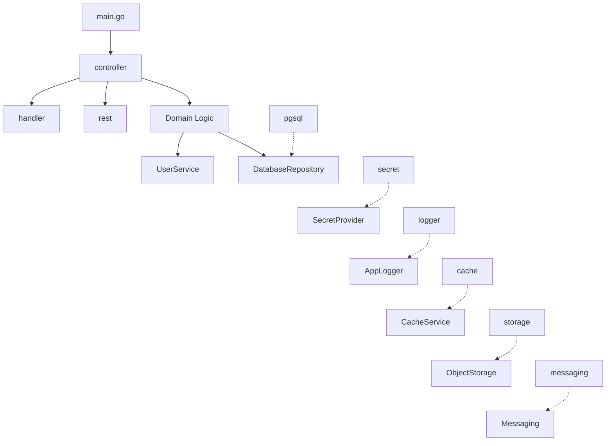

## Package Overview

| Package | Description |
|---------|-------------|
| `common` | Type conversion helpers (`AsString`, `AsInt64`, etc.), HTTP response utilities (`WriteJSON`, `WriteError` with RFC 7807), shared HTTP client, shared flag variables |
| `model` | Domain-agnostic models: `TableDefinition`, `TableColumn`, `ForeignKey`, `UserSession`, `PasswordPolicy`, `QueryResult`, `AppError`, `UserMenu`, `DeviceToken`, `TableChangeLog` |
| `port` | Interface definitions for all pluggable components (auth, cache, storage, messaging, login, ID generation, quota, web socket, table change logger) |
| `data` | `AbstractRepository`, `AbstractTableService`, `DatabaseRepository` / `TxView` / `QueryService` interfaces, file-based `TableLogger`, `QuotaServiceDb`, Snowflake bigint id generator |
| `pgsql` | PostgreSQL implementation using `pgx/v5` — repository, table service, query service, tx-bound query service, tx view |
| `schema` | YAML-based schema definition + seed loader, plus the `schemagen` model used by `cmd/schemagen` to emit DDL/DML for any supported dialect |
| `schema/dialect` | DDL dialects (PostgreSQL, MySQL) consumed by `schemagen` |
| `cmd/schemagen` | CLI tool that converts `schema/*.yml` files into DDL + seed SQL |
| `user` | `UserService` interface + `LocalUserService` (password / 2FA / OTP / refresh tokens / trusted devices / social login / phone-first auth / consent capture / device-token registry / account deletion) and `RegistrationService` (email-confirmation, OAuth-verified, OAuth + active session) |
| `rest` | Metadata-driven REST engine that reads API definitions from database tables (`rest_api_header`, `rest_api_child`) and generates CRUD endpoints automatically with parent-child relations |
| `handler` | `AbstractHandler` (JWT session parsing + helpers), `PublicHandler` (login with 2FA support), `SecurityHandler` (2FA setup/verify/disable, trusted devices, account deletion), `OTPHandler` (phone/email OTP authentication), `SocialLoginHandler` (Google/Apple social login), `PaymentHandler` (webhooks + checkout), `PushHandler` (device-token register/revoke), `RestHandler` (generic CRUD), `CacheHandler` (application data + TypeScript table generation) |
| `service` | Cross-cutting services that bind multiple ports: `APIKeyService` (issue/lookup/revoke), `APIKeyAuthMiddleware`, JWT `SSOMiddleware`, `HttpBackend` (HTTP server with hardened defaults) |
| `dispatcher` | `MailClient` (SMTP + HTML + attachments + REST mail API), `LocalNotificationService` (channel-keyed registry), `EmailDispatcher` and `TwilioSMSDispatcher` (`port.MessageDispatcher` adapters) |
| `secret` | Secret providers: Local (JSON file), Google Secret Manager, AWS Secrets Manager + factory |
| `logger` | Application loggers: File-based, GCP Cloud Logging (structured JSON), AWS CloudWatch + factory |
| `cache` | Redis/Valkey cache service. Single port covers KV + list + pub/sub. Single-node and Redis-Cluster modes; no-op fallback when no cache is configured. Backend chosen by flag (`--redis_url` / `--valkey_url`); password sourced from secret (`redis_password` / `valkey_password`). |
| `storage` | Object storage: S3 (AWS + Cloudflare R2), GCS (Google Cloud Storage), Azure Blob |
| `messaging` | Pluggable publish/subscribe backends behind `port.MessagePublisher` / `port.MessageSubscriber`. Ships GCP Pub/Sub, AWS SNS+SQS, and NATS JetStream impls plus a mode-driven factory (`NewMessagePublisher` / `NewMessageSubscriber`). |
| `payment` | Stripe / LemonSqueezy webhook processor, signature verifiers, event parsers, Stripe checkout + billing-portal client, SQL-backed webhook log repository |
| `push` | `port.MessageDispatcher` push implementations — FCM (Firebase Cloud Messaging, covers iOS via APNs + Android + Web) + NoOp fallback + factory |
| `worker` | `JobExecutor` — runs background workers with service registry and heartbeat — and `RunDefault`, the one-call worker bootstrap |

## Quick Start

### 1. Add the dependency

```bash
go get github.com/nauticana/keel@latest
```

Or for local development, add a replace directive in your `go.mod`:

```
replace github.com/nauticana/keel => ../keel
```

### 2. Bootstrap your application

```go
package main

import (
    "context"
    "flag"
    "log"

    "github.com/nauticana/keel/common"
    "github.com/nauticana/keel/data"
    "github.com/nauticana/keel/logger"
    "github.com/nauticana/keel/pgsql"
    "github.com/nauticana/keel/secret"
)

func main() {
    flag.Parse()
    ctx := context.Background()

    // 1. Logger
    journal, _ := logger.NewApplicationLogger("myapp")
    defer journal.Close()

    // 2. Secrets
    secrets, _ := secret.NewSecretProvider(ctx)

    // 2a. Boot-time-fatal keys: use secret.MustGet (v0.5.1-G). Returns
    //     the value or terminates the process via log.Fatalf when the
    //     secret is missing. Use this only at boot for genuinely-required
    //     keys (Stripe key, JWT secret, DB password). NEVER call MustGet
    //     from a request path — Fatalf takes the whole process down.
    jwtSecret := secret.MustGet(ctx, secrets, "jwt_secret")

    // 3. Bigint ID generator (fed into the repository for collision-free ids
    //    in federated deployments). See "Bigint ID Generation" below.
    gen, err := data.NewSnowflakeGenerator(int64(*common.NodeId), data.EpochMs2026)
    if err != nil { log.Fatalf("snowflake: %v", err) }

    // 4. Database
    db, _ := pgsql.NewPgSQLDatabase(ctx, secrets, gen)

    // 5. Wire your controller and run
    _ = jwtSecret // pass to user.NewLocalUserService(...)
    // ...
}
```

### 3. Use the REST engine

```go
import (
    "github.com/nauticana/keel/rest"
    "github.com/nauticana/keel/handler"
)

// Initialize REST service — reads API definitions from DB
restService := &rest.RestService{}
apis, reports, _ := restService.Init(ctx, db)

// Create handlers for each API
for name, api := range apis {
    h := &handler.RestHandler{
        AbstractHandler: handler.AbstractHandler{UserService: userSvc},
        Api:             *api,
    }
    backend.Handle(map[string]func(w, r){
        "/api/v1/" + name:          h.Get,
        "/api/v1/" + name + "/list": h.List,
        "/api/v1/" + name + "/post": h.Post,
    })
}
```

### 4. Run a background worker

For binaries that don't need a custom database/quota wiring, `worker.RunDefault` is the one-call entry point:

```go
import (
    "context"
    "flag"
    "log"

    "github.com/nauticana/keel/worker"
    yourworker "yourapp/internal/worker"
)

func main() {
    flag.Parse()
    if err := worker.RunDefault(context.Background(), "analytics", 3600, &yourworker.AnalyticsWorker{}); err != nil {
        log.Fatal(err)
    }
}
```

`RunDefault` builds the standard logger, secret provider, snowflake id generator, pgsql database, and `QuotaServiceDb` — wires them into a `JobExecutor` and runs the loop. Worker types must implement `port.JobWorker` (`GetHealthcheckPort`, `ProcessQueue`, `GetOLTPQueries`).

Use `JobExecutor` directly when you need to inject extra services or a non-default database flavor:

```go
executor := &worker.JobExecutor{
    Caption:     "analytics",
    Interval:    3600,
    Journal:     journal,
    Worker:      &yourworker.AnalyticsWorker{},
    NewDatabase: func(ctx context.Context, sp port.SecretProvider) (port.DatabaseRepository, error) {
        return pgsql.NewPgSQLDatabase(ctx, sp, gen)
    },
    NewQuota: func(db port.DatabaseRepository) port.QuotaService {
        return &myCustomQuotaService{Repo: db}
    },
}
executor.Run(ctx, secrets)
```

## API Key Authentication

Keel ships an end-to-end API-key authentication stack for `/pubapi/*` traffic (REST) and standalone services (e.g. MCP servers exposed over Streamable HTTP). Three pieces, one chain:

```
X-API-Key header → APIKeyAuthMiddleware → APIKeyService.LookupKey → context-injected (partner_id, api_key_id, scopes)
```

### `service.APIKeyService` — key lifecycle + 5-min lookup cache

Manages issued keys: generates the user-visible string, stores its SHA-256 hash + prefix in the `api_key` table, looks up keys with a 5-minute process-local cache, enforces expiry and quotas via `port.QuotaService`. The schema is shipped in `basis.sql` (`api_key` + sequence).

```go
apiKeys := &service.APIKeyService{
    DB:           db,
    QuotaService: quota,
    Journal:      journal,
    KeyPrefix:    "myapp_",  // required — panics at Init if empty
    // QuotaResource: "API_CALLS", // default
    // QuotaCaption:  "public-api", // default
}
apiKeys.Init(ctx)

// Issuing a key (typically from a JWT-authed admin handler):
plainKey, prefix, err := apiKeys.InsertKey(ctx, partnerID, "production-key", "businesses,search")
// plainKey is "myapp_<32-hex>"; show to user once and discard.
```

`KeyPrefix` is intentionally required (panic-on-empty at `Init`) so per-product prefixes never collide across consumers (e.g. `myapp_*`, `inventory_*`). `LookupKey` caches by SHA-256 hash for 5 minutes; `InvalidateKey(hash)` clears a single entry on rotation/revocation. `LogUsage` increments the configured quota resource and updates `last_used_at`.

### `service.APIKeyAuthMiddleware` — the reusable factory

Generic `func(http.Handler) http.Handler` factory that validates `X-API-Key`, looks up via `APIKeyService`, enforces expiry + quota, logs usage async, and injects `common.PartnerID / ApiKeyID / Scopes` into the request context. **No path gating** — wrap arbitrary subtrees yourself.

```go
auth := service.APIKeyAuthMiddleware(apiKeys, quota, journal)

// Two typical wirings:

// (1) Inside HttpBackend — gated to /pubapi/* automatically (next section).
// Standard REST setup; no extra code needed.

// (2) Standalone service that should auth every request — e.g. an MCP
// server exposed over Streamable HTTP at https://mcp.example.com/:
http.ListenAndServe(":8090", auth(myHandler))
```

The same context-key constants (`common.PartnerID` etc.) are read by `AbstractHandler.PartnerFromCtx`, `HasScope`, and `RequireScope` — so handlers downstream of either wiring use the same accessors.

### `service.HttpBackend.APIKeyMiddleware` — `/pubapi/*` path gate

`HttpBackend` automatically wraps the inbound chain with `APIKeyMiddleware`, which path-gates on `common.PubapiPrefix` and delegates to `APIKeyAuthMiddleware` for actual validation. Non-`/pubapi/*` requests pass through to `SSOMiddleware` (JWT auth). This is the standard wiring for any consumer using `HttpBackend.Run`:

```go
srv := service.HttpBackend{
    Journal:       journal,
    DB:            db,
    Secrets:       secrets,
    Origin:        *common.CORSOrigin,
    UserService:   userSvc,
    QuotaService:  quota,
    ApiKeyService: apiKeys,  // already constructed + Init'd
}
srv.Handle(myRoutes)
srv.Run(ctx)
```

For services that don't use `HttpBackend` (workers exposing healthchecks, MCP servers, etc.), use `APIKeyAuthMiddleware` directly per the example above.

### Configuration

| Source | Key | Purpose |
|---|---|---|
| Field | `APIKeyService.KeyPrefix` | Required. Per-product user-visible prefix (e.g., `"myapp_"`). |
| Field | `APIKeyService.QuotaResource` | Optional. Defaults to `"API_CALLS"`. The resource id passed to `QuotaService.LogUsage` and `CheckQuota`. |
| Field | `APIKeyService.QuotaCaption` | Optional. Defaults to `"public-api"`. The caption recorded in usage rows. |
| Schema | `api_key` table + sequence | Already in keel's `schema/security/14_api_key.yml`. No project-side schema. |

### Database Table

| Table | Purpose |
|---|---|
| `api_key` | Issued keys: `id`, `partner_id`, `key_name`, `key_prefix` (visible), `key_hash` (SHA-256), `scopes` (CSV), `is_active`, `expires_at`, `last_used_at`. |

## Two-Factor Authentication (2FA) & Trusted Devices

Keel includes built-in TOTP-based 2FA with trusted device management. The login endpoints (`LoginLocal`, `LoginGmail`) automatically check `TwoFactorEnabled` on the user session and return a conditional response.

### Login Flow with 2FA

```
POST /public/login/local   (or /public/login/gmail)
  Request:  { "username": "...", "password": "...", "deviceFingerprint": "optional" }

  // If 2FA NOT enabled (or device is trusted):
  Response: { "token": "jwt...", "userId": 1, "partnerId": 1, "menu": [...], "twoFactorRequired": false }

  // If 2FA enabled AND device NOT trusted:
  Response: { "twoFactorRequired": true, "loginToken": "12345678" }
```

When `twoFactorRequired` is `true`, the frontend redirects to a 2FA verification page and submits the code via the public verify endpoint.

### Security Endpoints

**Public (no JWT required)** -- used during login-time 2FA verification:

| Method | Path | Description |
|--------|------|-------------|
| POST | `/public/2fa/verify` | Verify TOTP code with `loginToken`, returns JWT on success |
| POST | `/public/2fa/backup-verify` | Verify backup code with `loginToken`, consumes the code |

**Authenticated (JWT required)** -- used for 2FA setup, device management, session revocation, and account deletion:

| Method | Path | Description |
|--------|------|-------------|
| POST | `/api/user/2fa/setup` | Generate TOTP secret, QR URI, and 10 backup codes. **Side effect:** revokes all active refresh tokens (user re-auths on next refresh). |
| POST | `/api/user/2fa/verify` | Confirm 2FA setup by verifying a TOTP code |
| POST | `/api/user/2fa/disable` | Disable 2FA (requires current TOTP code). **Side effect:** revokes all active refresh tokens. |
| GET | `/api/user/trusted-device/list` | List trusted devices for the authenticated user |
| POST | `/api/user/trusted-device/revoke` | Revoke a trusted device by ID. **Side effect:** revokes all active refresh tokens. |
| POST | `/api/user/logout-everywhere` | Revoke every active refresh token (user will re-auth on every device) |
| DELETE | `/api/user/account` | Soft-delete the caller's account (anonymize + cascade revoke). Body `{reason}` optional. Returns 204. |

### Session-hygiene behavior bump (v0.3)

`SetPassword`, `Setup2FA`, `Disable2FA`, and `RevokeTrustedDevice` now invalidate every active refresh token for the user. Rationale: a stale refresh token that survived a credential rotation is an attacker's foothold. Consumers upgrading from v0.2 should expect users to re-authenticate after these events.

The access token (JWT) remains valid until its natural expiry — only the refresh path is affected. For an immediate global logout (e.g., incident response), use the new `/api/user/logout-everywhere` endpoint.

### Single-device session policy (v0.4)

Some roles (ride-share drivers, medical-device operators, any high-trust account) must be signed in on exactly one device at a time. Keel exposes a per-user primitive via `user_account.single_device_session BOOLEAN`:

```go
// Typical pattern: consumer flips the bit on role creation.
if err := userSvc.SetSingleDevicePolicy(driverUserID, true); err != nil { ... }
```

When the bit is on, every call to `CreateRefreshToken(userID)` first revokes all prior active refresh tokens for that user. The device that most recently authenticated is the device that stays signed in. Riders, regular users — default off, normal multi-device behavior.

### Registering Security Routes

`SecurityHandler` provides `GetPublicRoutes()` and `GetAuthRoutes()` methods that return route maps. Any project using keel can register them:

```go
securityHandler := handler.SecurityHandler{
    AbstractHandler: handler.AbstractHandler{UserService: userSvc},
}
srv.Handle(securityHandler.GetPublicRoutes())  // /public/2fa/*
srv.Handle(securityHandler.GetAuthRoutes())    // /api/user/2fa/*, /api/user/trusted-device/*
```

### Database Tables

These tables must exist (defined in `schema/security/`):

| Table | Purpose |
|-------|---------|
| `user_account` | `twofa_enabled`, `twofa_method`, `twofa_secret`, `twofa_backup_codes`, `twofa_enabled_at`, `passtext` (nullable — NULL = social/OTP-only), `deleted_at` (nullable — set by `DeleteAccount`), `status` (`A`/`X`/`E`/`S`/`I`/`D`). |
| `user_trusted_device` | `device_fingerprint`, `device_name`, `trusted_at`, `expires_at` (30-day), `last_seen_at` |
| `user_registration` | Reused for login tokens (`payload='LOGIN'`, 5-minute expiry) |

### Account-deletion semantics

`DeleteAccount` is a **soft delete**, not a hard DELETE. Ride history, invoices, payment records, audit rows — anything that FK's back to `user_account(id)` — stays pointing at the same row. What changes: PII is anonymized (`first_name`→`Deleted`, `last_name`→`User`, `user_email`→`deleted+<id>@local.invalid`, `phone`→NULL, `passtext`→NULL, 2FA cleared, `user_name`→`deleted-<id>`), status flips to `'D'`, `deleted_at` stamps, all refresh tokens revoked, trusted devices deleted, social-provider links deleted, `UserActivityDelete` history row written with the supplied reason.

Consumers that own domain tables cascading off `user_id` (e.g. profiles, history rows, payment records) should implement their own `DeleteAccount` wrapper that runs keel's method plus their cascade in a coordinated flow.

## OTP Authentication (Phone/Email)

Keel includes OTP-based authentication for mobile-first applications. Users can sign in or register using a one-time code. Phone numbers are first-class in v0.3 — raw user input (e.g. `(416) 555-1234`, `416-555-1234`, `+14165551234`) is normalized to E.164 before lookup or insert, and phone registrations write to `user_account.phone` directly (no `user_social_provider` row).

### OTP Flow

```
1. POST /public/otp/send
     { "contact": "(416) 555-1234", "purpose": "register", "defaultRegion": "CA",
       "policyVersion": "v1", "consents": {"privacy_policy": true, "cross_border": true} }
   → server normalizes contact to "+14165551234", creates user with passtext=NULL
     (purpose=register only), records consent if ConsentService is registered.
   Response: { "otpToken": "<32-byte base64>" }

2. Backend generates 6-digit code, stores with 2-minute expiry, sends via NotificationService.

3. POST /public/otp/verify    { "otpToken": "<from step 1>", "code": "847291" }
   Response: { "token": "jwt...", "userId": 42, "partnerId": 1 }
```

`purpose` values: `login` (lookup-or-noop on unknown phone), `register` (lookup-or-create via `GetOrCreateUserByPhone`), `verify` (explicit contact verification). `defaultRegion` is the ISO country code used as a hint when parsing local-format numbers — defaults to `"US"`.

The `otpToken` is a server-issued opaque value (32 random bytes, base64-URL) bound in `Cache` to the user_id for `OTPTokenTTL` (5 minutes). Verify and Resend require the token; an attacker who guesses arbitrary user_ids cannot reach the verify path because the cache lookup fails. The login path returns the same response shape on unknown phone (no SMS dispatched), so an attacker cannot enumerate registered numbers by comparing 200 vs 404.

### OTP Endpoints

| Method | Path | Description |
|--------|------|-------------|
| POST | `/public/otp/send` | Generate and send OTP. Rate limited: **3 per contact / 10 min** (keyed on the E.164 form so unnormalized variants share the quota) AND **10 per caller IP / 10 min** (mitigates SMS-pumping across enumerated numbers). |
| POST | `/public/otp/verify` | Verify OTP code, returns JWT on success (max 5 attempts) |
| POST | `/public/otp/resend` | Clear and regenerate OTP for an existing session |

### Registering OTP Routes

```go
otpHandler := handler.OTPHandler{
    AbstractHandler: handler.AbstractHandler{UserService: userSvc},
    NotificationSvc: notificationSvc,
    Cache:           cacheService,
}
srv.Handle(map[string]func(w, r){
    "/public/otp/send":   otpHandler.SendOTP,
    "/public/otp/verify": otpHandler.VerifyOTP,
    "/public/otp/resend": otpHandler.ResendOTP,
})
```

### Database Tables

| Table | Purpose |
|-------|---------|
| `user_otp` | `user_id`, `code` (6-digit), `purpose`, `expires_at` (2 min), `attempts` (max 5) |

## Social Login (Google & Apple)

Keel supports social login via Google and Apple ID tokens. The handler verifies the token then delegates to a single service entry point that handles the full three-branch ladder atomically.

### Social Login Flow

```
POST /public/login/social  { "provider": "google", "token": "eyJhbG..." }

1. Verify token (Google: tokeninfo endpoint, Apple: JWT decode)
2. Service.GetOrCreateUserFromSocial(...) runs the ladder:
     a. Existing social link on (provider, providerId)?   → return session.
     b. emailVerified && existing account on email?       → link social provider to it.
     c. Otherwise                                         → INSERT user_account + user_social_provider
                                                            in one transaction.
3. Return JWT.

Response: { "token": "jwt...", "userId": 42, "partnerId": 1, "isNewUser": false }
```

Branch (c) runs inside `DatabaseRepository.BeginTx` so a link failure rolls back the orphan `user_account` row. Socially created accounts carry `passtext = NULL`; a subsequent password-login attempt against the same account is rejected with `"password authentication not enabled for this account"` *before* bcrypt runs.

### Service API

```go
GetOrCreateUserFromSocial(
    email, firstName, lastName, phone, provider, providerID string,
    emailVerified bool,
    signupConsent *port.SignupConsent,
) (session *model.UserSession, created bool, err error)
```

This is the only public social-login method on `port.UserService`. The older `CreateUserFromSocial` and `GetUserBySocialProvider` methods were consolidated into this single entry point.

`emailVerified` reflects the provider's verified-email claim. `verifyGoogleToken` extracts Google's `email_verified` (string `"true"`/`"false"`) from the tokeninfo response; `verifyAppleToken` reads it from the Apple ID-token JWT (handles both bool and string encoding). The handler passes the parsed value straight through. When `false`, branch (b) is skipped — which avoids account takeover via an unverified provider-asserted email.

### Apple "Hide My Email" handling

Apple sets `email_verified=true` for relay addresses (`*@privaterelay.appleid.com`), but those addresses are stable per app and **never** match a password-signup account's email. Branch (b) explicitly skips relay addresses so an Apple sign-in cannot link onto an unrelated password account that happens to share the same relay string.

### Email normalization

Every email read/write goes through a private `normalizeEmail` helper (lowercase + trim) at the service boundary: `GetUserByEmail`, `GetOrCreateUserFromSocial`, `insertUserAccount`, and the `RegistrationService` paths (`SendConfirmation`, `Register`, `SendPasswordChangeConfirmation`, `ConfirmPasswordChange`). Result: `Foo@Gmail.com` at password signup and `foo@gmail.com` from a Google ID token collapse to the same canonical row instead of silently creating duplicates.

### Audit trail

Every social-create, social-re-auth, phone-create, and phone-re-auth path now writes a `user_account_history` row:

- `UserActivityCreate` with object name `social:<provider>` or `phone` on first signup.
- `UserActivityLogin` with the same object name on subsequent re-auths.

Combined with the password-login history that was already written by `GetUserByLogin` / `GetUserByEmail`, every authenticated session in the system now leaves an audit-trail entry — answering "when did this user first sign in?" and "when did this social-only user last log in?" without ambiguity.

### Empty contact fields → SQL NULL

`insertUserAccount` converts an empty `email` or `phone` to SQL `NULL` rather than the empty string. The UNIQUE indexes described next treat NULL as distinct, so multiple accounts can legitimately have no email or no phone without colliding. `user_account.user_email` is `NULL`-able as of v0.5; phone-OTP and Apple "Hide My Email" flows that have no usable address rely on this.

### Duplicate prevention — UNIQUE indexes on email and phone

`schema/security/04_user_account.yml` declares two unique indexes:

| Index | Column | What it prevents |
|---|---|---|
| `user_account_email_uq` | `user_email` | Two active accounts with the same canonical email |
| `user_account_phone_uq` | `phone` | Two active accounts with the same E.164 phone |

Combined with the entry-point normalization (`normalizeEmail` lowercases + trims; `normalizePhone` rewrites to E.164), the indexes guarantee at most one active account per contact value. `INSERT` failures are surfaced as typed sentinel errors so callers can route the user to a "sign in instead" flow:

```go
_, err := userSvc.GetOrCreateUserFromSocial(...)
if errors.Is(err, user.ErrDuplicateEmail) { ... }
if errors.Is(err, user.ErrDuplicatePhone) { ... }
```

Soft-deleted accounts (`status='D'`) don't compete for the index — `DeleteAccount` rewrites email to `deleted+<id>@local.invalid` (unique per id) and phone to `NULL` (multiple NULLs allowed). A user can re-register with the same email/phone after deletion.

**Not yet handled:** if two accounts already exist for the same person (one created via email-password, another via phone-OTP) and the user wants to merge them or add the missing contact to an existing account, keel has no built-in flow for that. The UNIQUE indexes prevent *new* duplicates from being created via the standard `GetOrCreateUserFromSocial` / `GetOrCreateUserByPhone` / registration paths, but they do not resolve duplicates that already exist or back a "verified add" flow. That is intentionally deferred until a consumer requires it.

### Social Login Endpoint

| Method | Path | Description |
|--------|------|-------------|
| POST | `/public/login/social` | Authenticate via provider ID token (Google or Apple) |

### Registering Social Login Routes

```go
socialHandler := handler.SocialLoginHandler{
    AbstractHandler: handler.AbstractHandler{UserService: userSvc},
}
srv.Handle(map[string]func(w, r){
    "/public/login/social": socialHandler.LoginSocial,
})
```

### Database Tables

| Table | Purpose |
|-------|---------|
| `user_social_provider` | `user_id`, `provider` (google/apple), `provider_id` (sub claim from token). **Phone is NOT a provider here** — `GetOrCreateUserFromSocial` rejects `provider == "phone"` at runtime; phone registrations live in `user_account.phone` directly and are handled via `GetOrCreateUserByPhone`. |
| `user_account.passtext` | Nullable. NULL means "this account authenticates via social/OTP only; password login is disabled." |

## Consent Capture (PIPEDA / GDPR)

Keel exposes an optional `port.ConsentService` that signup flows (social login, phone OTP) call after account creation. Any consumer that needs regulator-visible consent audit trails can register one at `LocalUserService` construction.

### Consent DB tables

| Table | Purpose |
|-------|---------|
| `consent_policy` | Versioned policy text registry. Unique on `(policy_type, region, version, language)`. |
| `consent_event` | One row per (user × consent_type × policy version) decision. Stores `email_hash` fallback when the row predates user_account creation, plus `client_ip` / `client_user_agent` for the audit trail. |

### Wiring

```go
consentSvc, _ := user.NewLocalConsentService(ctx, db, journal)
userSvc, _ := user.NewLocalUserService(ctx, db, jwtSecret, "myapp")
userSvc.ConsentService = consentSvc  // optional; leave nil to skip consent recording
```

Social-login and OTP request bodies accept optional `policyType`, `policyVersion`, `policyRegion`, `policyLanguage`, `region`, and `consents: {<type>: <bool>}` fields. On a new-user signup they're recorded. On re-auth they're ignored. When no `ConsentService` is registered the handlers accept the fields but skip the recording — consumers that don't need consent audit trails are unaffected.

If the user is created but the subsequent consent insert fails, handlers return **HTTP 425 Failed Dependency** with the session context so clients can retry the consent write rather than recreate the account.

### Canonical consent type labels (port constants)

- `port.ConsentTypePrivacyPolicy`, `port.ConsentTypeTerms`, `port.ConsentTypeCrossBorder`, `port.ConsentTypeVideoOptIn`, `port.ConsentTypeVideoSession`, `port.ConsentTypeMarketing`

Consumers may record additional custom types just by passing their own string — keel does not enforce the label set.

### Spoof-safe client IP — `bhandler.TrustedClientIP(r)`

The `client_ip` column on `consent_event` is part of the regulator-visible audit trail; it must reflect the real caller, not whatever an attacker types into `X-Forwarded-For`. Keel ships `handler.TrustedClientIP(r *http.Request) string` (exported in v0.4.7) that honors `X-Forwarded-For` / `X-Real-IP` **only** when the inbound socket address falls inside `--trusted_proxy_cidr`. With an empty CIDR config the helper returns `RemoteAddr`'s host part — a fail-closed default per P0-15.

Use this helper anywhere a downstream consumer would otherwise reach for `r.RemoteAddr` or read forwarding headers directly:

```go
import "github.com/nauticana/keel/handler"

func (h *MyHandler) Register(w http.ResponseWriter, r *http.Request) {
    consent := &port.SignupConsent{
        ClientIP:        handler.TrustedClientIP(r), // gated; safe behind a trusted proxy
        ClientUserAgent: r.UserAgent(),
        // …
    }
}
```

Keel's own consent-capturing handlers (`SocialLoginHandler.LoginSocial`, the OTP flows, the Google login activity-history insert) all use this helper internally, so they're safe by default. Consumers writing their own handlers should call it explicitly rather than re-implementing the gate — the obvious-looking `r.Header.Get("X-Forwarded-For")` shortcut accepts spoofed values whenever the deployment isn't behind a CIDR-restricted proxy.

**Production startup check.** The empty-config default is library-friendly but operationally dangerous: every audit row would attribute traffic to the load balancer's peer IP and the spoof-gated `TrustedClientIP` would never promote XFF. Production binaries should call:

```go
flag.Parse()
handler.MustRequireTrustedProxyCIDR() // log.Fatalf if --trusted_proxy_cidr is empty / all-invalid
```

(Or the error-returning variant `handler.RequireTrustedProxyCIDR()` if you prefer to handle the failure yourself.) This converts the silently-broken-attribution failure mode into a deploy-time crash. The validator parses the CIDR list with the same logic the runtime uses — a config that splits to zero valid nets fails too, since that's behaviorally identical to "empty" at request time. Skip the helper for unit tests, localhost-only deployments, or consumers that genuinely do not record client IPs.

## Push Notifications (FCM)

Keel ships a push-notification subsystem behind `port.MessageDispatcher` (legacy alias `port.PushProvider`). The `device_token` table stores per-user FCM tokens (iOS devices use Firebase's APNs integration, so one provider covers both platforms). Non-mobile consumers get a NoOp provider by default and are unaffected.

### Wiring

Select the provider via `--push_mode=fcm|noop` (default `noop`):

```go
// In main.go, after UserService is constructed:
pushProvider, err := push.NewPushProvider(ctx, userSvc, journal)
if err != nil { ... }

// Register the mobile-facing endpoints on SecurityHandler or a dedicated PushHandler:
pushHandler := &handler.PushHandler{
    AbstractHandler: handler.AbstractHandler{UserService: userSvc},
}
srv.Handle(pushHandler.GetAuthRoutes())
```

FCM mode requires `GOOGLE_APPLICATION_CREDENTIALS` pointing at a service-account key, or running inside GCP with an attached identity.

### Device-token endpoints

| Method | Path | Description |
|--------|------|-------------|
| POST | `/api/push/register` | Idempotent upsert. Body: `{ "platform": "I\|A\|W", "token": "<fcm token>", "appVersion": "1.2.3", "deviceModel": "iPhone 15" }`. Called by the mobile SDK after each login + on token-refresh events. |
| POST | `/api/push/revoke` | Mark a token inactive. Body: `{ "token": "<fcm token>" }`. Called on explicit logout. |

### Dispatch

Server-side code that decides a push is warranted calls the provider directly:

```go
err := pushProvider.Dispatch(ctx, userID, "Order shipped", "Your order is on the way", map[string]string{
    "order_id": "o-123",
    "type":     "order_shipped",
})
```

FCM-reported stale tokens (the `registration-token-not-registered` error) are automatically marked `is_active=false` so subsequent dispatches skip them. `Dispatch` against a user with zero active devices is a silent no-op, not an error.

### device_token table

Columns: `id`, `user_id` (FK → user_account), `platform` (`CHAR(1)` — I=iOS, A=Android, W=Web), `token` (TEXT — FCM token), `app_version`, `device_model`, `is_active`, `created_at`, `updated_at`, `last_seen_at`. Unique index on `(user_id, token)` to keep re-registration idempotent. `DeleteAccount` cascades to deactivate every token for the user.

## Notifications & Messaging

Keel exposes a channel-keyed dispatcher abstraction so consumer code can fire `notif.Send({Channel: "email", UserID: 42, Title: ...})` without caring whether email/push/sms is wired up underneath. Email (SMTP/API via `MailClient`), push (FCM), and SMS (Twilio) all ship in keel; custom channels are consumer-supplied implementations of the same interface.

### `port.MessageDispatcher`

Single-channel delivery contract — implementations resolve `userID` to the channel-specific address and send. Returning `nil` when the user has no usable address for the channel is correct (the channel-level "nobody to notify" no-op); reserve non-nil errors for transport failures.

```go
type MessageDispatcher interface {
    Dispatch(ctx context.Context, userID int, title, body string, data map[string]string) error
}
```

`port.PushProvider` is now a deprecated alias of `MessageDispatcher` (same shape). FCM continues to satisfy both names; new code should depend on `MessageDispatcher`.

### `dispatcher.LocalNotificationService` — registry + router

Default keel implementation of `port.NotificationService`. Holds a channel name → dispatcher map; `Send(req)` routes by `req.Channel`:

```go
notif := dispatcher.NewLocalNotificationService()
notif.Register("email", &dispatcher.EmailDispatcher{Mail: mailClient, Users: userSvc})
notif.Register("push",  fcmProvider)             // FCMPushProvider satisfies MessageDispatcher
notif.Register("sms",   twilioSMS)               // TwilioSMSDispatcher (keel-shipped)

err := notif.Send(ctx, port.NotificationRequest{
    UserID:  42,
    Channel: "email",
    Title:   "Receipt",
    Body:    "Thanks for your order…",
})
```

Unknown channel returns a typed error so callers can distinguish "channel not configured" from "dispatcher failed". `Channels()` lists registered channel names — useful for admin/diagnostic surfaces.

### `dispatcher.EmailDispatcher` — MailClient adapter

Wraps the existing `MailClient` so SMTP/API email plugs into the dispatcher registry:

```go
&dispatcher.EmailDispatcher{Mail: mailClient, Users: userSvc}
```

`Users` is a `port.RecipientResolver` (just `EmailFor` and `PhoneFor`) — the keel-shipped `LocalUserService` satisfies it directly, and consumers can wire a thinner address-only resolver (e.g. one backed by a recipient cache) if they don't want dispatcher to import the user package. Returns `nil` (no-op) when the user has no email on file — correct for deleted accounts and social-only signups that never set one.

### `dispatcher.TwilioSMSDispatcher` — Twilio Messaging Service adapter

Sends SMS via Twilio's Messages API. Implements `port.MessageDispatcher` so it plugs into `LocalNotificationService` on the `"sms"` channel:

```go
sms, err := dispatcher.NewTwilioSMSDispatcher(ctx, secrets, userSvc, journal)
if err == nil {
    notif.Register("sms", sms)
}
```

Configuration:

| Source | Key | Purpose |
|---|---|---|
| Secret provider | `twilio_account_sid` | Twilio account SID (basic-auth username) |
| Secret provider | `twilio_auth_token` | Twilio auth token (basic-auth password) |
| Flag | `--twilio_messaging_service_sid` | `MGxxxxxxxx...` — the Messaging Service that owns the sender pool |

The dispatcher holds a single Messaging Service SID. Twilio routes each outbound message to the right sender (Canadian long code, US 10DLC, UK/EU alphanumeric, etc.) based on the senders attached inside the Twilio console — adding regional coverage is a console-only change, no code edits or redeploy.

The constructor fails fast when any of the three values is missing, so callers can `Register` only on success and cleanly run with SMS disabled when the deployment hasn't provisioned Twilio yet:

```go
sms, err := dispatcher.NewTwilioSMSDispatcher(ctx, secrets, userSvc, journal)
if err != nil {
    journal.Error("SMS disabled: " + err.Error())
} else {
    notif.Register("sms", sms)
}
```

`Dispatch` resolves `userID` to the E.164 phone via `UserService.GetUserById` (reads `session.PhoneNumber`). Returns `nil` when the user has no phone on file — the documented "nobody to notify" channel-level no-op. Non-2xx responses and transport failures are wrapped as errors so the worker logs and skips marking the notification sent (the notification row stays pending for retry).

## Payments (Stripe & LemonSqueezy)

Keel ships a provider-agnostic payment layer: HMAC signature verification,
idempotent webhook processing, canonical event parsing, and a Stripe checkout
client. Each consumer project implements a ~15-line `PaymentEventHandler`
that maps canonical events into its domain actions (activate subscription,
record ride payment, extend license, etc.). See
[SHARED_PAYMENT.md](SHARED_PAYMENT.md) for the full design rationale.

### Webhook Lifecycle

```
POST /public/webhook/stripe
  1. Read body (MaxBytesReader, 256 KiB cap)
  2. Log raw webhook → payment_webhook_log (status='R')
  3. Idempotency check on (provider, event_id) — duplicates → 'D', skip
  4. Verify signature — HMAC-SHA256 of "<ts>.<body>", 5-min replay window
  5. Parse into canonical port.PaymentEvent (amount in major units, metadata flattened)
  6. Call project's PaymentEventHandler.OnPaymentEvent(event)
  7. Update log status → 'P' (processed) or 'F' (failed) with error_message
```

### Core Interfaces

Defined in [port/payment.go](port/payment.go):

| Interface | Purpose |
|-----------|---------|
| `PaymentEventHandler` | Implemented by each project — maps `PaymentEvent` → domain action |
| `SignatureVerifier` | Validates a provider's webhook signature |
| `EventParser` | Converts raw provider body → canonical `PaymentEvent` |
| `PaymentProvider` | Bundles name + signature header + verifier + parser |
| `WebhookRepository` | Persists log rows (idempotency + audit) — `SQLWebhookRepository` is the default |
| `CheckoutClient` | Outbound checkout / billing-portal API (Stripe impl: `StripeCheckoutClient`) |

### Wiring Example

```go
import (
    "github.com/nauticana/keel/handler"
    "github.com/nauticana/keel/payment"
)

stripeClient := payment.NewStripeCheckoutClient(secrets)

repo := payment.NewSQLWebhookRepository(db)
processor := payment.NewWebhookProcessor(
    repo,
    journal,
    payment.NewStripeProvider(secrets),
    payment.NewLemonSqueezyProvider(secrets),
).
    // v0.5.1-E: fail-closed on dashboard misconfiguration. Events not
    // listed here are logged with status='S' and never dispatched.
    // Omit the call to allow every signed event through (v0.5.0 behavior).
    WithAllowedEventTypes(
        "checkout.session.completed",
        "setup_intent.succeeded",
        "invoice.paid",
        "customer.subscription.deleted",
    )

// v0.5.1-F: optional follow-up hook for cross-cutting work that must
// run AFTER OnPaymentEvent succeeded — e.g. attaching a freshly-saved
// PaymentMethod to the customer for default-payment-method routing.
// MUST be idempotent — Stripe re-delivers on a 5xx and OnPaymentEvent
// will run again on the retry.
processor.AfterHandler = func(ctx context.Context, e *payment.PaymentEvent) error {
    if e.EventType != "setup_intent.succeeded" || e.SetupIntentID == "" {
        return nil
    }
    // Read the SetupIntent to recover the PaymentMethod, then attach it.
    body, err := stripeClient.Get(ctx, "/setup_intents/"+e.SetupIntentID, nil)
    if err != nil { return err }
    // ... extract pm_xxx from body, then:
    _, err = stripeClient.Post(ctx, "/payment_methods/pm_xxx/attach",
        url.Values{"customer": {e.CustomerID}})
    return err
}

paymentHandler := &handler.AbstractPaymentHandler{
    Processor: processor,
    Handler:   &myDomainHandler{db: db},       // implements port.PaymentEventHandler
    Checkout:  stripeClient,
    Journal:   journal,
}

srv.Handle(map[string]func(http.ResponseWriter, *http.Request){
    "/public/webhook/stripe":       paymentHandler.HandleStripeWebhook,
    "/public/webhook/lemonsqueezy": paymentHandler.HandleLemonSqueezyWebhook,
    "/api/billing/checkout":        paymentHandler.CreateCheckout,
})
```

### Project-Specific Handler

`OnPaymentEvent` receives a typed `*PaymentEvent` with the setup-mode fields pre-extracted as of v0.5.1 — branch on `e.Mode == "setup"` instead of unmarshalling `e.RawPayload`. The JWT-gated checkout path also injects `user_id` into metadata automatically (v0.5.1-A), so consumers no longer round-trip the id through the client.

```go
func (h *myDomainHandler) OnPaymentEvent(ctx context.Context, e *payment.PaymentEvent) error {
    userID := e.Metadata["user_id"] // auto-injected by CreateCheckout for JWT-gated callers
    switch e.EventType {
    case "checkout.session.completed":
        if e.Mode == "setup" {
            // PaymentMethod-capture flow; the SetupIntent fires its own event.
            return nil
        }
        return h.activateSubscription(ctx, userID, e.Metadata["plan"], e.MinorUnits)
    case "setup_intent.succeeded":
        // e.SetupIntentID and e.CustomerID are pre-extracted (v0.5.1-D).
        return h.recordPaymentMethod(ctx, userID, e.SetupIntentID, e.CustomerID)
    case "invoice.paid":
        return h.recordRenewal(ctx, e)
    case "customer.subscription.deleted":
        return h.cancelSubscription(ctx, userID)
    }
    return nil
}
```

### Outbound Stripe API calls — `StripeCheckoutClient.Get` / `Post` (v0.5.1-C)

Webhook handlers and after-hooks often need to read or mutate Stripe resources synchronously (e.g. expand a SetupIntent to get the attached PaymentMethod, or attach a PaymentMethod to a Customer). Use the same `StripeCheckoutClient` you already constructed for `CreateCheckoutSession` — it carries the secret, retry budget, and 1 MiB response cap.

```go
// Read: GET /v1/setup_intents/{id}?expand[]=payment_method
body, err := client.Get(ctx, "/setup_intents/"+id, url.Values{
    "expand[]": {"payment_method"},
})

// Write: POST /v1/payment_methods/{id}/attach
form := url.Values{"customer": {"cus_abc"}}
body, err := client.Post(ctx, "/payment_methods/pm_xyz/attach", form)
```

`Get` does NOT send the `Idempotency-Key` header (Stripe rejects it on read endpoints); `Post` does. Both apply the shared 5xx/429 retry with exponential backoff.

### Secrets

| Secret name | Used by | Purpose |
|-------------|---------|---------|
| `stripe_secret_key` | `StripeCheckoutClient` | Basic-auth to `api.stripe.com` |
| `stripe_webhook_secret` | `StripeSignatureVerifier` | HMAC key for Stripe webhook validation |
| `lemonsqueezy_webhook_secret` | `LemonSqueezySignatureVerifier` | HMAC key for LS webhook validation |

### Database Tables

| Table | Purpose |
|-------|---------|
| `payment_webhook_log` | Raw inbound webhooks — idempotency key on `(provider, event_id)` + audit |
| `payment_method` | Partner-owned provider customer tokens (`stripe cus_...`) |
| `payment_record` | Completed / failed / refunded transactions |

### Checkout modes

`POST /api/billing/checkout` accepts three Stripe modes via the `mode` field:

| Mode | `priceId` required | Use case |
|------|--------------------|----------|
| `subscription` (default) | yes — must be in `AllowedPriceIDs` | Recurring billing — subscriptions, seats |
| `payment` | yes — must be in `AllowedPriceIDs` | One-off charge |
| `setup` | **must be empty** | Capture a payment method without charging (SetupIntent flow). `line_items` are omitted from the Stripe request; a non-empty `priceId` here is rejected because Stripe ignores it anyway. |

Setup mode returns the same `{ "checkoutUrl": "..." }` shape; Stripe persists a SetupIntent on the resulting session that consumers can read from `setup_intent.succeeded` webhooks. The handler enforces the `mode` allowlist (one of the three values above) before reaching the port — unknown modes fail with 400, not a downstream Stripe 502.

**`AllowedRedirectHosts` matching (v0.4.7+):** an entry without a colon matches the URL's hostname port-insensitively, so listing `"app.example"` accepts both `https://app.example/` and `https://app.example:8443/`. An entry containing a colon (e.g. `"app.example:8443"`) stays port-strict — useful when you intentionally want to gate by exact `host:port`. Pre-v0.4.7 matched against the raw `host:port` pair, which silently 400'd legitimate non-default ports.

### What each project still owns

- **Event → domain action mapping** — your `OnPaymentEvent` switch.
- **Plan ↔ Price ID table** — hardcode, flag, or DB; keel's checkout takes any `price_xxx`.
- **Accounting / journaling** — keel is provider-neutral; per-project until a pattern clearly repeats.
- **Success / cancel URLs** — computed from each project's `ConfirmBaseURL`.

## Multi-Cloud Support

Keel supports multiple cloud providers through its port/adapter pattern:

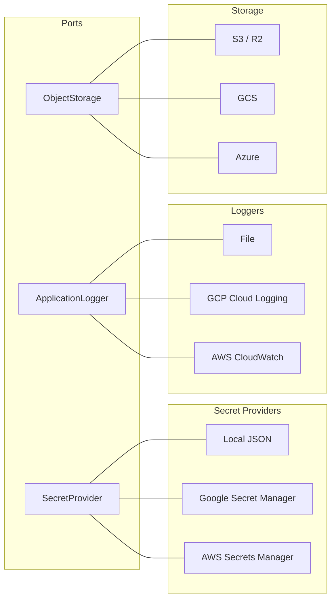

Selection is driven by flag variables:
- `--secret_mode=local|gsm|aws`
- `--log_type=local|gcp|aws`
- `--storage_mode=s3|gcs`
- `--messaging_mode=gcp|aws|nats`

## Messaging (publisher / subscriber)

Keel ships a portable pub/sub abstraction so app code can publish events without knowing which broker is wired underneath:

```go
type MessagePublisher interface {
    Publish(ctx context.Context, topic string, data []byte, attributes map[string]string) error
    Close() error
}

type MessageSubscriber interface {
    Subscribe(ctx context.Context, subscription string, handler MessageHandler) error
    Close() error
}

type MessageHandler func(ctx context.Context, msg *Message) error

type Message struct {
    ID         string
    Data       []byte
    Attributes map[string]string
    Ack        func()
    Nack       func()
}
```

### Backends

| Mode | Publisher | Subscriber | Config |
|------|-----------|------------|--------|
| `gcp` | `PubSubPublisher` (Cloud Pub/Sub) | `PubSubSubscriber` | `--gcp_project_id` |
| `aws` | `SNSPublisher` (looks up topic ARN by name) | `SQSSubscriber` (long-poll, ack via `DeleteMessage`, nack via `ChangeMessageVisibility(0)`) | Standard AWS SDK credentials chain |
| `nats` | `NATSPublisher` (JetStream, work-queue retention, lazy stream creation) | `NATSSubscriber` (durable pull consumer; `MaxDeliver=3`, `AckWait=30s`) | `--nats_url`; optional `NATS_NAME` / `NATS_CREDS` env |

The factory dispatches on the `--messaging_mode` flag:

```go
pub, err := messaging.NewMessagePublisher(*common.MessagingMode)
if err != nil {
    journal.Error("publisher unavailable: " + err.Error())
}

sub, err := messaging.NewMessageSubscriber(*common.MessagingMode)
```

Empty / unknown modes return an error — deployments fail fast on misconfiguration. Callers that want graceful degradation (e.g. notifications fall back to DB-only when publishing is unavailable) treat the error as "broker not configured" and continue without the publisher.

### NATS direct connection

`messaging.NATSConnect()` returns a raw `*nats.Conn` for callers that need plain NATS (e.g. WebSocket fan-out hubs that want low-latency core pub/sub without JetStream overhead). It honors the same `--nats_url` / `NATS_NAME` / `NATS_CREDS` configuration used by the JetStream publisher and subscriber, so a single deployment configures all three from one set of values.

## Bigint ID Generation

Primary-key ids on tables are minted one of two ways:

1. **PostgreSQL sequence** — a table declares `sequence:` in its YAML, `nextval('<seq>')` fills the id. The historical default; still used by most tables.
2. **Snowflake-style bigint generator** — a table declares `id BIGINT` with no `sequence:` block; ids come from an injected `port.BigintGenerator`. This is how `user_account.id` works in v0.5+.

### Why Snowflake

In a federated deployment (one central identity plane + per-region data planes), more than one writer may end up inserting into the same table. PostgreSQL sequences are per-database and cannot guarantee global uniqueness across independent databases. A Snowflake id embeds the writer's `node_id` in the id itself, so 1024 independent writers can coexist in a shared id space with zero collisions.

A full 128-bit GUID does not fit in `BIGINT`. Snowflake trades down to 64 bits cleanly:

```
MSB -------------------------- 63 usable bits (sign bit = 0) -------------------------- LSB
[41 bits: ms since 2026-01-01][10 bits: node_id (0..1023)][12 bits: per-ms sequence]
```

One node emits up to 4096 ids/ms (~4M/s). The 41-bit timestamp spans ~69 years.

### Components

| File | What it is |
|------|------------|
| [port/id_generator.go](port/id_generator.go) | `BigintGenerator` interface — `NextID() int64` |
| [data/generator_snowflake.go](data/generator_snowflake.go) | `SnowflakeGenerator` implementation + `NewSnowflakeGenerator(nodeID, epochMs)` + `EpochMs2026` |
| [common/variables.go](common/variables.go) | `--node_id` flag (default 0) |

### DI flow

The host app creates **one** `*SnowflakeGenerator` at startup and injects it into `pgsql.NewPgSQLDatabase`. Keel threads it through:

```
*SnowflakeGenerator
      │
      ▼
NewPgSQLDatabase(ctx, secrets, gen)
      │  (stored on AbstractRepository.IdGenerator)
      ▼
  ┌─────────────────────────────┬──────────────────────────────┐
  ▼                             ▼                              ▼
QueryServicePgsql           TxQueryServicePgsql           AbstractTableService
(GetQueryService)           (BeginTx)                     (CreateTableService)
      │                            │                              │
      └──── GenID() ───────────────┴──── GenID() ──────────────── NextID() (used by generic Insert path)
```

Services in `package service` (registration, user) mint ids through the transaction they already hold:

```go
id := tx.GenID()
_, err := tx.Query(ctx, qCreateSocialUser, id, firstName, lastName, email, phone, username)
```

The generic `TableService.Insert` path (used by REST + downstream services) auto-calls `IdGenerator.NextID()` when a table's single-column int PK has no `SequenceName`. No caller changes required.

### Opting a new table in

1. In the YAML, declare `id BIGINT` as the single PK; **omit** the `sequence:` block.
2. Either route inserts through `DB.GetTableService("<table>").Insert(...)` (framework fills `id` automatically) or write hand-coded SQL that binds `tx.GenID()` as the id parameter.

### Node ID assignment

- Single-DB deployments: leave `--node_id=0`.
- Federated deployments: assign a distinct value in `[0, 1023]` to each independent writer (central instance = 0, tenant A = 1, tenant B = 2, …). Track assignments in ops runbooks; never reuse a retired node_id while its ids are still alive in the DB.

### JS client precision caveat

Snowflake ids are always > 2^52, so naive JavaScript `JSON.parse` will lose precision. Browser / React-Native clients that read `user.id` as a number will see truncation. Serialize the id as a string in REST responses when any JS consumer is in the read path.

## Database Schema Requirements

Keel expects certain tables to exist in your PostgreSQL database. These are described in YAML under `schema/basis/` and `schema/security/`. The companion CLI [`cmd/schemagen`](cmd/schemagen) compiles those YAML files into DDL + seed SQL for the chosen dialect (PostgreSQL by default).

### Geographic & tax reference data

Keel ships `country`, `state`, and `county` as pure reference tables, seeded in [schema/geo_seed.yml](schema/geo_seed.yml). Scope: countries for N+S America / Turkey / Europe; states for US + Canada; counties for US only (FIPS-derived).

Tax lives in the consumer, not in keel. Apps that charge tax define their own `tax_jurisdiction` table that FK's to keel's `country` / `state`, with their own rate/caption columns. This keeps keel provider-neutral and lets each app model its jurisdictions independently (US sales tax by county, Canadian GST/HST/PST/QST by province, EU VAT by country, etc.).

Cities are not normalized in keel. Consumer address tables carry city as a free-form string and use it only for display.

### ER Diagram — Framework Tables

Lookup constants

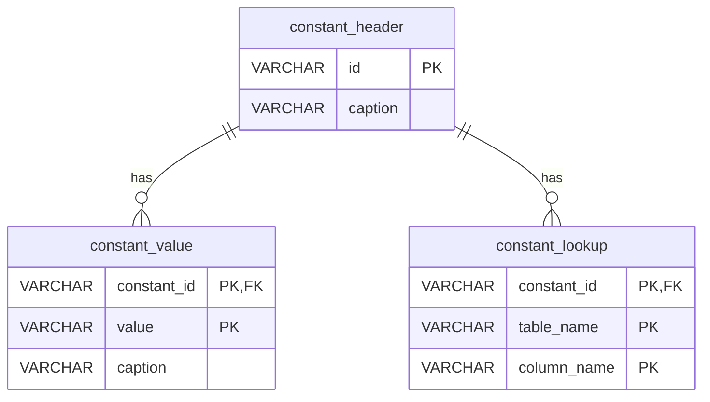

REST API for CRUD and Reporting

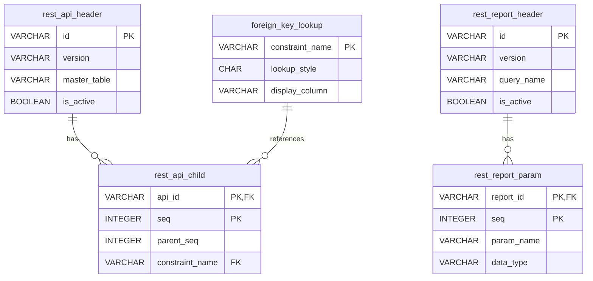

Application Menu, GEO locations

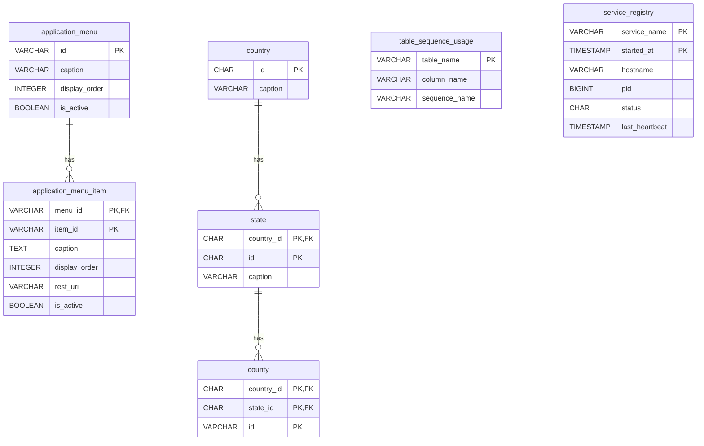

### ER Diagram — Security Tables

Policy and registration

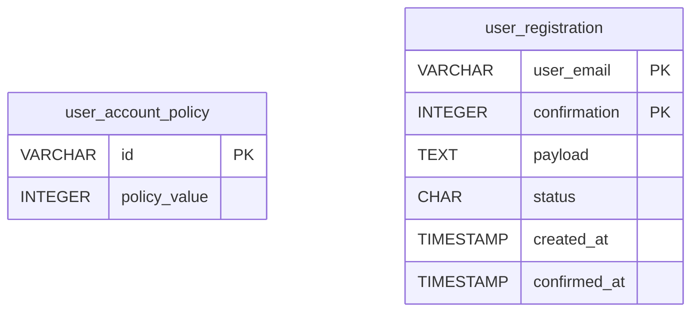

Roles and permitted actions

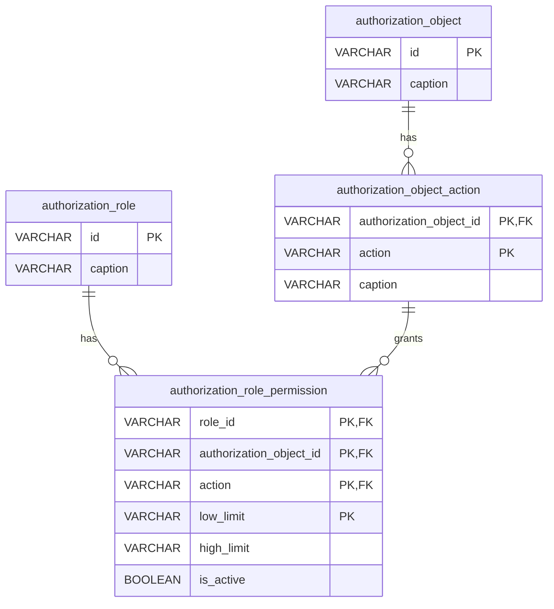

User accounts

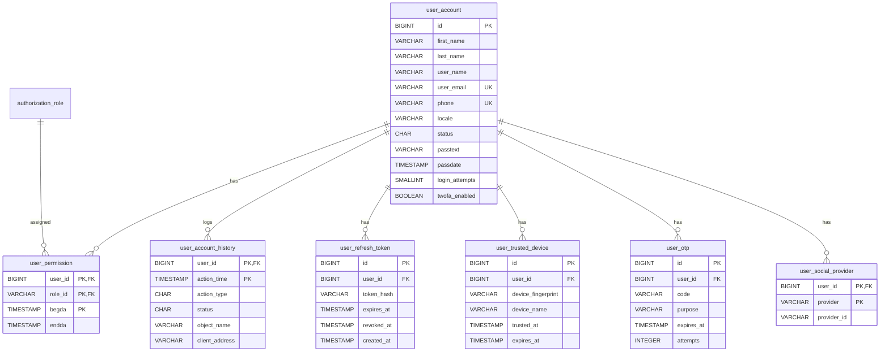

### ER Diagram — Subscription Tables

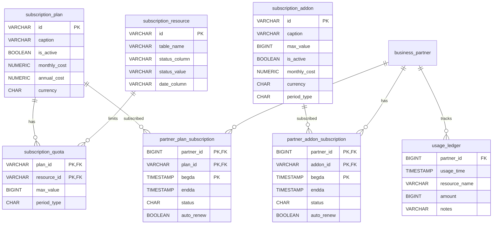

### ER Diagram — Payment Tables

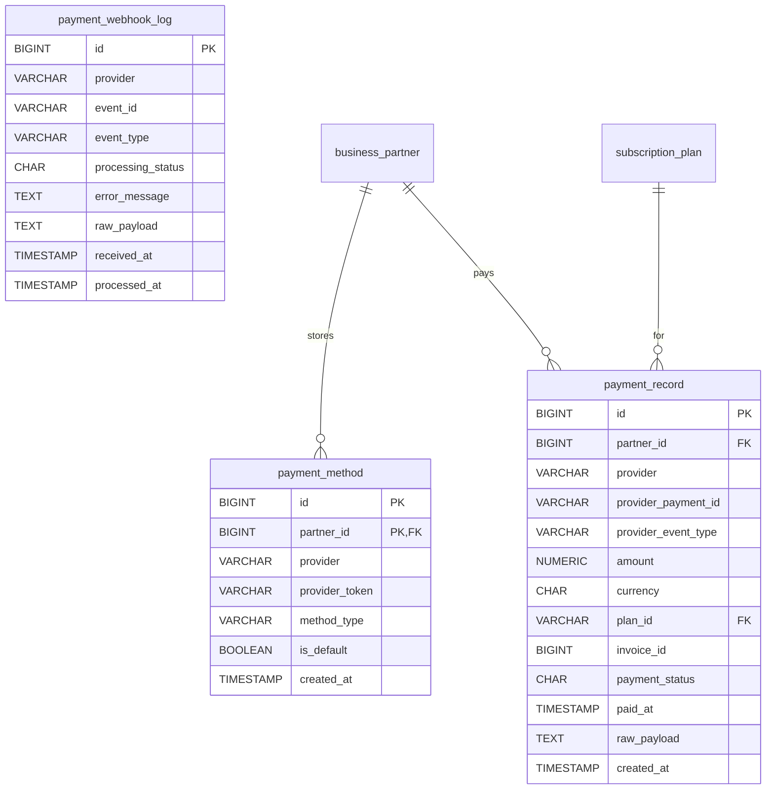

## Business Partners
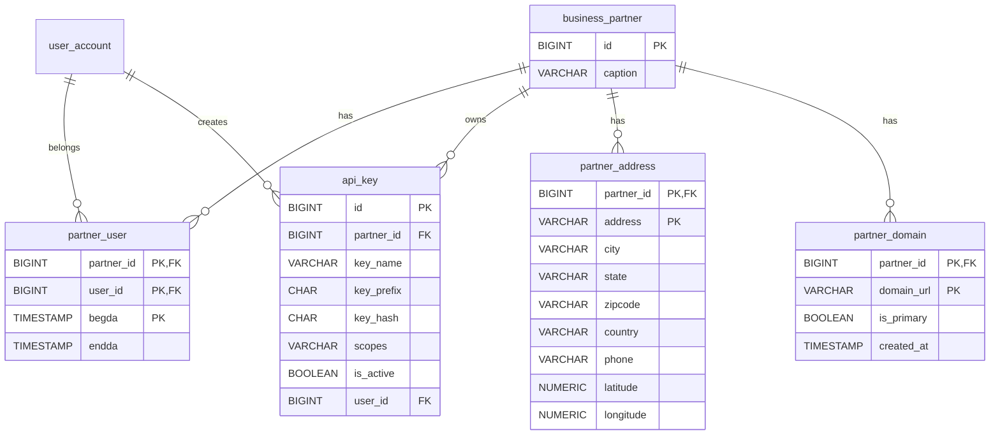

### Table Summary

| Table | Purpose |
|-------|---------|
| `constant_header` / `constant_value` | Dropdown/enum lookup values |
| `constant_lookup` | Maps constants to table columns |
| `foreign_key_lookup` | Controls FK display behavior |
| `rest_api_header` / `rest_api_child` | REST API definitions (metadata-driven) |
| `rest_report_header` / `rest_report_param` | Report definitions with parameters |
| `table_sequence_usage` | Maps tables to PostgreSQL sequences |
| `application_menu` / `application_menu_item` | Navigation menu structure |
| `authorization_object` / `authorization_object_action` | RBAC object definitions |
| `authorization_role` / `authorization_role_permission` | Role-based permissions |
| `user_account` | User accounts with password, 2FA fields |
| `user_account_policy` | Password/account policy settings |
| `user_permission` | User-to-role assignments |
| `user_account_history` | Login audit trail |
| `user_registration` | Email confirmation flow |
| `user_refresh_token` / `user_trusted_device` | Session and device management |
| `user_otp` | OTP codes with expiry and attempt tracking |
| `user_social_provider` | Social login provider links (Google, Apple) |
| `business_partner` / `partner_user` | Multi-tenant partner structure |
| `partner_address` / `partner_domain` | Partner locations and domains |
| `api_key` | API key management per partner |
| `subscription_plan` / `subscription_quota` | Subscription plans with resource limits |
| `subscription_resource` | Quota-tracked resources |
| `subscription_addon` | Optional add-on features |
| `partner_plan_subscription` / `partner_addon_subscription` | Active subscriptions per partner |
| `usage_ledger` | Resource usage tracking for quota enforcement |
| `payment_webhook_log` | Raw inbound provider webhooks with idempotency + audit |
| `payment_method` | Stored payment methods per partner (provider customer tokens) |
| `payment_record` | Completed/failed/refunded payment transactions |
| `country` / `state` / `county` | Geographic hierarchy |
| `service_registry` | Background worker registration and heartbeat |

## Flag Variables

Keel defines shared flag variables in `common/variables.go`. Your project can define additional flags alongside these.

| Flag | Default | Description |
|------|---------|-------------|
| `--log_type` | `local` | Logger: local, gcp, aws |
| `--log_root` | `/opt/app/log` | Log directory |
| `--http_api_port` | `8080` | HTTP server port |
| `--https_port` | `443` | HTTPS server port |
| `--tls_cert` | (empty) | TLS certificate path |
| `--tls_key` | (empty) | TLS private key path |
| `--keystore` | `/opt/app/sec/secrets.json` | Secrets file path |
| `--db_host` | `localhost` | PostgreSQL host |
| `--db_port` | `5432` | PostgreSQL port |
| `--db_name` | `app` | Database name |
| `--db_user` | `app` | Database user |
| `--db_sslmode` | `disable` | SSL mode |
| `--secret_mode` | `local` | Secret provider: local, gsm, aws |
| `--cors_origin` | (empty) | CORS allowed origins. Comma-separated allowlist (e.g. `https://app.example.com,https://admin.example.com`) or `"*"` for any origin (incompatible with `HttpBackend.AllowCredentials=true`). The middleware echoes the inbound `Origin` header back ONLY when it matches an entry in the allowlist; mismatched origins receive no CORS headers. `Vary: Origin` is always set so caches/CDNs key responses correctly per origin. |
| `--nats_url` | (empty) | NATS server URL |
| `--push_mode` | `noop` | Push provider: `fcm` or `noop` |
| `--node_id` | `0` | Node ID (0..1023) for the bigint ID generator; assign distinct values per writer in federated deployments |
| `--redis_url` | (empty) | Single-node Redis connection (`host:port` or `redis[s]://host:port/db`). Mutually exclusive with `--valkey_url`. Password lives in the `redis_password` secret. |
| `--valkey_url` | (empty) | Valkey connection (`host:port` or `redis[s]://host:port/db`). Mutually exclusive with `--redis_url`. Password lives in the `valkey_password` secret. |
| `--valkey_cluster` | `false` | Use Redis-Cluster protocol (required for Memorystore for Valkey cluster-mode-only and ElastiCache for Valkey clusters). Applies only when `--valkey_url` is set. |
| `--twilio_messaging_service_sid` | (empty) | Twilio Messaging Service SID (`MGxxxxxxxx...`) used by `TwilioSMSDispatcher`. Empty disables SMS dispatch. Account SID + auth token live in the `twilio_account_sid` / `twilio_auth_token` secrets. |

## Cache Service

`cache` is the unified cache port — KV (`Get`/`Set`/`Delete`/`Increment`), list (`RPush`/`LPopAll`), and pub/sub (`Publish`/`Subscribe`) on a single `port.CacheService` interface. The implementation is backed by `redis.UniversalClient`, so the same struct handles both single-node and Redis-Cluster topologies; the wire protocol is identical between Redis and Valkey.

### Backend selection

`cache.NewCacheService(ctx, secrets)` reads the keel common flags and decides which backend to construct, in this precedence:

1. `--valkey_url` set → Valkey path. Honors `--valkey_cluster`. Reads the `valkey_password` secret.
2. `--redis_url` set → Redis single-node path. Reads the `redis_password` secret.
3. neither set → `NoOpCacheService` (Get returns `redis.Nil`; mutations are silently dropped). Lets dev/test boot without a cache.

Setting both `--redis_url` and `--valkey_url` is a configuration error and the constructor returns a non-nil error so the app fails fast at startup.

### Connection string forms

- `host:port` — plain, no TLS
- `redis://host:port/db` — RESP URL, plaintext
- `rediss://host:port/db` — RESP URL, TLS (Memorystore TLS, Upstash, etc.)

**Passwords MUST NOT be embedded in the URL.** They are pulled from the secret provider so they can be rotated without redeploying. The constructor injects the password into the parsed `*redis.Options` before instantiating the client.

### Wiring example

```go
secrets, _ := secret.NewSecretProvider(ctx)
cache, err := cache.NewCacheService(ctx, secrets)
if err != nil {
    log.Fatalf("cache: %v", err)
}

otp := handler.OTPHandler{
    AbstractHandler: handler.AbstractHandler{UserService: userSvc},
    NotificationSvc: notificationSvc,
    Cache:           cache,
}
```

A worker that drains a Valkey list:

```go
items, err := cache.LPopAll(ctx, "events:batch")
```

A WebSocket-fanout publisher:

```go
cache.Publish(ctx, "user-events", payload)
ch, _ := cache.Subscribe(ctx, "user-events")
for msg := range ch { … }
```

## Extending Keel

### UserService

Keel provides a full `UserService` implementation with:
- **Password auth** with policy enforcement (complexity, expiry, lockout)
- **JWT** token creation and parsing
- **2FA (TOTP)** setup, verify, disable, backup codes
- **Refresh tokens** with revocation
- **Trusted devices** with 30-day expiry
- **OTP authentication** (phone/email) with rate limiting
- **Social login** (Google, Apple) via single `GetOrCreateUserFromSocial` — atomic transactional create, verified-email account linking, NULL `passtext` for social-only accounts
- **Phone-first auth** via `GetOrCreateUserByPhone` — E.164 normalization (libphonenumber), `phone` stored in `user_account.phone` directly (no `user_social_provider` shim), `passtext=NULL` on OTP registrations
- **Session hygiene** — `SetPassword`, `Setup2FA`, `Disable2FA`, `RevokeTrustedDevice` automatically revoke all active refresh tokens; public `LogoutEverywhere(userID)` for explicit "log out of all devices"
- **Single-device policy** — `SetSingleDevicePolicy(userID, on)` primitive; when on, `CreateRefreshToken` revokes all prior tokens on issue (e.g. drivers must be signed in on one device at a time)
- **Account deletion** — `DeleteAccount(userID, reason)` anonymizes in place, revokes tokens, drops trusted devices, deactivates device tokens, drops social links; App Store / Play Store compliant
- **Consent capture** — optional `port.ConsentService` called from signup flows; PIPEDA / GDPR audit trail in `consent_policy` + `consent_event` tables
- **Push notifications (FCM)** — channel-keyed `port.MessageDispatcher` (FCM and `NoOp` push impls ship; email adapter wraps `MailClient`), `device_token` table, register/revoke endpoints, stale-token auto-deactivation. `port.PushProvider` is now a deprecated alias of `MessageDispatcher`.

`RegistrationService` exposes three entry points:
- `Register(ctx, email, confirmation)` — standard email-confirmation two-step (`SendConfirmation` followed by `Register`). Created `user_account` lands at `status='I'`; the email-confirmation step flips it to `'A'`.
- `RegisterImmediately(ctx, *PartnerRegistration)` — for OAuth-verified signups (Google Business Profile, Apple Sign-In, etc.) where the upstream provider has already verified the email. Skips the `user_registration` round-trip and runs the full transactional create directly. Created `user_account` is left at `status='I'` (consistent with `Register`); a follow-up confirmation step is expected. Caller is responsible for bcrypt-hashing `data.Password` (or passing empty for password-less social signups).
- `RegisterImmediatelyWithSession(ctx, *PartnerRegistration) (result, *model.UserSession, error)` — like `RegisterImmediately`, but additionally activates the new `user_account` (`status='A'`) and returns an in-memory `*model.UserSession` ready for `UserService.CreateJWT(session)`. Removes the otherwise-needed `GetUserByLogin` round-trip on OAuth-verified flows that have no password to bcrypt-check. `data.Password` may be empty.

Use the built-in `LocalUserService` directly:

```go
userSvc, _ := user.NewLocalUserService(ctx, db, jwtSecret, "myapp")
```

Or embed it to add project-specific methods:

```go
type MyUserService struct {
    *user.LocalUserService
    customQS port.QueryService
}
```

### Custom Handlers

Embed `handler.AbstractHandler` to get JWT parsing and a set of common request-handling helpers for free:

```go
type MyDomainHandler struct {
    handler.AbstractHandler
    MyService *MyDomainService
}

func (h *MyDomainHandler) UpdateItem(w http.ResponseWriter, r *http.Request) {
    if !h.RequireMethod(w, r, http.MethodPost) { return }   // 405 if not POST
    id, ok := h.RequireQueryInt64(w, r, "id")
    if !ok { return }                                       // 400 if missing/invalid
    var req UpdateItemReq
    session, ok := h.ReadAuthRequest(w, r, &req)
    if !ok { return }                                       // 401 (no JWT) / 400 (bad body)
    if !h.RequireFields(w, map[string]string{"name": req.Name}) {
        return                                              // 400 lists missing field names
    }
    item, err := h.MyService.Update(r.Context(), session.PartnerId, id, req)
    if err != nil {
        h.WriteError(w, http.StatusInternalServerError, "Internal Server Error", err.Error())
        return
    }
    common.WriteJSON(w, http.StatusOK, item)
}
```

#### AbstractHandler request helpers

All methods are stateless — they only inspect the JWT or request context and write the canonical RFC 7807 envelope via `h.WriteError`. Every handler that embeds `AbstractHandler` inherits them automatically.

| Method | Purpose |
|---|---|
| `ParseSession(r)` | Returns the JWT session, or nil. Read-only — no error envelope. |
| `GetUser(r) / GetPartner(r)` | Convenience accessors; -1 when absent. |
| `RequireSession(w, r) (*Session, bool)` | 401 if no session. Use when you need the full session. |
| `RequireUser(w, r) (int, bool)` | 401 if no user id. |
| `RequirePartner(w, r) (int64, bool)` | 401 if `partner_id < 0`. |
| `ReadRequest(w, r, &req) bool` | `MaxBytesReader(*common.MaxRequestSize)` + JSON unmarshal; 400 on failure. Public endpoints. |
| `ReadAuthRequest(w, r, &req) (*Session, bool)` | `RequireSession + ReadRequest` combined. Authenticated endpoints with a JSON body. |
| `RequireMethod(w, r, methods...string) bool` | 405 + `Allow` header if `r.Method` doesn't match any of the allowed methods. One-line guard for HTTP-method-restricted handlers. |
| `RequireQueryInt64(w, r, name string) (int64, bool)` | Reads `?name=<int>` from the URL, parses to int64. 400 on missing or unparseable value. |
| `RequireFields(w, fields map[string]string) bool` | 400 listing any empty (after `TrimSpace`) values. |
| `PartnerFromCtx(r) int64` | Reads `common.PartnerID` from the request context (injected by `APIKeyMiddleware` for `/pubapi/*` traffic). -1 when absent. |
| `HasScope(r, scope) bool` | Checks the API key's `common.Scopes` context value. |
| `RequireScope(w, r, scope) bool` | 403 if scope missing. |
| `WriteError(w, status, title, detail)` | RFC 7807 problem+json envelope writer used by every method above. The single canonical error path — handlers should never call `http.Error`. |

In-repo demos: [handler/rest_handler.go](handler/rest_handler.go) `Post` uses `ReadRequest`. [handler/payment_handler.go](handler/payment_handler.go) keeps a bespoke 256 KiB cap for webhook traffic — that's a deliberate exception, not a pattern to copy. `RequireMethod` and `RequireQueryInt64` are not yet used inside keel (added for downstream consumers that have many `?id=<int>` and method-restricted endpoints); when an in-keel handler adopts them, add a citation here.

#### Query-result projection

`*model.QueryResult` carries a `.AsMaps()` method that projects rows into `[]map[string]any` keyed by `Columns`. Useful when a handler needs to JSON-encode an ad-hoc query response without defining a typed model:

```go
res, _ := qs.Query(ctx, "list_active_partners")
common.WriteJSON(w, http.StatusOK, res.AsMaps())
```

Returns an empty slice (not nil) when there are no rows, so JSON encoding always emits `[]`.

## Directory Structure

```
keel/
├── cmd/
│   └── schemagen/             # CLI: YAML schema → DDL + seed SQL
├── common/                    # Type helpers, HTTP response envelope, shared HTTP client, flag variables
├── model/                     # Domain-agnostic data shapes (UserSession, TableDefinition, AppError, ...)
├── port/                      # Pluggable component interfaces (login, messaging, notification, quota,
│                              #   table change logger, web socket hub, ID generator)
├── data/                      # AbstractRepository, AbstractTableService, DatabaseRepository / TxView /
│                              #   QueryService interfaces, file TableLogger, QuotaServiceDb,
│                              #   SnowflakeGenerator
├── pgsql/                     # PostgreSQL adapter (pgx/v5): repository, table service,
│                              #   query service, tx-bound query service, tx view
├── schema/                    # YAML schema definitions + seed loader + schemagen model
│   ├── basis/                 # Framework tables (constants, REST metadata, geo, subscriptions, ...)
│   ├── security/              # Auth tables (users, roles, permissions, OTP, social, devices, ...)
│   ├── dialect/               # DDL dialects: PostgreSQL, MySQL
│   ├── basis_seed.yml         # Framework seed data
│   ├── geo_seed.yml           # Country / state / county reference data
│   ├── security_seed.yml      # Built-in roles + permissions
│   ├── subscription_seed.yml  # PARTNER_ADMIN permissions for the subscription tables
│   ├── schema.go              # Schema model + parser + Validate
│   └── seed.go                # Seed-file parser + GenerateSeedSQL (FK-safe topo sort)
├── rest/                      # Metadata-driven REST engine + parent-child relation CRUD
├── handler/                   # AbstractHandler + login / 2FA / OTP / social / payment / push / REST / cache
├── user/                      # UserService interface + LocalUserService + RegistrationService +
│                              #   ConsentService
├── service/                   # APIKeyService + JWT/API-key middleware + HttpBackend
├── dispatcher/                # MailClient + LocalNotificationService + Email & Twilio dispatchers
├── worker/                    # JobExecutor + RunDefault one-call bootstrap
├── secret/                    # Local JSON / GCP Secret Manager / AWS Secrets Manager + factory
├── logger/                    # File / GCP Cloud Logging / AWS CloudWatch + factory
├── cache/                     # Redis / Valkey single-node + cluster + NoOp fallback
├── storage/                   # S3 (AWS + Cloudflare R2) / GCS / Azure Blob
├── messaging/                 # GCP Pub/Sub + AWS SNS+SQS + NATS JetStream + factory
├── payment/                   # Stripe + LemonSqueezy webhook processor, signatures, parsers,
│                              #   SQL webhook log repo, Stripe Checkout client
└── push/                      # FCM + NoOp port.MessageDispatcher implementations + factory
```

## Role Matrix

```
A = Access    S = Select    I = Insert    U = Update    D = Delete
```

Keel defines 6 shared roles. Projects may add domain-specific roles (e.g., SEO_ADMIN, SEO_OPER).

| Type | Object | SUPER | APP_ADMIN | SECURITY_ADMIN | SECURITY_OPER | BUSINESS_ADMIN | PARTNER_ADMIN |
|------|--------|-------|-----------|----------------|---------------|----------------|---------------|
| PAGE | * | A | | | | | |
| TABLE | * | SIUD | | | | | |
| REPORT | * | A | | | | | |
| **Security** | | | | | | | |
| PAGE | authorization_roles | | A | A | A | A | |
| PAGE | authorization_objects | | A | A | A | A | |
| PAGE | user_accounts | | A | A | A | | |
| PAGE | user_account_policies | | A | A | A | A | |
| TABLE | authorization_role | | S | SIUD | S | S | |
| TABLE | authorization_role_permission | | S | SIUD | S | S | |
| TABLE | authorization_object | | SIUD | S | S | S | |
| TABLE | authorization_object_action | | SIUD | S | S | S | |
| TABLE | user_account | | S | SIUD | SIU | | |
| TABLE | user_permission | | S | SIUD | SIUD | | S |
| TABLE | user_account_history | | S | S | S | | |
| TABLE | user_account_policy | | S | SIUD | S | S | |
| TABLE | partner_user | | S | SIUD | S | | S |
| **Framework** | | | | | | | |
| PAGE | application_menus | | A | A | A | A | |
| PAGE | constant_headers | | A | A | | A | |
| PAGE | foreign_key_lookups | | A | A | | A | |
| PAGE | rest_api_headers | | A | A | | A | |
| TABLE | application_menu | | SIUD | S | S | S | |
| TABLE | application_menu_item | | SIUD | S | S | S | |
| TABLE | constant_header | | SIUD | S | | S | |
| TABLE | constant_value | | SIUD | S | | S | |
| TABLE | constant_lookup | | SIUD | S | | S | |
| TABLE | foreign_key_lookup | | SIUD | S | | S | |
| TABLE | rest_api_header | | SIUD | S | | S | |
| TABLE | rest_api_child | | SIUD | S | | S | |
| TABLE | service_registry | | S | | | | |
| **Business Partner** | | | | | | | |
| PAGE | partner_registrations | | A | A | A | A | |
| PAGE | api_keys | | A | A | | | |
| TABLE | business_partner | | S | S | S | SIUD | SU |
| TABLE | partner_address | | S | | | | SIUD |
| TABLE | partner_domain | | S | | | | SIUD |
| TABLE | api_key | | S | S | | S | S |
| **Subscriptions** | | | | | | | |
| PAGE | subscription_plans | | A | | | A | S |
| PAGE | subscription_resources | | A | A | | A | |
| PAGE | subscription_addons | | | | | A | |
| PAGE | partner_quota_usages | | | | | A | |
| TABLE | subscription_plan | | S | | | SIUD | S |
| TABLE | subscription_quota | | S | | | SIUD | S |
| TABLE | subscription_resource | | SIUD | S | | S | |
| TABLE | subscription_addon | | S | | | SIUD | |
| TABLE | partner_plan_subscription | | S | | | SIUD | S |
| TABLE | partner_addon_subscription | | S | | | SIUD | S |
| TABLE | usage_ledger | | S | | | S | S |
| **Payments** | | | | | | | |
| PAGE | payment_records | | A | | | A | A |
| PAGE | payment_methods | | A | | | A | A |
| PAGE | payment_webhook_logs | | A | | | A | |
| TABLE | payment_record | | S | | | S | S |
| TABLE | payment_method | | S | | | SIUD | SIUD |
| TABLE | payment_webhook_log | | S | | | S | |
| **Geo** | | | | | | | |
| PAGE | countries | | | | | | A |
| TABLE | country | | | | | | S |
| TABLE | state | | | | | | S |
| TABLE | county | | | | | | S |

## Status

Keel is **pre-1.0** and under active development. Public APIs (interfaces in
`port/`, exported types in `model/`, handler method signatures) are kept stable
across minor releases so downstream consumers can bump without rewrites, but
internal implementations can change. A full security audit is in progress
ahead of the 1.0 tag — until then, treat the security-sensitive subsystems
(auth, payments, webhook signature verification) as production-tested but not
independently verified.

## Security

If you discover a security vulnerability in keel, please **do not open a
public GitHub issue.** Report it privately by emailing the maintainer; you
should expect an acknowledgement within 72 hours and a coordinated disclosure
timeline thereafter. Vulnerabilities in dependencies (pgx, jwt, redis,
firebase, AWS/GCP/Azure SDKs, Stripe webhooks) are tracked the same way.

## Contributing

Contributions are welcome via GitHub pull requests. A few ground rules:

- **Don't break method signatures.** Downstream consumers depend on the
  signatures of every exported function in `port/`, `service/`, `handler/`,
  `data/`, and `worker/`. Additive changes (new methods on a struct, new
  optional struct fields) are fine; renames, parameter reordering, and return
  shape changes are not.
- **Ports are minimal.** New interfaces in `port/` should expose the
  smallest surface that a consumer or implementation needs. Adapters in
  `service/<area>/` may carry richer types internally.
- **Write Go that gofmt is happy with.** Run `go vet ./...` and
  `go test ./...` before submitting. If you add a new adapter, include at
  least one no-op or in-memory test.
- **Doc-comment every exported symbol.** This repo is the public surface for
  several downstream projects; opaque exports cost everyone time.

## License

Apache License 2.0 — see [LICENSE](LICENSE) and [NOTICE](NOTICE).
