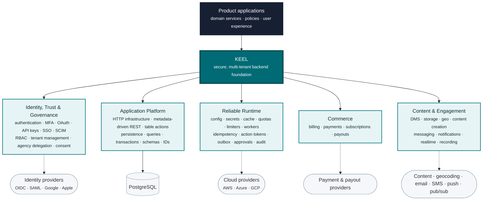

# Keel

Keel is Nauticana's shared Go infrastructure library for backend services built with ports and adapters. It provides reusable persistence, configuration, secrets, authentication, authorization, REST, billing, messaging, storage, workers, and operational primitives while downstream applications retain their domain behavior and composition.

## Architecture


```mermaid
flowchart TB
    APP["Product applications<br/><small>domain services · policies · user experience</small>"]
    KEEL["KEEL<br/><small>secure, multi-tenant backend foundation</small>"]
    APP --> KEEL

    KEEL --> TRUST["Identity, Trust & Governance<br/><small>authentication · MFA · OAuth · API keys · SSO · SCIM<br/>RBAC · tenant management · agency delegation · consent</small>"]
    KEEL --> PLATFORM["Application Platform<br/><small>HTTP infrastructure · metadata-driven REST · table actions<br/>persistence · queries · transactions · schemas · IDs</small>"]
    KEEL --> RUNTIME["Reliable Runtime<br/><small>config · secrets · cache · quotas · limiters · workers<br/>idempotency · action tokens · outbox · approvals · audit</small>"]
    KEEL --> COMMERCE["Commerce<br/><small>billing · payments · subscriptions · payouts</small>"]
    KEEL --> EXPERIENCE["Content & Engagement<br/><small>DMS · storage · geo · content creation<br/>messaging · notifications · realtime · recording</small>"]

    TRUST -.-> IDP(["Identity providers<br/><small>OIDC · SAML · Google · Apple</small>"])
    PLATFORM --> DB[(PostgreSQL)]
    RUNTIME -.-> CLOUD(["Cloud providers<br/><small>AWS · Azure · GCP</small>"])
    COMMERCE -.-> FINANCE(["Payment & payout providers"])
    EXPERIENCE -.-> SYSTEMS(["Content · geocoding · email · SMS · push · pub/sub"])

    classDef app fill:#172033,color:#ffffff,stroke:#172033,stroke-width:2px
    classDef keel fill:#006b75,color:#ffffff,stroke:#004f57,stroke-width:4px
    classDef capability fill:#e7f4f5,color:#102a2e,stroke:#16818b,stroke-width:2px
    classDef adapter fill:#f5f7fa,color:#263238,stroke:#90a4ae,stroke-width:1px
    class APP app
    class KEEL keel
    class TRUST,PLATFORM,RUNTIME,COMMERCE,EXPERIENCE capability
    class IDP,DB,CLOUD,FINANCE,SYSTEMS adapter
```

Applications bring the product vocabulary and experience. Keel supplies the secure, reusable foundation and provider-neutral contracts beneath them.

## Start Here

Add a pinned release to the consuming module:

```bash
go get github.com/nauticana/keel@<version>
```

Then follow [Configuration and Getting Started](doc/configuration-and-getting-started.md) for runtime configuration, application bootstrap, REST wiring, and workers.

## Documentation

| Topic | Contents |
|---|---|
| [Configuration and Getting Started](doc/configuration-and-getting-started.md) | Configuration, bootstrap, REST, and workers |
| [Package Reference](doc/package-reference.md) | Package responsibilities and adapter inventory |
| [Authentication](doc/authentication.md) | API keys, OAuth, standards compliance, sessions, MFA, OTP, and social sign-in |
| [Standards and Compliance](doc/authentication.md#standards-compliance) | OAuth, token verification, outbound connection, and SCIM standards |
| [Identity and Access](doc/identity-and-access.md) | Domain verification, tenant SSO, SCIM, and consent |
| [Application Services](doc/application-services.md) | Quotas, limiters, guards, notifications, realtime, and reusable services |
| [Reusable Primitives](doc/reusable-primitives.md) | Shared cryptography, HTTP, scheduling, content, browser, reference-data, and reliability helpers |
| [Billing and Payments](doc/billing-and-payments.md) | Billing engines, payments, payouts, and commissions |
| [Data and Infrastructure](doc/data-and-infrastructure.md) | Table actions, cloud adapters, documents, messaging, schema, IDs, flags, and caching |
| [Database Model](doc/database.md) | ER diagrams and table definitions |
| [Extending and Developing Keel](doc/extending-and-development.md) | Extension points, repository structure, security, contribution, and engineering standards |

Release-to-release changes are recorded in [`migration_guide.json`](migration_guide.json). Schema sources are under [`schema/`](schema/); generated SQL is derived from those definitions.

## License

See [LICENSE](LICENSE).
