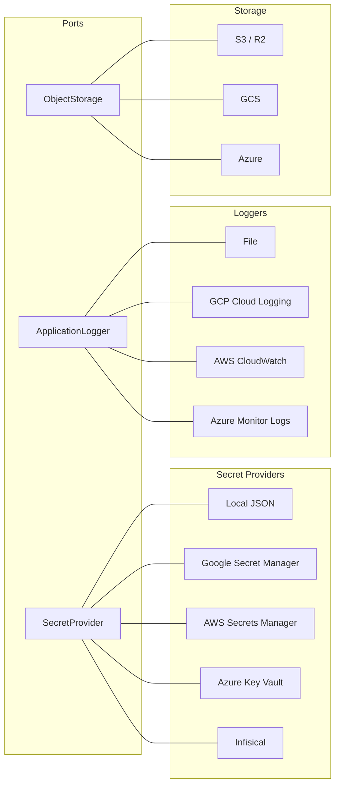
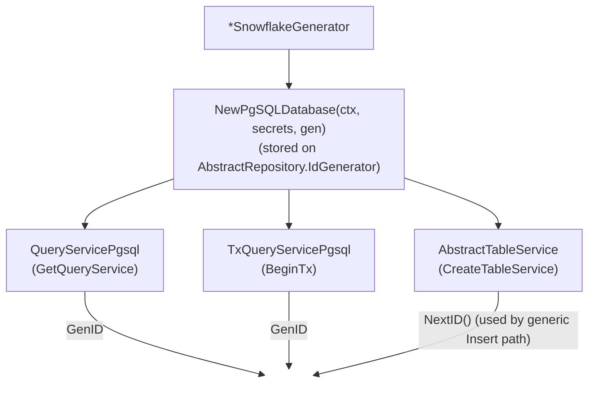

# Data and Infrastructure

Metadata-driven actions, cloud adapters, storage, messaging, identifiers, schema, flags, and caching.

## Table Actions

`table_action` is a basis table that surfaces custom buttons in sail's generic CRUD screens (table_list, table_detail, table_search) — collapsing the five-piece boilerplate every "Set Default" / "Enable" / "Calculate" / "Assign" button used to need (handler + route + Angular button + click handler + permission grant) down to **one seed row + one Go handler + one auth grant**.

### Schema

```sql
CREATE TABLE table_action (
    table_name      VARCHAR(80)  NOT NULL,
    action_name     VARCHAR(30)  NOT NULL,
    caption         VARCHAR(80)  NOT NULL,
    icon            VARCHAR(40),
    record_specific BOOLEAN      NOT NULL DEFAULT FALSE,
    method_name     VARCHAR(80),
    display_order   SMALLINT     NOT NULL DEFAULT 10,
    confirm_message VARCHAR(200),
    PRIMARY KEY (table_name, action_name)
);
```

`record_specific=TRUE` renders the button next to each row's edit/delete icons. `record_specific=FALSE` renders it on the toolbar next to "New Record".

`action_name` is lowercase; the framework uppercases it for authorization lookups. Names that collide with generic-CRUD subpaths (`list`, `get`, `post`, `delete`, `get-paginated`) are rejected at REST service boot — fail-fast safety net.

### Authorization

Each table that owns custom actions registers its **own** `authorization_object`. The action becomes an `authorization_object_action` row under it. This keeps per-table namespacing — `ASSIGN` on `PROJECT_WBS_ITEM` is a distinct grant from `ASSIGN` on `ORDER_LINE`.

```yaml
- table: authorization_object
  rows:
    - [USER_PAYMENT_METHOD, "User Payment Method Actions"]

- table: authorization_object_action
  rows:
    - [USER_PAYMENT_METHOD, SET_DEFAULT, "Set Default"]

- table: authorization_role_permission
  rows:
    - [APP_USER, USER_PAYMENT_METHOD, SET_DEFAULT, "user_payment_method"]
```

The `low_limit` column carries the table_name (lowercase), matched the same way as standard `TABLE` CRUD grants: an **exact** scope match or a literal `'*'` grants access (KR-003). Glob patterns other than `'*'` and `low_limit`/`high_limit` ranges are **not** evaluated — the generated grant query filters them out, so a grant whose `low_limit` is neither the exact value nor `'*'` silently denies. Use one grant row per scope, or `'*'` for all.

### URL convention

`POST /api/v1/{table_name}/{action_name}` — no `/action/` segment, version segment matches the table's `rest_api_header.version`. Request body carries the record's primary key columns (record-specific) or `{}` (table-level).

Override via the `table_action.method_name` column when two tables need to route to one shared handler — keel uses `{method_name}` in place of `{table}/{action_name}` on the URL.

### Parameters

An action that needs values besides the key declares them in `table_action_parameter` (`seq`, `param_name`, `caption`, `data_type`, `required`, `lookup_table`); they reach the client as `TableAction.parameters` and are posted merged with the key. `lookup_table` offers that table's rows as choices. A `param_name` equal to a key column or repeated within the action fails REST boot. The handler validates the values.

```yaml
- table: table_action_parameter
  columns: [table_name, action_name, seq, param_name, caption, data_type, required]
  rows:
    - [lead, mark_won, 1, sale_value, Sale value, number, true]
```

### Backend wiring

Downstream apps register the handler in their existing `Routes(prefix)` map, wrapped in `handler.WrapTableAction` for the auth gate:

```go
func (h *UserPaymentMethodHandler) Routes(prefix string) map[string]http.HandlerFunc {
    return map[string]http.HandlerFunc{
        handler.TableActionPath(prefix, "user_payment_method", "set_default"):
            handler.WrapTableAction(h.DB, h.UserService,
                "USER_PAYMENT_METHOD", "SET_DEFAULT", "user_payment_method",
                h.SetDefault),
    }
}
```

`handler.TableActionPath(prefix, table, action)` returns the conventional URL. `handler.WrapTableAction` runs the auth check before delegating to the inner handler — denied callers get 403 (RFC 7807).

### Frontend behaviour

Sail's `BaseTable.getActions(recordSpecific)` returns the `TableAction[]` for the active table, sorted by `displayOrder`. The three CRUD components consume it:

- `table_list` and `table_detail` render record-specific actions next to edit/delete and table-level actions next to "New Record".
- `table_search` renders table-level actions only (no per-row context).

Each render is gated by `BaseAuthService.canExecute(authorityObject, authorityCheck, tableName)`. Click fires `BackendService.executeAction(action.method, body)` — for record-specific actions the body is the row's primary key (lifted via `BaseTable.primaryKeyValues`); for table-level it's `{}`. The list re-fetches on success.

### What the application owns

- The Go method that runs when the button is clicked (writes to the DB, calls keel services, etc.).
- The auth grant deciding which roles can fire the action.
- Optional confirm-prompt text on the `table_action` row.
- The icon name (any Material icon) per row.

### What sail / keel own

- Button rendering, ordering, permission gating, click → HTTP dispatch, primary-key extraction, list-refresh-on-success.
- Reserved-subpath safety guard at boot.

## Multi-Cloud Support

Keel supports multiple cloud providers through its port/adapter pattern:



Selection is driven by flag variables:
- `--secret_mode=local|gsm|aws|azure|infisical`
  - `azure` reads from Azure Key Vault; set `--azure_keyvault_url=https://<vault>.vault.azure.net/`. Auth uses `azidentity.DefaultAzureCredential` (managed identity on Azure VM/AKS, or the `AZURE_*` env fallback), so no secret material passes through the process config.
  - `infisical` reads from [Infisical](https://infisical.com) — the production-grade option for deployments **not** on AWS/GCP/Azure (so they need not fall back to the local `secrets.json` file). Set `--infisical_project_id`, `--infisical_environment` (default `prod`), and `--infisical_host` (default `https://app.infisical.com`; override for a self-hosted instance). Auth uses an Infisical **machine identity** via Universal Auth: the SDK reads `INFISICAL_UNIVERSAL_AUTH_CLIENT_ID` / `INFISICAL_UNIVERSAL_AUTH_CLIENT_SECRET` from the environment, so — like the gsm/aws/azure backends — the credential is owned by the vendor SDK's chain and never passes through a keel flag. Universal Auth is chosen because it is platform-agnostic; the native AWS/Azure/GCP/Kubernetes machine-identity methods only apply when running on that platform.
  - **Writing secrets.** Every backend also implements `secret.SecretRWProvider`, which adds `PutSecret(ctx, path, value)`: create the secret or make `value` its current version. Build it with `secret.NewSecretRWProvider(ctx)` (same `--secret_mode` switch) and hand it only to the component that mints or rotates a secret — per-tenant signing keys, provider-issued tokens; everything else keeps taking the read-only `SecretProvider`. Blank paths and values are refused with `ErrInvalidSecretWrite`, since `GetSecret` trims and could never read them back. Readers that cached a value, including `MustGet` results held since boot, do not see a later write.

    | Backend | `PutSecret` | Write permission the runtime identity needs |
    |---|---|---|
    | `local` | merges into the file's current contents and replaces it atomically with mode `0600`; creates a missing file; writers in other processes are not coordinated | write access to the keystore's directory |
    | `gsm` | `AddSecretVersion`; on `NotFound`, `CreateSecret` (automatic replication) first | `secretmanager.versions.add`, plus `secretmanager.secrets.create` for new secrets |
    | `aws` | `PutSecretValue`; on `ResourceNotFoundException`, `CreateSecret` | `secretsmanager:PutSecretValue`, plus `secretsmanager:CreateSecret` for new secrets |
    | `azure` | `SetSecret` (an upsert that adds a version) | Key Vault Secrets Officer, or the `Set` secret permission |
    | `infisical` | update at the root path; on 404, create | write access for the machine identity on the project environment |

    Grant the write permission only to services that call `PutSecret`; read-only services keep their existing role.
- `--log_type=local|gcp|aws|azure`
  - `HttpBackend` binds one request id per request into `common.RequestID` before anything else runs, so every route, keel handler or not, shares it with its logs and sanitized errors. The id is echoed in the `request_id_header` response header (default `X-Request-Id`; empty disables the header) and in the `{data, meta}` envelope; an inbound value is adopted only from a peer inside `trusted_proxy_cidr` and only when it is 1–128 characters of letters, digits and `-._:`. Add the header to `ExposeHeaders` for cross-origin browser clients.
  - `HttpBackend` writes one access record per request through `ApplicationLogger.Access` — `METHOD /path STATUS BYTES MILLIS CLIENT_IP REQUEST_ID` (`-` when none is bound) — as the outermost middleware after the request id, so rejections from CORS, TLS guard, API-key and SSO layers are recorded too, and a handler panic is recorded as 500 before it propagates. Query strings are excluded because public confirmation URLs can contain credentials. `CLIENT_IP` comes from `common.TrustedClientIP`, so forwarding headers are honored only behind `trusted_proxy_cidr`. `/health` and `/ready` are logged only when they fail (status ≥ 400). A nil `Journal` leaves requests unchanged. `local` lands it in `<name>_access_<date>.log`; `gcp` and `azure` route it to the `<name>_access` log name; `aws` writes it to the same CloudWatch stream as server records with an `[ACCESS]` prefix.
  - `azure` ships records to Azure Monitor / Log Analytics via the Logs Ingestion API; set `--azure_logs_endpoint` (DCE), `--azure_logs_dcr` (rule immutable id), and `--azure_logs_stream`. Auth uses `azidentity.DefaultAzureCredential` (managed identity with the "Monitoring Metrics Publisher" role on the DCR). `gcp` already emits structured JSON to stdout, which Azure container platforms (AKS / Container Apps / App Service) and the Azure Monitor Agent on VMs also ingest — use `azure` only when you need the app to push directly to a Log Analytics table.
- `storage_mode=s3|gcs|azure|file`
  - An `ObjectStorage` is bound to one bucket (Azure container, file root folder) described by a `storage.Spec{Mode, Bucket, Project, Region, Endpoint, AccountURL, PublicBaseURL, CredentialSecret}`. `storage.New(ctx, spec, secrets)` verifies the bucket exists (`ErrBucketNotFound` otherwise) and never creates one — **deployment prerequisite**: the runtime identity needs list permission on the bucket (GCS `storage.objects.list`, held by `roles/storage.objectViewer`; S3 `s3:ListBucket`; Azure container read), which object-only policies granting just get/put lack; `storage.CreateBucket(ctx, spec, secrets)` is the separate admin call (GCS needs `Project`; S3 sends `LocationConstraint` from `Region` except for `us-east-1`). `storage.NewFromConfig(ctx, secrets, bucket)` builds the spec from the flags below. `HttpBackend.Storage` and `JobExecutor.Storage` (populated by `worker.AbstractWorker.Run` when `storage_mode` is set) are bound to `storage_bucket`. Empty `storage_mode` disables storage (the field stays `nil`). An app with several buckets holds one `storage.NewBuckets(secrets)` and calls `Get(ctx, bucket)`, which builds each bucket's store once (`ErrNoBucket` for a blank name, `ErrNotConfigured` when `storage_mode` is empty).
  - **Credentials**: `storage_credential_secret` names one keystore secret whose value is provider-specific — `s3`: JSON `{"access_key_id", "secret_access_key", "session_token"?}`; `gcs`: the service-account JSON; `azure`: the account key (the account name comes from the account URL; keel builds a shared-key credential and signs SAS URLs with it). Empty means the provider's ambient chain (IAM role, ADC, `DefaultAzureCredential`).
  - Methods: `PutObject(ctx, key, reader, contentType, attributes)`, `PutObjectIfAbsent` (one conditional provider call; `ErrExists`), `GetObject`, `DeleteObject`, `ListObjects(ctx, prefix, limit)` (every key starting with prefix; 0 = all), `ListPrefixes(ctx, prefix, limit)` (the child names between prefix and the next `/`, without prefix or trailing `/`), `SetObjectAttributes` (replaces all attributes; `ErrPreconditionFailed` when the object changed meanwhile), `GetObjectAttributes`, `GetObjectAndAttributes` (a `*Component` whose content and attributes come from the same write), `GetSignedURL`, `PublicURL`, `Bucket`. A missing object wraps `storage.ErrNotFound`; an operation a backend cannot do wraps `storage.ErrUnsupported`. Attribute keys must suit every backend you deploy to: Azure requires identifier-style keys (no `-`) and they come back lowercased; S3 limits all metadata to about 2 KB.
  - **Cloudflare R2 / S3-compatible**: use `s3` plus `s3_endpoint=https://<account>.r2.cloudflarestorage.com` (this switches the client to path-style addressing) and `storage_region=auto`. `storage_region` sets `Spec.Region` (S3 region, GCS location); empty uses the provider's default chain. Verify `PutObjectIfAbsent` (`If-None-Match: *`) on the provider before relying on it.
  - **Public URLs**: `PublicURL(key)` returns a stable, non-expiring served URL (no signing, no API call) for publicly-readable buckets. GCS → `https://storage.googleapis.com/<bucket>/<key>`; S3/R2 → `<storage_public_base_url>/<key>` (empty returns `""`); Azure → `<account-url>/<container>/<key>`; file → always `""`. Use `GetSignedURL` instead when the bucket is private.
  - **Azure**: requires `storage_account_url=https://<account>.blob.core.windows.net/`.
  - **File**: the bucket is an existing root folder (`CreateBucket` makes it). Each object is a folder named by its key holding `DATA.bin` and `ATTR.txt` (`key=value` lines); folders left empty are pruned. Keys that escape the root are refused. Content types are not stored, and it serves no URLs (`GetSignedURL` → `ErrUnsupported`). Meant for RHEL/SUSE test hosts: it maps keys to folder names as-is, so a case-insensitive volume folds ids.
  - **HTTP surface**: `storage.UploadService{Storage, Scanner, MaxBytes, ContentTypes, SignedURLSeconds}` sniffs the content type from the bytes (the client's claim is ignored), enforces the allow-list and size cap, scans the buffered body when `Scanner` is set (`scan.ErrContentRejected` refuses it) and mints signed read URLs. `handler.StorageHandler{Uploads, UploadKey, PreviewKey}` exposes `Upload` (multipart field `file` → 201 `{key, contentType, url}`; 415 / 413 on a refused type / size, with codes `upload_media_type` / `upload_too_large`) and `Preview` (→ `{url}`, `no-store`). The app mounts both and injects the two hooks, which pick the object key and authorize the caller (return a `*model.AppError` to refuse). `storage.SanitizeFilename` reduces a client filename to a safe key segment.
- `extract_mode=native`, `extract_max_bytes` (default 64 MiB)
  - `extract.NewFromConfig()` returns a `TextExtractor`. `Native` handles `text/plain`, `text/markdown` (blocks split on blank lines; every ATX `#` line is a heading with its level, the lines between headings a paragraph), DOCX and PDF text layers. DOCX text comes only from `w:t` in runs, so tab stops, the previous formatting and deleted or moved-away text of tracked changes, field codes and the legacy copy of a text box stay out, and a text box's paragraphs follow the paragraph that holds it; a heading is a paragraph whose style resolves to an outline level in `styles.xml` (built-in `heading N` / `Title` names, `w:outlineLvl`, or through `w:basedOn`, so localized and derived styles work; the default English ids apply without `styles.xml`); a table is one section with rows on lines, cells ending in a tab and cell paragraphs separated by newlines. PDF gives one section per page; a page without a text layer is an empty section, listed by `Extracted.EmptyPages()` for an OCR fallback (TODO C14). `extract_max_bytes` caps each decompressed DOCX part and the extracted text (`ErrTooLarge`); `ctx` is checked between PDF pages and during DOCX parsing. PDF text comes from `github.com/carlos7ags/folio` (pure Go), ordered top to bottom and left to right; invisible text, which is how a scanned page carries its OCR layer, is kept. For PDFs, `extract_max_bytes` also bounds each decoded stream and their total for the document, enforced inside the parser (`ErrTooLarge`). A PDF that opens with the empty user password is extracted; one that needs a password or uses an unsupported security handler returns `ErrEncrypted`. Known gaps in the pinned folio release, tracked as TODO C15: nested Form XObjects are bounded only by depth, so a crafted file of a few KB can keep one page busy for days and `ctx` is not checked until the page ends (folio#457) — extract untrusted PDFs with `extract.Isolated` (below); text in a font defined inside a Form XObject (folio#458) and in a simple font whose ToUnicode CMap declares a two-byte codespace (folio#459) extracts as raw codes. `ErrUnsupportedMediaType` for anything else; check `Supports` first.
  - `extract.NewIsolated(inProcess, extract.IsolatedConfig{Path, MaxBytes, Timeout, Concurrency, MediaTypes})` runs the chosen media types (default PDF) in a child binary, with no shell and an empty environment, that a deadline kills; other types go to `inProcess`. Input over `MaxBytes` is refused before a child starts and the child's output is capped. A deadline returns `ErrTimeout`, a child that cannot run, crashes or writes an invalid result returns `ErrIsolationFailed`, and `ErrTooLarge`, `ErrEncrypted` and `ErrUnsupportedMediaType` cross the process boundary unchanged. The child's main is one line: `os.Exit(extract.ChildMain(os.Args[1:], os.Stdin, os.Stdout, os.Stderr))`.
- `scan_mode=none|clamd`, `scan_addr=<host:port>`
  - `scan.NewFromConfig()` returns a `scan.ContentScanner` (nil for `none`). `ScannerClamd` streams the content to clamd (`zINSTREAM`); a `FOUND` reply is `scan.ErrContentRejected`, which callers map to 403.
- `messaging_mode=noop|gcp|aws|nats` (empty = error)

## Document management (`dms`)

`dms` is the document model over `storage.ObjectStorage`. It imports no database package, so a content server without a database (for example an SAP ArchiveLink content server) links it as well as a keel application.

- A **content repository** (`dms.RepositoryDefinition{ID, Caption, Storage storage.Spec, PathPrefix, DefaultDocProt, Status}`) is a logical storage space: a bucket plus a key prefix (`PathPrefix`, default `ID`). Several repositories may share a bucket; their prefixes must not overlap. `Status` is `active`, `read-only` or `migrating`; the last two refuse writes with `dms.ErrRepositoryReadOnly` while reads continue.
- Definitions come from a `RepositoryCatalog`: `dms.StaticCatalog` for entries a server decoded from its own configuration (embed `RepositoryDefinition` in your own entry type). `dms.ContentRepositoryService{Catalog, Secrets, Reserved}` builds one `ObjectStorage` per repository on first use, and changes at runtime with `Add` (binds the bucket at once, so a missing bucket surfaces), `Remove` (refused while documents exist: `ErrRepositoryInUse`) and `Reload` (all-or-nothing; a definition that changes the storage location of a repository holding documents is refused). Persisting definitions is the caller's job. `Reserved` names document keys the caller uses for its own objects under a repository prefix (for example client certificates): document operations refuse them, `List` skips them and the delete guard ignores them.
- A **document** is the zero-byte header object `<prefix>/<docKey>/dochdr_` plus one object per component `<prefix>/<docKey>/<compId>`; metadata is object attributes (`doc_id`, `comp_id`, `doc_prot`, `content_type`, `charset`, `app_version`, `content_length`, `content_digest` (SHA-256), `date_c`/`time_c`/`date_m`/`time_m` in UTC `2006-01-02` / `15:04:05`). `dochdr_` is reserved; ids must not contain `/` (`dms.ErrInvalidKey`). A document written before header objects existed (components only) still exists and gets its header on first touch.
- `dms.ContentDocumentService{Repos, Observer, MaxBytes, HeaderRetries}`: `Create` (an existence listing first, so a legacy document without a header is refused too, then the header with `PutObjectIfAbsent`, then components, rolled back on failure; `ErrDocumentExists`). `docProt` is stored verbatim: `dms.DocProtServerSetting` (or a header without the attribute) means the creator left it to the repository, `""` is an explicit "no restrictions", and `Info` reports the same three forms; `dms.DocProtOf(attrs)` decodes them from a header read directly, `PutComponent` / `Replace` / `DeleteComponent` (require an existing document, keep `date_c`, move the header's `date_m` forward with bounded retry under contention), `Delete`, `Info`, `Read`, `Open` (stream), `List`. Bodies are buffered up to `MaxBytes` (wire `dms_max_bytes`) so the digest can be an attribute; content types are stored as given, never sniffed, and nothing is scanned — scan before the write. The `Observer{Stored, Deleted}` hook fires after the operation succeeded; its errors, like an exhausted header retry (`ErrHeaderStale`), are soft: `dms.Succeeded(err)` is true and the caller logs them. A content server wires the observer to its processing pipeline; a keel application writes its own records in its own transaction.
- Guarantees a content server can build a protocol on: ids and attributes round-trip verbatim (no case folding, truncation or sniffing; the only refused ids contain `/`, are `.` / `..`, or are reserved); `storage.ErrNotFound` means a missing object and nothing else, so any other failure on the header can be reported as "administrative data inaccessible"; an empty document exists (deleting the last component keeps the header); a missing prefix lists as empty; a repository with documents is never removed (`ErrRepositoryInUse`), re-keyed or relocated, and prefixes never overlap on one bucket (`ErrPrefixOverlap`); the core has no offline state.
- Protocol concerns (ArchiveLink URL parsing, `secKey` checks, multipart formats, `scanPerformed`) stay in the content server. keel provides the primitives: `crypto.VerifyPKCS7Detached(sig, data, cert, allowed)` (certificate mandatory, never the one embedded in the signature; algorithm allow-list) and `scan.ContentScanner`.

### Partner documents (`document`)

The client-application layer over `dms`, for applications with a database (schema group `document`, depends on `core` and `tenant_management`).

- **`content_repository`** is the table form of a `dms.RepositoryDefinition` (`storage_mode`, `bucket`, `project`, `region`, `endpoint`, `account_url`, `public_base_url`, `credential_secret` — a secret *name* — `path_prefix`, `default_doc_prot`, `status`, and a nullable `partner_id` owner; null means shared). `document.TableCatalog{DB}` serves it to `dms.ContentRepositoryService`; `storage_mode` and `bucket` are the repository's location and are always recorded on the row (the location guards in `dms` compare them; a location derived from a flag could move silently between restarts). The access-path columns `region`, `endpoint`, `account_url`, `public_base_url` and `credential_secret` fall back to `storage_region`, `s3_endpoint`, `storage_account_url`, `storage_public_base_url` and `storage_credential_secret` when empty. Seed one row per environment when buckets differ. Route edits through that service (`Add` / `Remove` / `Reload`), which enforces the location, prefix-overlap and delete rules; a direct row edit bypasses them, so do not expose the table for writes through generic REST.
- **`document_type`** names the repository a kind of document is routed to, its `max_bytes` and comma-separated `media_types`, whether it `requires_review`, and whether it needs `independent_review` (the uploader cannot review it: `ErrSelfReview`). Each application seeds its own types.
- **`partner_document`** is the partner's business record for one dms document (`contrep_id` + `doc_key`): `document_type`, a nullable `user_id` subject (the member the document is about, for example a licence holder; null = the partner itself), `title`, `file_name`, `version_no`, `document_number`, `expires_on`, the trace columns `origin_ip`, `uploaded_by`, `uploaded_at`, and the review columns. Content type, size and digest are read from the component attributes, not stored twice. Applications link their own records to documents with real foreign keys to `partner_document.id`; keel ships no polymorphic relation table.
- **`document.DocumentService{DB, Repos, Docs, Scanner}`**:
  - `Store(ctx, Upload{PartnerID, UserID, DocumentType, Title, FileName, DocumentNumber, ExpiresOn, OriginIP, UploadedBy, Body})` refuses an unknown type (`ErrUnknownType`), a repository owned by another partner (`ErrTenantMismatch`), a body over `max_bytes` (`ErrTooLarge`), a sniffed media type outside `media_types` (`ErrMediaType`; the client's claim is never used, and `common.DetectMediaType` reports an OOXML file by its main part, so allowing DOCX does not allow every ZIP) and scanner rejections. It writes a one-component dms document (`data`), then the row in one transaction with the version number (`max + 1` per partner, subject and type); a failed row removes the objects.
  - **Review workflow** (status `P` pending, `Y` approved, `N` rejected, `X` superseded, `R` retired): a type with `requires_review` starts pending, otherwise approved at once. A type with `supersedes = false` is a set: every approved document stands alone and nothing is superseded. `Review(ctx, partnerID, id, reviewerID, approve, notes)` approves or rejects a pending document (`ErrInvalidState` otherwise); an approval supersedes the previously approved version of the same partner, subject and type **in the same transaction**, so at most one `Y` exists per `(partner_id, user_id, document_type)` for a superseding type; `Store` and `Review` take a transaction-scoped advisory lock on that group first, so two concurrent approvals serialize. A rejection keeps the previous approval in force. `Retire` withdraws a document without a replacement (`retired_at`); the row leaves the lists and `document.RetentionSweeper{DB, Docs, After}.Sweep(ctx)`, run from a worker, deletes its objects once `After` has passed (a zero `After` is refused) and stamps `purged_at`; a document it cannot delete is skipped and reported, and the sweep goes on.
  - `OnStored(ctx, tx, doc)` runs inside `Store`'s transaction after the row is written, for an application's own same-transaction writes (a licence number on the holder's profile, an outbox event); its error rolls the row back and removes the objects.
  - `OnReviewed(ctx, tx, doc)` runs inside `Review`'s transaction after the decision is written (e.g. to submit the parent record for approval); its error rolls the decision back.
  - Reads: `Get`, `ByVersion(ctx, partnerID, userID, type, versionNo)` (how clients address a document), `Read` (content plus the `dms.Component` attributes), `Open` (stream), `SignedURL`, `ListByPartner`, `ListByUser`, `Latest(ctx, partnerID, userID)` (newest version per type — the basis of a "missing / pending / rejected" summary and of "approved types" checks), `Approved(ctx, partnerID, userID, type)`, `Pending` (the review queue), `ReviewedBy`. Every read is partner-scoped: another partner's id is `ErrNotFound`.
  - Authorization is the caller's: the service checks tenancy only. Who may upload for a subject, who may review, and separation of duties between uploader and reviewer are the application's rules, enforced before calling `Store` / `Review`. The `document` seed ships `rest_api_header` rows but no role permissions; each application grants them.
  - Links to an application's own aggregate (a driver, a vehicle) are the application's foreign keys **to** `partner_document.id`, or a link table with a `rest_api_child` row; keel's table cannot reference application tables, so nested REST from the aggregate to its documents is generated from the application's side.
  - `Store` buffers the body up to `max_bytes` (the digest and the scan need the whole content); `storage.UploadService` streams when no scanner is set.
  - **HTTP surface**: `handler.DocumentHandler{Documents, Authorize, AuthorizeRead, AuthorizeReview, MaxBytes, SignedURLSeconds}` exposes `Upload` (multipart field `file` plus `document_type`, `title`, `document_number`, `expires_on`, `user_id` → 201 with the stored document; 400 / 413 / 415 / 403 on a refused type / size / media type / tenant or scan, with client-safe wording and a `document_*` / `content_rejected` `code`; re-register a sentinel with `handler.RegisterErrorMessage` for other wording), `Preview` (`?id=` → `{url}`, `no-store`) and `Review` (`POST {"id":"…","approve":true,"notes":"…"}` → 204 with the session user as reviewer; 409 when not pending, 403 on self-review). The app mounts them; `Authorize` decides whether the session may store that upload, and `AuthorizeRead` / `AuthorizeReview` whether it may read or review that document. An endpoint whose hook is unset refuses every request. Generic REST create on `partner_document` stays JSON and cannot carry a file.

## Messaging (publisher / subscriber)

Keel ships a portable pub/sub abstraction so app code can publish events without knowing which broker is wired underneath:

```go
type MessagePublisher interface {
    Publish(ctx context.Context, topic string, data []byte, attributes map[string]string) error
    Close() error
}

type MessageSubscriber interface {
    Subscribe(ctx context.Context, subscription string, handler MessageHandler) error
    Close() error
}

type MessageHandler func(ctx context.Context, msg *Message) error

type Message struct {
    ID         string
    Data       []byte
    Attributes map[string]string
    Ack        func()
    Nack       func()
}
```

### Backends

| Mode | Publisher | Subscriber | Config |
|------|-----------|------------|--------|
| `noop` | `NoOpPublisher` (drops every message) | — (error) | none |
| `gcp` | `PubSubPublisher` (Cloud Pub/Sub) | `PubSubSubscriber` | `--gcp_project_id` |
| `aws` | `SNSPublisher` (looks up topic ARN by name) | `SQSSubscriber` (long-poll, ack via `DeleteMessage`, nack via `ChangeMessageVisibility(0)`) | Standard AWS SDK credentials chain |
| `nats` | `NATSPublisher` (JetStream, work-queue retention, lazy stream creation) | `NATSSubscriber` (durable pull consumer; `MaxDeliver=3`, `AckWait=30s`) | `nats_url`; optional `nats_name` config + `nats_creds_secret` (secret NAME holding the .creds content) |

The factory dispatches on the `messaging_mode` flag:

```go
pub, err := messaging.NewMessagePublisher(ctx, config.Config().MessagingMode, secrets)
if err != nil {
    journal.Error("publisher unavailable: " + err.Error())
}

sub, err := messaging.NewMessageSubscriber(ctx, config.Config().MessagingMode, secrets)
```

The explicit `noop` mode returns `messaging.NoOpPublisher`, so a brokerless deployment (local development, single-node) holds a usable publisher and never a nil — but only when an operator wrote `noop` into the config. Empty and unknown modes still return an error, and provider initialization failures (`gcp` without a project) do too, so a missing config row cannot silently drop traffic. Check the error before using the returned value; the factory returns `(nil, err)`. `NewMessageSubscriber` has no no-op form: a worker that subscribes without a broker cannot do its job, so `noop` errors there.

### NATS direct connection

`messaging.NATSConnect(ctx, secrets)` returns a raw `*nats.Conn` for callers that need plain NATS (e.g. WebSocket fan-out hubs that want low-latency core pub/sub without JetStream overhead). It honors the same `nats_url` / `nats_name` / `nats_creds_secret` configuration used by the JetStream publisher and subscriber, so a single deployment configures all three from one set of values.

## Table Change Log

`port.TableLogger` writes and reads one row by id; query-style reads (`FindChanges`) are the optional `port.ChangeQuerier` capability, which the file logger does not implement — assert for it at composition time.

`port.TableLogger` ([port/table_logger.go](../port/table_logger.go)) is the audit store for row changes. `data.TableLoggerFile` is the bundled implementation (one JSON file per row under `<RootPath>/YYYYMMDD/`, reads by id only); a database-backed logger is a downstream concern.

```go
type TableLogger interface {
    Init() error
    LogChange(ctx context.Context, change *model.TableChangeLog) error
    GetChange(ctx context.Context, id int64, partnerID int64, ownerID int) (*model.TableChangeLog, error)
    FindChanges(ctx context.Context, filter port.ChangeFilter, partnerID int64, ownerID int) ([]*model.TableChangeLog, error)
    Close()
}
```

### Scope is snapshotted on write, enforced on read

A log row carries the full `OldData` of the changed row, so it is as sensitive as the row itself — and the row may be deleted or re-homed by the time the log is read, so ownership cannot be re-derived by joining back. `model.TableChangeLog` therefore stores it:

| Field | Set by the writer from |
|---|---|
| `PartnerID` | the row's `partner_id` — or the resolved parent's, for a child table marked `PartnerSpecific` through its FK chain. `0` on global tables. |
| `OwnerUserID` | the row's `user_id` when the table is `UserSpecific`. `0` otherwise. |

Every read takes `partnerID` / `ownerID` with **`0` meaning unrestricted** — the same convention as `port.TableService`. The logger applies them as mandatory filters (`model.TableChangeLog.InScope`) and does not resolve roles itself; the table service that calls it collapses the role decision exactly as `planSelect` does for CRUD:

| Caller | `partnerID` | `ownerID` |
|---|---|---|
| Partner user on a `PartnerSpecific` table | `session.PartnerId` | `session.Id` if `UserSpecific` and the grant is broad (`ownScope`), else `0` |
| `GlobalRoleIDs` holder or `bypass_scope` grant | `0` | `0` |
| Any caller on a non-`PartnerSpecific` table | `0` | as above |
| Worker / job with no session | `0` | `0` |

Handlers never call the logger with raw session values; one service method makes the collapse so no read path can skip it. A `GetChange` outside the caller's scope returns `port.ErrChangeNotFound`, identical to a missing id, so ids are not an oracle for other partners' history. Do **not** widen the filter to `partner_id = $1 OR partner_id = 0` to let partner users see global-table rows — pass `0` for non-partner tables instead, or a partner-table row whose snapshot happened to be `0` leaks.

Pass `OldData` through `common.RedactForStorage` before `LogChange` so secret-bearing columns never reach the audit trail.

## Bigint ID Generation

Primary-key ids on tables are minted one of two ways:

1. **PostgreSQL sequence** — a table declares `sequence:` in its YAML, `nextval('<seq>')` fills the id. The historical default; still used by most tables.
2. **Snowflake-style bigint generator** — a table declares `id BIGINT` with no `sequence:` block; ids come from an injected `port.BigintGenerator`. This is how `user_account.id` works.

### Why Snowflake

In a federated deployment (one central identity plane + per-region data planes), more than one writer may end up inserting into the same table. PostgreSQL sequences are per-database and cannot guarantee global uniqueness across independent databases. A Snowflake id embeds the writer's `node_id` in the id itself, so 1024 independent writers can coexist in a shared id space with zero collisions.

A full 128-bit GUID does not fit in `BIGINT`. Snowflake trades down to 64 bits cleanly:

```
MSB -------------------------- 63 usable bits (sign bit = 0) -------------------------- LSB
[41 bits: ms since 2026-01-01][10 bits: node_id (0..1023)][12 bits: per-ms sequence]
```

One node emits up to 4096 ids/ms (~4M/s). The 41-bit timestamp spans ~69 years.

### Components

| File | What it is |
|------|------------|
| [port/id_generator.go](../port/id_generator.go) | `BigintGenerator` interface — `NextID() int64` |
| [data/generator_snowflake.go](../data/generator_snowflake.go) | `SnowflakeGenerator` implementation + `NewSnowflakeGenerator(nodeID, epochMs)` + `NewNodeSnowflake()` + `EpochMs2026` |
| [common/variables.go](../common/variables.go) | `--node_id` flag (default 0) |

### DI flow

The host app creates **one** `*SnowflakeGenerator` at startup and injects it into `pgsql.NewPgSQLDatabase`. Keel threads it through:



Services in `package service` (registration, user) mint ids through the transaction they already hold:

```go
id := tx.GenID()
_, err := tx.Query(ctx, qCreateSocialUser, id, firstName, lastName, email, phone, username)
```

The generic `TableService.Insert` path (used by REST + downstream services) auto-calls `IdGenerator.NextID()` when a table's single-column int PK has no `SequenceName`. No caller changes required.

### Opting a new table in

1. In the YAML, declare `id BIGINT` as the single PK; **omit** the `sequence:` block.
2. Either route inserts through `DB.GetTableService("<table>").Insert(...)` (framework fills `id` automatically) or write hand-coded SQL that binds `tx.GenID()` as the id parameter.

### Node ID assignment

- Single-DB deployments: leave `--node_id=0`.
- Federated deployments: assign a distinct value in `[0, 1023]` to each independent writer (central instance = 0, tenant A = 1, tenant B = 2, …). Track assignments in ops runbooks; never reuse a retired node_id while its ids are still alive in the DB.

### JS client precision caveat

Snowflake ids are always > 2^52, so naive JavaScript `JSON.parse` will lose precision. Browser / React-Native clients that read `user.id` as a number will see truncation. Serialize the id as a string in REST responses when any JS consumer is in the read path.

## Race-safe ordinal allocation

For a per-scope running number (the n-th client of an agency, line n of a document) a sequence is the wrong tool: it is global and leaves gaps. Declare `UNIQUE (scope_id, ordinal)` and allocate in one statement:

```sql
INSERT INTO scoped_item (id, scope_id, item_ref, ordinal)
SELECT ?, ?, ?, COALESCE(MAX(ordinal), 0) + 1 FROM scoped_item WHERE scope_id = ?
ON CONFLICT DO NOTHING
RETURNING ordinal
```

Two concurrent allocators compute the same `MAX + 1`; the unique constraint lets one win and `ON CONFLICT DO NOTHING` turns the loser's violation into zero rows instead of an aborted transaction. On zero rows, re-read: if the row for `item_ref` now exists (a replay of the same allocation) return its ordinal, otherwise retry the insert. Without the unique constraint the statement is not safe at any isolation level below serializable.

## Database Schema Requirements

Keel's table YAML files are organized by component under `schema/`.
[`schema/dependency.yml`](../schema/dependency.yml) lists every component folder,
its seed file, direct FK dependencies, and application-layer dependencies on
shared tables targeted by its stock seeds. The companion CLI
[`cmd/schemagen`](../cmd/schemagen) walks the selected directories recursively and
compiles them into DDL + seed SQL for the chosen dialect (PostgreSQL by
default). Use `-input schema` for the complete schema, or pass a comma-separated
set of component directories after including the dependencies declared in the
manifest.

Seed data lives under [`schema/seed/`](../schema/seed), with one file per component.
`-seed` takes a comma-separated list of seed files or directories, so a
downstream installing some components passes exactly their seed files.
A component seed may insert configuration rows into shared metadata, menu, or
RBAC tables; the filename identifies the component being configured, not only
the tables receiving those rows.

Each component directory contains unprefixed `<table>.yml` definitions and an
`ab_meta.yml`. The ordered `tables` list in `ab_meta.yml` is the authoritative
creation order for that component; table files do not declare their own order.

### Geographic & tax reference data

Keel ships `country`, `state`, and `county` as pure reference tables, seeded in [schema/seed/geo.yml](../schema/seed/geo.yml). Scope: countries for N+S America / Turkey / Europe; states for US + Canada; counties for US only (FIPS-derived).

Tax lives in the consumer, not in keel. Apps that charge tax define their own `tax_jurisdiction` table that FK's to keel's `country` / `state`, with their own rate/caption columns. This keeps keel provider-neutral and lets each app model its jurisdictions independently (US sales tax by county, Canadian GST/HST/PST/QST by province, EU VAT by country, etc.).

Cities are not normalized in keel. Consumer address tables carry city as a free-form string and use it only for display.

### Database diagrams

The component dependency flowcharts and conceptual ER diagrams are maintained in
[`database.md`](database.md). It contains every table, column, and relationship previously
diagrammed here, plus the newer component tables. Keep diagram changes there so
the repository has one database-diagram source of truth.

### Table Summary

All 80 tables emitted by `schema/basis_pgsql.sql` are listed individually so
this summary can be checked directly against the generated schema.

| Table | Purpose |
|-------|---------|
| `constant_header` | Constant/enum catalogue headers |
| `constant_value` | Values and captions belonging to a constant catalogue |
| `constant_lookup` | Maps constants to table columns |
| `foreign_key_lookup` | Controls FK display behavior |
| `rest_api_header` | Metadata-driven REST API root definitions |
| `rest_api_child` | Nested child relations exposed by a REST API |
| `rest_report_header` | Named report definitions |
| `rest_report_param` | Typed parameters accepted by reports |
| `table_sequence_usage` | Maps tables to PostgreSQL sequences |
| `application_menu` | Navigation menu headers |
| `application_menu_item` | Ordered navigation entries within a menu |
| `authorization_object` | RBAC-protected object definitions |
| `authorization_object_action` | Actions supported by an authorization object |
| `service_registry` | Background worker registration and heartbeat |
| `country` | Country reference catalogue |
| `state` | State/province reference catalogue |
| `county` | County reference catalogue |
| `authorization_role` | RBAC role definitions; `partner_scoped` marks roles that apply within the holder's partner |
| `authorization_role_permission` | Object/action/scope grants assigned to roles |
| `user_account_policy` | Password and sign-in policies, global (`partner_id` NULL) or per partner |
| `user_account` | User accounts with password, 2FA fields, email verification time and method |
| `user_permission` | User-to-role assignments |
| `user_account_history` | Login audit trail |
| `user_registration` | Email confirmation flow |
| `business_partner` | Tenant/business-partner identity |
| `partner_user` | Effective-dated membership of users in partners |
| `partner_address` | Partner addresses and geographic coordinates |
| `partner_domain` | Domains owned or verified by partners |
| `partner_domain_verification` | How a partner proved a domain, one row per verification, current until lapsed or cancelled |
| `partner_domain_challenge` | Open hashed challenge of a challenge-based domain verification |
| `column_display_attribute` | UI display and edit behavior for table columns |
| `user_refresh_token` | Rotatable and revocable login refresh tokens |
| `user_trusted_device` | Server-minted trusted-device credentials |
| `api_key` | Partner-scoped API key lifecycle and scopes |
| `user_otp` | OTP codes with expiry and attempt tracking |
| `user_external_identity` | External identity links keyed by issuer and subject |
| `consent_policy` | Versioned regional consent-policy documents |
| `consent_event` | Immutable user or pre-registration consent evidence |
| `device_token` | Push-notification device registrations |
| `user_notification` | In-app notification inbox (`read_at` NULL = unread) |
| `oauth_client` | OAuth 2.1 client registrations |
| `subscription_plan` | Subscription-plan catalogue |
| `oauth_authorization_code` | Short-lived OAuth authorization codes |
| `subscription_plan_price` | Per-offer prices (billing cycle + commitment term) for a plan |
| `subscription_resource` | Quota-tracked resources |
| `oauth_refresh_token` | OAuth refresh-token families and rotation state |
| `subscription_quota` | Per-plan resource limits and reset periods |
| `partner_credential` | Partner-owned provider connection references |
| `subscription_addon` | Optional add-on features |
| `auth_nonce` | Single-use authentication/OAuth nonce records |
| `partner_plan_subscription` | Effective-dated plan subscriptions per partner |
| `partner_addon_subscription` | Effective-dated add-on subscriptions per partner |
| `usage_ledger` | Resource usage tracking for quota enforcement |
| `payment_webhook_log` | Raw inbound payment-provider webhooks with idempotency + audit |
| `payment_method` | Stored payment methods per partner (provider customer tokens) |
| `user_bank_info` | Versioned payout destinations — one active row per (user, partner), history preserved |
| `user_payment_method` | Saved end-user cards, wallets, and bank methods (`currency` nullable — unknown for a SetupIntent card) |
| `user_billing_customer` | User ↔ provider-customer token, one per (user, provider) |
| `table_action` | Authorized custom actions surfaced by generic CRUD UIs |
| `invoice` | Partner invoices and provider reconciliation state |
| `invoice_line` | Domain-neutral invoice lines with minor units and service periods |
| `partner_billing_customer` | Partner-to-provider customer-token mapping |
| `subscription_invoice_line` | Subscription extension naming the plan/add-on billed by a line |
| `payment_record` | Completed/failed/refunded payment transactions with provider identities |
| `invoice_line_payment` | Durable payment/refund allocation to an invoice line |
| `payout_webhook_log` | Raw payout-provider account/transfer events with idempotency + audit |
| `outbox_event` | Transactional outbox records for asynchronous delivery |
| `idempotency_ledger` | Replay-safe record of mutating operations by key: in flight, completed with result, or unknown |
| `action_token` | Single-use token hashes bound to one user, action, resource and content digest; a claimed row is the claim the ledger resolves |
| `application_config_flag` | Non-secret runtime configuration catalogue and defaults |
| `application_config_value` | Per-node/shared overrides for configuration flags |
| `agency_profile` | Agency approval, suspension, wholesale permission, and default rate override |
| `agency_client_invitation` | Staged prospect and explicit agency-management invitation lifecycle |
| `agency_client_delegation` | Revocable partner-to-partner management grants |
| `agency_client_billing` | Effective-dated referral/wholesale model per delegation |
| `agency_payout_profile` | Selected versioned bank destination for agency payouts |
| `agency_client_rate` | Percentage commission rate frozen per agency/client at first earning |
| `agency_commission` | Append-only commission earning and reversal ledger |
| `agency_payout` | Monthly agency payout aggregate and provider dispatch state |
| `agency_payout_line` | Allocation of commission ledger entries to a payout |

## Flag Variables

Keel keeps only **bootstrap** settings as command-line flags, declared in
`common/variables.go`: what is needed before the database connection exists —
the log sink, the secret provider, the DB coordinates, and `--node_id`. Every
other runtime setting lives in the `application_config_*` tables and is read
through `config.Config()` (see [Runtime Configuration](configuration-and-getting-started.md#runtime-configuration)).

> **Rule: flags or DB config, never environment variables.** `os.Getenv` is
> NEVER used for configuration. Bootstrap knobs are `--flag=value`; everything
> else is a row in `application_config_flag` (+ optional per-node
> `application_config_value`). If you see `os.Getenv` in a keel file, that's a
> bug to fix, not a pattern to copy.

| Flag | Default | Description |
|------|---------|-------------|
| `--log_type` | `local` | Logger: local, gcp, aws, azure |
| `--log_root` | `/opt/app/log` | Log directory |
| `--azure_logs_endpoint` | `` | Azure Monitor DCE URL (required when `--log_type=azure`) |
| `--azure_logs_dcr` | `` | Azure Monitor DCR immutable id (required when `--log_type=azure`) |
| `--azure_logs_stream` | `` | Azure Monitor DCR stream name (required when `--log_type=azure`) |
| `--keystore` | `/opt/app/sec/secrets.json` | Secrets file path (local secret provider) |
| `--secret_mode` | `local` | Secret provider: local, gsm, aws, azure, infisical |
| `--aws_region` | `` | AWS region for Secrets Manager (required when `--secret_mode=aws`) |
| `--gcp_project_id` | `` | GCP project for the GSM secret provider and Pub/Sub messaging |
| `--azure_keyvault_url` | `` | Azure Key Vault URL (required when `--secret_mode=azure`) |
| `--infisical_project_id` | `` | Infisical project (workspace) ID (required when `--secret_mode=infisical`) |
| `--infisical_environment` | `prod` | Infisical environment slug: dev, staging, prod (used when `--secret_mode=infisical`) |
| `--infisical_host` | `https://app.infisical.com` | Infisical API host; override for a self-hosted instance |
| `--db_host` | `localhost` | PostgreSQL host |
| `--db_port` | `5432` | PostgreSQL port |
| `--db_name` | `app` | Database name |
| `--db_user` | `app` | Database user |
| `--db_secret` | `` | Secret name holding the database password; empty falls back to `--db_user`. Lets one secret manager serve several regional databases |
| `--db_schema` | `public` | Database schema |
| `--db_sslmode` | `disable` | SSL mode |
| `--db_pool_max` | `4` | Maximum database pool connections |
| `--print_config` | `false` | Print effective flags and application config with sensitive values masked, then exit (`config.Print`) |
| `--node_id` | `0` | Identifies this runtime node/process: seeds the bigint ID generator (assign distinct values per writer in federated deployments) and selects this node's `application_config_value` rows, which fall back to the shared `node_id = -1` bucket then the catalog default. Must stay in `[0, 1023]` for the id generator — `-1` is a config-only sentinel, never a valid `--node_id` |

## Cache Service

`cache` is the unified cache port — KV (`Get`/`Set`/`Delete`/`Increment`), list (`RPush`/`LPopAll`), and pub/sub (`Publish`/`Subscribe`) on a single `port.CacheService` interface. Two concrete backends ship with keel: a Redis/Valkey adapter built on `redis.UniversalClient` that handles both single-node and Redis-Cluster topologies (the wire protocol is identical between Redis and Valkey), and an in-process `MemoryCacheService` that backs deployments without a separate cache server.

### Backend selection

`cache.NewCacheService(ctx, secrets)` reads the keel common flags and decides which backend to construct, in this precedence:

1. `valkey_url` set → Valkey path. Honors `valkey_cluster`. Reads the `valkey_password` secret.
2. `redis_url` set → Redis single-node path. Reads the `redis_password` secret.
3. neither set → `MemoryCacheService`. KV + Increment with lazy TTL expiration backed by a single mutex; pub/sub fans out to subscribers in the same process.

Setting both `redis_url` and `valkey_url` is a configuration error and the constructor returns a non-nil error so the app fails fast at startup.

### `MemoryCacheService` — when it's safe

The memory backend is the default fallback because the alternative (NoOp) silently disables rate limits — `Increment` returns `0`, `count > 3` is never true, and an attacker can pump unlimited OTP SMS/email or 2FA-verify attempts. Memory at least bounds abuse to `cap × N processes`.

It is correct for any deployment where:

- There is exactly one backend process per region, **or**
- The load balancer pins a client to one process for the OTP flow (Caddy `lb_policy ip_hash` or session cookie), **or**
- The deployment doesn't use OTP / does not need cross-process pub/sub.

It is **not** correct when multiple non-sticky processes serve `/public/otp/send` and `/public/otp/verify`: the verify can land on a process that never minted the token, producing a phantom miss. Multi-instance OTP deployments must provision Valkey or Redis. Pub/Sub is also single-process — `Publish` does not reach subscribers in other processes.

Rate-limit caps multiply by process count. With the OTP send cap of `3/contact` and 4 instances, an attacker hitting all four can send `12/contact` per window. Still bounded; tune the per-handler cap if a tighter ceiling matters.

The KV half is capped at `memory_cache_max_entries` (default 100000; 0 disables it) and evicts the least-recently-used key once full. Eviction can drop a live rate-limit counter and reset that window — one more reason a multi-instance deploy belongs on Valkey. Lists are uncapped. Tests can inject time with `NewMemoryCacheServiceWithClock`.

### Typed in-process caches

`cache.LRU[K, V]` is a fixed-capacity typed cache with per-entry TTL under one lock; `cache.ShardedLRU[K, V]` spreads keys over independently locked shards and sweeps expired entries in bounded batches on a `clock.Ticker`. Both take a `clock.Clock`, so tests advance time instead of waiting. Use them for a service's hot objects in front of a store; `CacheService` stays the shared string-valued cache.

### Multi-scope admission

`MultiScopeAdmitter` charges several fixed-window counters as **one all-or-nothing decision** — a tenant quota and a fleet quota in a single round trip. Both backends implement it (Lua on Redis/Valkey, one lock in memory); it is separate from `CacheService` because adding a method there would break every external implementation.

```go
if admitter, ok := cacheSvc.(cache.MultiScopeAdmitter); ok {
    res, err := admitter.Admit(ctx,
        cache.AdmissionScope{Key: "{t42}:rpm", Limit: 600, Window: time.Minute},
        cache.AdmissionScope{Key: "{t42}:fleet", Limit: 10000, Window: time.Minute})
    // res.Admitted, res.RejectedKey, res.RetryAfter
}
```

Per-scope `IncrementWithTTL` is not equivalent: a later scope's rejection leaves the earlier ones charged, and compensating still exposes the count to concurrent callers, so the wider scope over-admits. On Redis Cluster all keys in one call must share a hash tag (`{tenant:42}`).

### Connection string forms

- `host:port` — plain, no TLS
- `redis://host:port/db` — RESP URL, plaintext
- `rediss://host:port/db` — RESP URL, TLS (Memorystore TLS, Upstash, etc.)

**Passwords MUST NOT be embedded in the URL.** They are pulled from the secret provider so they can be rotated without redeploying. The constructor injects the password into the parsed `*redis.Options` before instantiating the client.

### Wiring example

```go
secrets, _ := secret.NewSecretProvider(ctx)
cache, err := cache.NewCacheService(ctx, secrets)
if err != nil {
    log.Fatalf("cache: %v", err)
}

otp := handler.OTPHandler{
    AbstractHandler: handler.AbstractHandler{UserService: userSvc},
    NotificationSvc: notificationSvc,
    Cache:           cache,
}
```

A worker that drains a Valkey list:

```go
items, err := cache.LPopAll(ctx, "events:batch")
```

A WebSocket-fanout publisher:

```go
cache.Publish(ctx, "user-events", payload)
ch, _ := cache.Subscribe(ctx, "user-events")
for msg := range ch { … }
```

