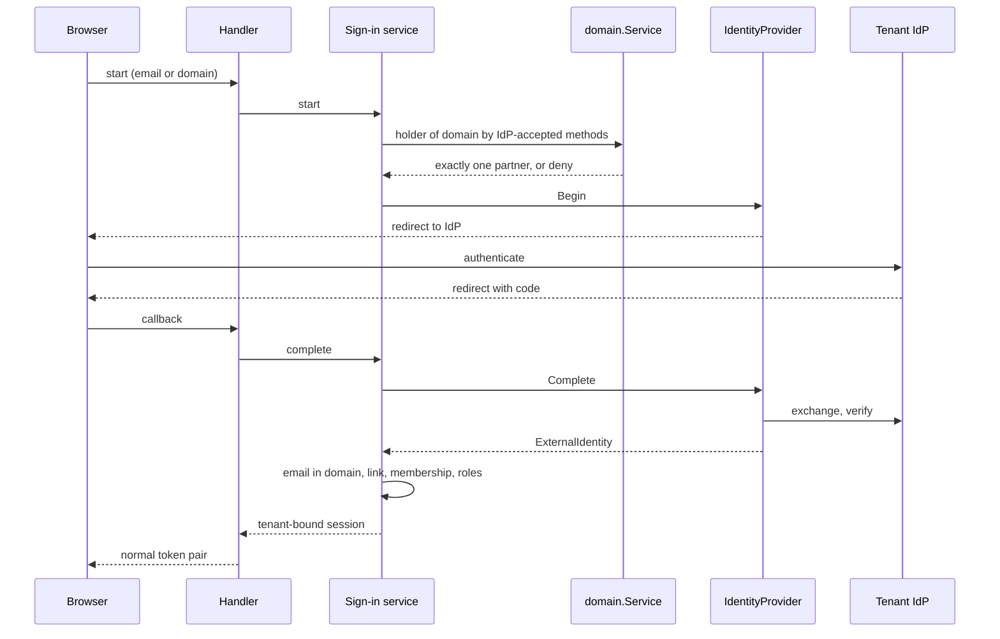

# Enterprise identity providers — working plan

Working document. Final content moves to README and the migration guide when each stage ships; this file is not release history.

Everything under "Current state", "Findings", and "Domain verification already in downstream applications" was verified against source. Everything under "Target design" is proposed and not implemented.

## Goal

A tenant (`business_partner`) lets its people sign in with the company identity provider, enforces its own MFA and lifecycle, and can keep passwords out of the application entirely. Accounts are provisioned and removed from the tenant's directory.

Three capabilities:

| ID | Capability | Summary |
|---|---|---|
| DV | Domain verification | Record how a partner proved a domain, by any of several methods, with history, re-check, lapse, and cancellation. Upstreamed from two downstream applications; useful on its own. Each consumer decides which methods it honors. |
| IDP-A | Tenant single sign-on | Per-tenant OpenID Connect, later SAML 2.0. Routes sign-in only by domains proven with the methods keel's IdP accepts. Success issues the normal keel session, so handlers and frontends are unchanged. |
| IDP-B | Directory provisioning | SCIM 2.0 users and groups per tenant; deactivation ends the membership and revokes its sessions immediately. |

## Current state

keel plays five separate identity roles today. None of them is tenant single sign-on.

| Role | What exists | Fit for tenant SSO |
|---|---|---|
| Identity store and authenticator | `user_account`, password, OTP, TOTP, trusted devices, refresh tokens ([user/user_service.go](user/user_service.go)) | keel is the IdP for first-party users |
| Relying party | Google and Apple ID tokens verified by a `switch` in [handler/social_handler.go](handler/social_handler.go); Google code exchange inside `PublicHandler.LoginGoogle` in [handler/public_handler.go](handler/public_handler.go) | Global client IDs, fixed issuers, RS256 only, not per tenant |
| Authorization server | `oauth_as_mode=local` issues tokens to third-party clients ([oauth/authserver](oauth/authserver)) | keel as IdP for other clients; unrelated to employee sign-in |
| Resource server | `oauth_as_mode=external` validates one issuer's tokens ([oauth/resource/jwt_validator.go](oauth/resource/jwt_validator.go)) | Single issuer; yields a `TokenPrincipal`, not a session or membership |
| Outbound connections | Partner-scoped connections in [oauth/client](oauth/client) and [oauth/connect](oauth/connect) | Authorization to external APIs, not authentication |

Reusable pieces already present: `crypto.JWKSProvider` and `crypto.VerifyRS256`, the PKCE helper in [oauth/client/pkce.go](oauth/client/pkce.go), the single-use nonce pattern in the social handler, the secret provider, `AbstractHandler.SessionTokens`, `LogoutEverywhere`, `RevokeAccessTokens`, the domain helpers `DomainFromEmail`, `RegistrableDomain`, `DomainsMatch`, `IsPublicDomain` in [common/domain.go](common/domain.go), host normalization in [service/partner_domain_service.go](service/partner_domain_service.go), and the key-file reader in [reference/indexnow.go](reference/indexnow.go).

Missing, all at tenant level: domain verification, per-tenant IdP configuration, OIDC discovery, issuer-keyed identity links, a tenant-scoped session, tenant-safe role mapping, membership end, and provisioning.

## Findings

These are defects or gaps in the current model that tenant SSO would turn into vulnerabilities. Each is fixed as part of this work; the todo list references them.

| ID | Severity | Finding | Evidence | Required fix | Status |
|---|---|---|---|---|---|
| F1 | Critical | Domains carry no proof of ownership, and two partners can claim the same domain. Routing sign-in by domain would let a tenant claim another company's domain and send its users to an attacker-run IdP. | [schema/tenant_management/partner_domain.yml](schema/tenant_management/partner_domain.yml): no verification column; primary key `(partner_id, domain_url)` | Domain verification (DV) that records how each domain was proven: method, verifying user, evidence, time, lapse, cancellation. Sign-in routes only by a domain whose current evidence uses an IdP-accepted method, held by exactly one partner. | Closed in code (v1.2.90, v1.2.92). Remaining: run the SQL smoke test on a real PostgreSQL (T28) and a live-tenant check of the provider calls (T29) |
| F2 | Critical | Account linking trusts the provider's `email_verified`. A tenant-controlled IdP can assert any email and take over an existing account, including one in another tenant. | `GetOrCreateUserFromSocial` in [user/user_service_local.go](user/user_service_local.go), email-link branch | A tenant IdP may assert only emails inside its tenant's IdP-verified domains. Links are keyed on issuer and subject, never on email alone. | Closed for shipped code (v1.2.91, v1.2.92). T41 is a requirement on the future tenant sign-in service, not an open defect |
| F3 | High | The identity link cannot represent a tenant IdP: no issuer or tenant column, one link per `(user_id, provider)`, provider limited to 20 characters. | [schema/core/user_social_provider.yml](schema/core/user_social_provider.yml) | An external-identity link keyed on `(issuer, subject)` and tied to the IdP connection. | Closed in v1.2.91: `user_external_identity` keyed `(issuer, subject)`; connection reference follows T30 |
| F4 | High | Roles are global. A tenant-configured group mapping could grant any role, including SUPER, and a user in two partners carries the role into both. | [schema/core/user_permission.yml](schema/core/user_permission.yml): no `partner_id` | Tenant-assignable role allowlist at minimum; partner-scoped grants if decision D2 selects them. Mapping fails closed. | Closed for shipped code (v1.2.92, v1.2.93): one partner per user, every role ends with the membership, and partner administrators can no longer write `user_permission`. `authorization_role.partner_scoped` marks tenant roles; the tenant role mapping must grant only those (T32) |
| F5 | High | "Require SSO" has no enforcement point. The password is on the global `user_account`; policy is per tenant; users can hold several memberships. OTP, social login, password reset, existing refresh tokens, and the local authorization server's login are all bypasses. | [schema/core/user_account.yml](schema/core/user_account.yml), `UserService` login paths | A tenant authentication policy checked on every path that mints a session for that tenant. | Closed (v1.2.93): `SSO_REQUIRED` levels 1 (any identity) and 2 (the partner's own IdP), checked fail-closed at every sign-in path, after 2FA and at refresh. A real tenant IdP connection replaces the Google Workspace domain proof in T40 |
| F6 | High | The session partner is the user's earliest membership, not the tenant whose IdP authenticated the user. | README, session partner section; `ListPartners` ordering | SSO sign-in yields a session bound to the authenticating tenant and to no other. | Closed (v1.2.92): a user has at most one partner at a time, enforced by `partner_user_no_overlap`, so the session partner is unambiguous |
| F7 | High | OIDC gives no leaver signal and the refresh token lives 30 days by default, so a leaver keeps access without provisioning. | `refresh_token_ttl` default | SSO sessions carry a bounded lifetime and are re-checked at refresh. | Closed (v1.2.92, v1.2.93): `EndMembership` revokes at once, refresh refuses unavailable accounts, and the `SESSION_MAX_HOURS` policy caps renewal |
| F8 | Medium | Nothing ends a membership. The only write to `partner_user` is the insert at registration. Revocation is per user, not per membership, and does not cover authorization-server refresh tokens or trusted devices in one operation. | [user/registration.go](user/registration.go); `LogoutEverywhere`, `RevokeAccessTokens`, `OAuthTokenStore.RevokeForUser` | A membership-end service operation that sets `endda` and revokes every credential in one place. | Closed (v1.2.92, v1.2.93): `EndMembership` and `partner_user/end` end the membership and roles and revoke all sessions; ended rows are read-only and no seeded role can update or delete a membership through generic REST |
| F9 | Medium | Provider logic sits in handlers: a provider `switch`, package-level JWKS singletons, and a hardcoded Google token exchange. A downstream cannot add a provider without forking, and the handler does more than bridge HTTP. | [handler/social_handler.go](handler/social_handler.go), [handler/public_handler.go](handler/public_handler.go) | Move verification behind the provider seam and the sign-in service. | Partly closed (v1.2.93): a provider is enabled by its client id, set per application or node. Open: verification still lives in the handler; the provider seam is stage 1 |
| F10 | Low | `port.LoginProvider` has no implementation and no caller, and returns a bare string. | [port/login_provider.go](port/login_provider.go) | Remove it when the new seam lands; record the removal in the migration guide. | Closed (v1.2.93): `port.LoginProvider` removed |
| F11 | Low | ID-token verification accepts RS256 only. Some enterprise IdPs sign with ES256 or PS256. | `crypto.VerifyRS256` | Accept the algorithms the discovery document advertises from a fixed safe allowlist; never `none` or symmetric. | Closed (v1.2.93): `crypto.VerifyAsymmetric` accepts only algorithms in both its allowlist and the issuer's advertised list; the tenant OIDC provider must use it (T11) |

## Domain verification already in downstream applications

Two downstream applications verify domains today, each in its own way. DV upstreams all of their methods so each application stops maintaining its own.

| Downstream mechanism | What it proves | Persisted as | DV method |
|---|---|---|---|
| Signup email shares the claimed site's registrable domain, confirmed by an emailed code | The registrant holds a mailbox at the domain | Nothing; it only gates registration | `EC` |
| Signup-first match: the caller's verified email domain equals the business website's domain | The same, from an already verified account email | Product tables | `VE` |
| Google sign-in with a non-public email domain whose MX is Google-hosted | A Google mailbox at the domain | Child table of `partner_domain` with free-text `method` and `verified_at`, keyed `(partner_id, domain_url)` | `GM`. The downstream MX suffix check has no dot boundary (`evilgoogle.com` passes); the upstream version matches whole labels. |
| Key file read back from the host, with `verified_at`, `last_error`, a 30-day re-read, and a transient failure not treated as a verdict | Control of content on that exact host; the key is one shared application key, so it does not identify the partner | Per-domain readiness row | `HF` with a per-partner token. The re-check and lapse lifecycle becomes the model for every re-checkable method. |
| Business Profile OAuth: the listing's website becomes the partner domain | The user manages a Google-verified business listing that names this website; the website field is self-asserted by the listing manager | Product tables | `GB` |
| Sign-in email equals a business listing's published contact email; the domain comes from the listing's website | Listing ownership, then domain by association | Product tables | Not shipped by keel: business-listing vocabulary. The downstream registers its own method code in the catalog and records it through DV. |

## Target design

### Domain verification (DV)

keel records evidence; it does not decide what is good enough for an application. Every consumer chooses the methods it honors. keel's own IdP is one such consumer and chooses a strict set.

#### Methods

Codes are seeded in `constant_value`; a downstream may add its own codes and record them through the same service.

| Code | Evidence | How it works | Re-checkable | Accepted by keel IdP |
|---|---|---|---|---|
| `EC` | Mailbox at the domain | Code sent to an address whose registrable domain matches; confirmed within an expiry, with attempt and send-rate limits | No | No |
| `VE` | Mailbox at the domain | The acting user's keel-verified email shares the domain's registrable domain | No | No |
| `GH` | Membership in the Google organization that owns the domain | The verified Google ID token's `hd` claim matches the domain | No | No |
| `GM` | A Google mailbox at the domain | Google sign-in with a non-public email domain whose MX hosts end in a Google mail domain on a label boundary | No | No |
| `HF` | Control of content on the exact host | Per-partner token served at a well-known path on the host, read back over HTTPS without following off-host redirects | Yes | No: CMS editors and contractors can satisfy it |
| `DT` | Control of the domain's DNS | Per-partner token in a TXT record on the domain | Yes | Yes |
| `GS` | The acting Google account owns the domain property | Site Verification API lists the domain for the account; delegated owners included | Yes, with a stored grant | No: not exclusive, many accounts can own one property |
| `GB` | The user manages a verified listing naming the domain as its website | Business Profile API read of the listing's website | Yes, with a stored grant | No: the website field is self-asserted |
| `GW` | The acting user administers the Google organization that verified the domain | Admin SDK domain list, `verified` flag, administrator-granted read-only scope | Yes, with a stored grant | Yes |
| `ME` | The acting user administers the Entra tenant that verified the domain | Microsoft Graph domain list, `isVerified`, administrator consent | Yes, with a stored grant | Yes |

Facts about the Google and Microsoft APIs come from prior knowledge and must be confirmed against current documentation in the implementing task, including scope classification and app-verification requirements.

#### Service and seam

- One concrete `domain.Service` owns challenges, recording, history, re-check, lapse, cancellation, and queries. It is the only writer of verification rows.
- One focused interface per method family, an implementation file per method, wired explicitly in `main`:

```go
// port (provisional)
type DomainVerifier interface {
	Method() string
	// Check returns evidence that partnerID controls domain, or an error.
	// A transient failure is distinguishable from a negative verdict.
	Check(ctx context.Context, req DomainCheck) (*DomainEvidence, error)
}
```

- Queries take the caller's accepted methods: `Current(partnerID, domain, methods)` answers whether the partner holds current evidence by any of them, and `Holders(domain, methods)` lists the partners that do. A downstream that wants exclusivity for its own accepted set uses `Holders`.
- Exclusivity built into keel applies only to the IdP-accepted set: recording an IdP-accepted method fails when another partner holds current IdP-accepted evidence for the domain. Other methods are non-exclusive by design.

### One interface, at the protocol boundary

The protocol is the only part of sign-in that varies, so it is the only interface. A provider turns protocol evidence into a neutral identity; it makes no decision about accounts, tenants, or roles.

```go
// port (provisional)
type IdentityProvider interface {
	Begin(ctx context.Context, conn IdentityConnection, state string) (redirectURL string, err error)
	Complete(ctx context.Context, conn IdentityConnection, callback IdentityCallback) (*ExternalIdentity, error)
}

type ExternalIdentity struct {
	Issuer, Subject       string
	Email                 string
	EmailVerified         bool
	GivenName, FamilyName string
	Groups                []string
}
```

- Implementations live in their own packages: generic OIDC first, SAML later. Google and Apple become two configurations of the OIDC implementation.
- A downstream wires an explicit map of protocol code to provider in `main`. One that does not want SAML never links its dependencies. A downstream can add a provider keel does not ship, and tests inject a fake.
- Every provider ends in the same session mint, so handlers and frontends are unchanged.

### One concrete service for sign-in policy

Domain rules apply only to a tenant that configures its own IdP. A consumer application that puts every user in one default partner, with or without a domain, never needs domain evidence: users keep signing up and signing in with Google, Apple or a password as today.

Everything after the provider is a single concrete sign-in service, not an interface: resolve the tenant from a domain with current IdP-accepted evidence, check the asserted email against that tenant's IdP-verified domains, find or create the link on `(issuer, subject)`, ensure the membership, apply role mapping, mint a session bound to that tenant. Making this pluggable would let a downstream drop a fail-closed check.



### Proposed schema

Table and column names are proposals; open decisions can change them.

| Table | Purpose |
|---|---|
| `partner_domain_verification` | Child of `partner_domain`, keyed `(partner_id, domain_url, verified_at)`: one row per executed verification, so the same method can run many times and the history is kept. Columns: method (catalog code), verifying user, token hash, provider evidence reference, `verified_at`, `last_checked_at`, `last_error`, nullable `lapsed_at`, nullable `cancelled_at`. A re-check that still holds updates `last_checked_at`; a re-check that finds the evidence gone sets `lapsed_at`; a deliberate withdrawal by the partner or an operator sets `cancelled_at`; a new verification appends a row. Current evidence is a row with both `lapsed_at` and `cancelled_at` NULL. `partner_domain` itself is unchanged. |
| `partner_domain_challenge` | Pending challenge for `EC`, `DT`, `HF`: partner, domain, method, token hash, issuing user, issued and expiry times, attempts. Consumed when the verification row is written. |
| `partner_identity_provider` | One IdP connection per row: protocol, issuer, client coordinates, secret name, status. Secrets stay in the secret provider. |
| `user_external_identity` | Link keyed on `(issuer, subject)` to `user_account`, referencing the connection for tenant IdPs |
| `partner_auth_policy` | Per-tenant policy: SSO required, account creation on first sign-in, session lifetime |
| `partner_idp_role_mapping` | Group or claim value to role, restricted to tenant-assignable roles |

Stored provider grants for re-checkable OAuth methods reuse the existing partner connection store in [oauth/connect](oauth/connect) rather than a new token table.

## Decisions

| ID | Decision | Status | Outcome or recommendation |
|---|---|---|---|
| D0 | Scope of domain verification | Decided | keel ships every method found in the downstream applications plus those discussed here. Recording a method is neutral; honoring it is the consumer's choice. keel chooses only the set its own IdP honors. |
| D1 | One link table for consumer and tenant identities, or keep `user_social_provider` beside a new table | Decided | One table: `user_external_identity`, keyed `(issuer, subject)`, one identity per issuer per account; `user_social_provider` is removed. |
| D2 | How roles become tenant-safe | Decided | A user has one partner at a time and `EndMembership` ends every role; if that removes the last platform administrator, a database administrator restores one. `authorization_role.partner_scoped` marks the roles a tenant mapping may grant. |
| D3 | How a multi-membership user is handled when one tenant requires SSO | Decided | Not applicable: a user belongs to at most one partner at a time. |
| D4 | Which methods keel's IdP honors | Decided | `domain.IdentityMethods()`: `DT`, `GW`, `ME`, exclusive per domain. Narrowing per deployment is deferred to the sign-in service. |
| D9 | Whether Google and Apple link an existing account by verified email | Decided | Yes, for any mail domain, when the account itself proved that email (`email_verified_at`). Google and Apple are trusted to have verified that the address belongs to the person; a review finding asking to remove email linking was declined on that basis. |
| D10 | Whether a new social account stores a Google- or Apple-verified email | Decided | Yes, whatever its mail domain. Other issuers store none until T41. |
| D5 | SAML implementation: library or in-house | Open | Decide at stage 8. A vetted library, isolated in its own package, with signature-wrapping tests. |
| D6 | Whether tenant SSO sessions may use trusted-device and keel TOTP | Open | No: the tenant IdP owns MFA for those sessions. |
| D7 | Whether a lapsed re-check stops sign-in routing | Decided | Yes: evidence lapses after `domain_recheck_grace` of negative verdicts, `Service.OnLapsed` notifies; a transient failure is not a verdict. |
| D8 | Re-check cadence per method | Decided | One `domain_recheck_interval` (default one day) for every re-checkable method; split per method only if provider quotas require it. |

## Stages and todo

Stages are ordered by dependency. A stage ships with its tests, schema, seeds, config flags, README section, and migration-guide entry.

Status values: `Open`, `In progress`, `Blocked`, `Done`.

| ID | Stage | Task | Fixes | Depends on | Status |
|---|---|---|---|---|---|
| T01 | 0 Decisions | Resolve the open decisions: D5 (SAML library) and D6 (keel 2FA on tenant SSO sessions) | — | — | Open |
| T10 | 1 Provider seam | Define `port.IdentityProvider`, `ExternalIdentity`, and connection and callback types | F9 | T01 | Open |
| T11 | 1 Provider seam | Generic OIDC provider: discovery, JWKS, issuer, audience, nonce, code exchange with PKCE | F9, F11 | T10 | Open |
| T12 | 1 Provider seam | `crypto.VerifyAsymmetric`: fixed asymmetric allowlist, EC keys in `JWKSProvider`, key-size, curve and pinned-algorithm checks | F11 | — | Done |
| T13 | 1 Provider seam | Move Google and Apple onto the OIDC provider; remove the handler `switch`, JWKS singletons, and the in-handler Google exchange; expose `hd` on the verified identity | F9 | T11 | Open |
| T14 | 1 Provider seam | Remove `port.LoginProvider`; migration-guide entry | F10 | — | Done |
| T15 | 1 Provider seam | Tests: provider contract suite with a fake IdP, parity for Google and Apple, replayed nonce, wrong issuer, wrong audience, rejected algorithms | — | T11–T13 | Open |
| T20 | 2 Domain verification | Schema: `partner_domain_verification` history table, `partner_domain_challenge`, method catalog seeds, sequences where keel generates IDs | F1 | T01 | Done |
| T21 | 2 Domain verification | `domain.Service` and `port.DomainVerifier`: `Challenge`, `Confirm`, `Verify`, `Check` + `RecordTx` for caller transactions, `Current`, `Domains`, `Holders`, `IdentityHolder`, `Cancel`, `History`; identity-set exclusivity under a per-name advisory lock | F1 | T20 | Done |
| T22 | 2 Domain verification | Challenge methods: `EC` (expiry, attempt cap, send-rate cap, hashed code), `DT`, `HF` (HTTPS only, no off-host redirect, size and time limits) | F1 | T21 | Done |
| T23 | 2 Domain verification | Session-evidence methods `VE`, `GH`, `GM`; `GM` matches whole labels and excludes public mail domains. `GH` takes the `hd` claim from the caller until T13 exposes it from the verified token | — | T21 | Done |
| T24 | 2 Domain verification | Provider-attested verifiers `GW`, `ME` (requires a domain administrator role), `GS` (DNS-verified domain properties only), `GB` (verified listings only). Grants come from the caller; re-check uses the `Service.AccessToken` hook | F1 | T21 | Done |
| T25 | 2 Domain verification | `Service.Recheck` for a downstream worker: due rows per D8, lapse per D7, transient failure recorded without a verdict, `OnLapsed` hook | F1 | T22, T24 | Done |
| T26 | 2 Domain verification | Tests: two partners on one domain by IdP and non-IdP methods, repeated verification by the same method, lapse, cancel, transient failure, expired and brute-forced challenges, `GM` look-alike host, off-host redirect, tenant isolation of every query | F1 | T21–T25 | Done |
| T27 | 2 Domain verification | README section and migration-guide entry: method catalog, how a consumer chooses accepted methods, adopting the table in place of a same-named downstream table, replacing downstream email-code and MX checks | — | T21–T25 | Done |
| T28 | 2 Domain verification | Run `go test ./domain ./user -sqlsmoke` against a disposable PostgreSQL. The test exists; no database is reachable from the development machine and the repository documents none | F1 | T21 | Blocked |
| T29 | 2 Domain verification | Provider calls checked against current Google and Microsoft reference pages: endpoints, fields, scopes and role template ids confirmed; alias domains, the Entra role query and page-limit handling corrected. Remaining: one run against a live Workspace and Entra tenant | F1 | T24 | In progress |
| T2A | 2 Domain verification | Downstream adoption: replace each application's own email-domain match, MX check, verification table and verified-domain reads with `domain.MailboxOnDomain`, `Check` + `RecordTx`, and `Domains`; register application-specific methods as own codes and verifiers. Tracked in each downstream, not edited from here | — | T27 | Open |
| T2B | 2 Domain verification | Identity evidence counts only while its last passed check is younger than `domain_identity_max_age`; stale evidence stops routing and blocking without lapsing and is superseded by a new holder | F1 | T25 | Done |
| T30 | 3 Tenant identity schema | `partner_identity_provider` table, REST metadata, grants limited to tenant administrators | — | T01 | Open |
| T31 | 3 Tenant identity schema | Identity link keyed on `(issuer, subject)` in `user_external_identity`; tie a link to its IdP connection when T30 adds connections | F3 | T01 | Done |
| T32 | 3 Tenant identity schema | Tenant-assignable roles and the role-mapping table | F4 | T02 | Open |
| T34 | 3 Tenant identity schema | Tests: mapping to a non-assignable role denied; connection rows visible only to their tenant | F4 | T30–T33 | Open |
| T40 | 4 OIDC sign-in | Sign-in service: tenant by domain holder under IdP-accepted methods, email-in-domain check, link or create on `(issuer, subject)`, membership, role mapping | F1, F2, F3 | T11, T21, T30–T32 | Open |
| T41 | 4 OIDC sign-in | Tenant IdPs: restrict asserted email to domains the tenant holds by `domain.IdentityMethods()` before account creation; reuse `user.ExternalIdentity` and the existing ladder | F2 | T40, T42A | Open |
| T42A | 4 OIDC sign-in | F2 for existing providers: links keyed on canonical issuer and subject; only Google- and Apple-verified email links or is stored; other issuers and unverified emails get `identity_not_linked`; `LinkSocial` links from a re-authenticated session; social sign-in honors account locks | F2 | — | Done |
| T42 | 4 OIDC sign-in | Tenant sign-in admits only a user whose single current membership is the authenticating tenant | F6 | T40 | Open |
| T43 | 4 OIDC sign-in | Start and callback handlers; state bound to the browser; opaque errors | — | T40 | Open |
| T44 | 4 OIDC sign-in | Account creation on first sign-in only under tenant policy; no generic `user_account` insertion | — | T33, T40 | Open |
| T45 | 4 OIDC sign-in | Tests: domain proven only by non-IdP methods never routes, lapsed or cancelled domain stops routing, cross-tenant email assertion denied, takeover of an existing account denied, session scoped to the right tenant, unknown group grants nothing | F1, F2, F4, F6 | T40–T44 | Open |
| T50 | 5 Policy enforcement | `SSO_REQUIRED` enforced at password and OTP sign-in and at refresh; downstream login handlers call `CheckSignInMethod` and set `session.SignInMethod` | F5 | — | Done |
| T51 | 5 Policy enforcement | `SESSION_MAX_HOURS` policy caps session renewal, per partner over a global default; refresh re-checks account status and sign-in method | F7 | — | Done |
| T54 | 5 Policy enforcement | A partner's own password rules (length, attempts, lockout, expiry) apply to its users through the same policy resolution | — | — | Done |
| T52 | 5 Policy enforcement | Disable trusted-device and keel TOTP for tenant SSO sessions per D6 | — | T42 | Open |
| T60 | 6 Membership lifecycle | `EndMembership`: end the open membership and role assignments, revoke all refresh and access tokens and, through the optional store, authorization-server tokens; `partner_user/end` route; ended rows read-only; no overlapping memberships | F8 | — | Done |
| T61 | 6 Membership lifecycle | Tests: ended membership cannot refresh, roles ended, rollback on failure, ended rows skipped by generic writes, overlap constraint in the DDL | F8 | T60 | Done |
| T70 | 7 SCIM | Tenant-scoped SCIM token: issue, hash, rotate, revoke | — | T30 | Open |
| T71 | 7 SCIM | SCIM users: create, update, deactivate calls T60 | F7, F8 | T60, T70 | Open |
| T72 | 7 SCIM | SCIM groups mapped through the stage 3 role mapping | F4 | T32, T70 | Open |
| T73 | 7 SCIM | Tests: tenant isolation of the token, deactivation revokes immediately, idempotent replays, conformance fixtures | — | T70–T72 | Open |
| T80 | 8 SAML | Resolve D5; SAML service-provider implementation of `port.IdentityProvider` in its own package | — | T40 | Open |
| T81 | 8 SAML | Tests: signature wrapping, unsigned assertion, audience and recipient mismatch, replay, clock skew | — | T80 | Open |
| T90 | 9 Release | README sections, migration-guide entries, config flag catalog, seeds; move this file's final content out | — | each stage | Open |
| T91 | 9 Release | Record the matching sign-in and domain-verification screens as gaps in the frontend library's own tracker | — | T22, T43 | Open |
